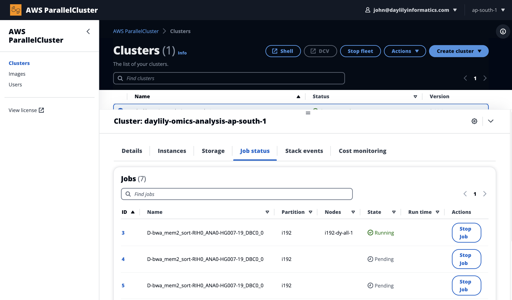
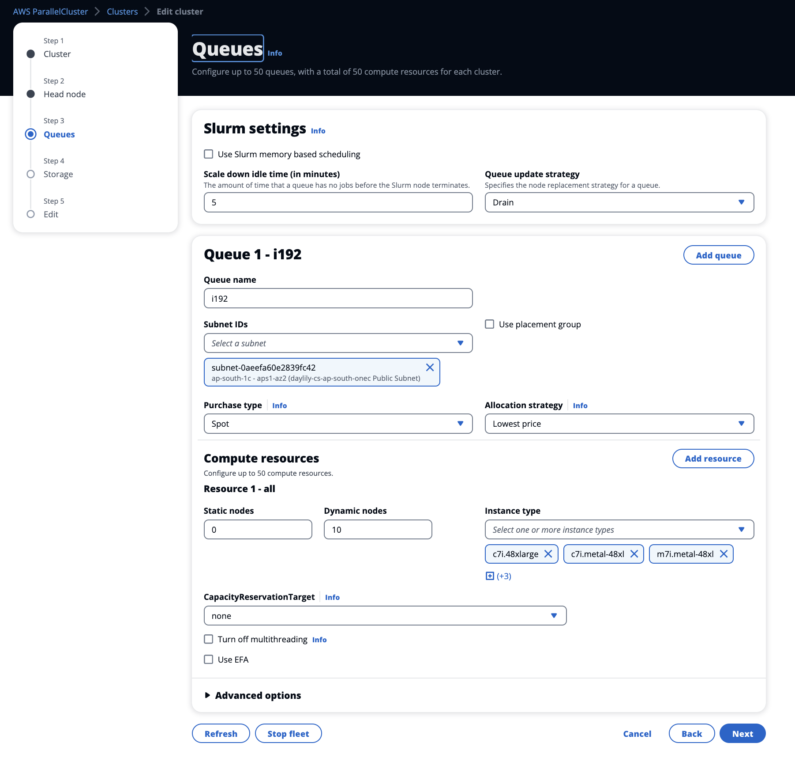

# Daylily AWS Ephemeral Cluster Setup (0.7.82)

**beta release**

Daylily is a framework for setting up ephemeral AWS clusters optimized for genomics data analysis. It leverages AWS ParallelCluster and provides automated scripts for cluster creation, management, and teardown.


<p valign="middle"><a href=http://www.workwithcolor.com/color-converter-01.htm?cp=ff8c00></a></p>


## Table of Contents
- [Before Beginning](#before-beginning)
- [Strongly Suggested: AWS Parallel Cluster UI](#strongly-suggested--pcui)
- [Installation Steps](#installation-steps)
  - [Prepare Your Local Shell](#prepare-your-local-shell)
  - [Clone The `daylily` Repository](#clone-the-daylily-repository)
  - [Install Conda](#install-conda-if-not-already-installed)
- [AWS Setup](#aws-setup)
- [Cluster Initialization](#cluster-initialization)
- [Working with the Ephemeral Cluster](#working-with-the-ephemeral-cluster)
- [Monitoring Tools](#monitoring-tools)
- [Known Issues](#known-issues)
- [Future Development](#future-development)

---


# Before Beginning
- `daylily` can run in multiple AZs, but this capability is not end-to-end automated yet. It is straightforward to run 1-many ephemeral clusters in one AZ of a region, and to do so in multiple regions.  Running in multipe AZs w/in a region is allowed, but the automation to set these up is not complete (read: you'll need to build subnets and a few other AZ specific resources by hand ATM).
- A cloudstack formation template will run which will create some important resources for the epheral cluster, namely: the public VPC, public subnet, private subnet, and a policy to allow tagging and budget tracking of resources by pcluster.
- The install steps should work for both `bash` and `zsh` shells, but the `bash` shell is the default for the `pcluster` environment.
- Daylily `projects` are synonymous with AWS `budgets`. When initializing daylily `. dyinit  --project PROJECT`, the project specified will be checked vs the slurm registry of projects, found `/opt/slurm/etc/projects_list.conf` and be checked to confirm there is a matching AWS budget of the specified name. If not, you will be prompted to create a budget (which may also be completed via the AWS dashboard, use a simplified `monthly spend` type). for now, you willneed to update the `projects_list.conf` file manually with each new budget added, *importantly* both in the current ephemeral cluster conf file as well as the s3 bucket hosted version which is used to build new nodes.

# Strongly Suggested --> Parallel CLuster UI ( _PCUI_ )

> [PCUI](https://us-west-2.console.aws.amazon.com/parallelcluster/home?region=us-west-2#clusters) is a useful tool for managing all parallel clusters across AZ's. You can accomplish everything the `pcluster` cli allows, and in addition, much more convenient stackformation/log monitoring. Bonus: job monitoring, dynamic volume management & integrated budget/cost monitoring (`daylily` adds to this budget enforcement and finer grained cost tracking).

## Cluster Jobs


## Cluster Queue Management



  <p valign="middle"><a href=http://www.workwithcolor.com/color-converter-01.htm?cp=ff8c00></a></p>

  <p valign="middle"></p>

# Installation Steps

## On Your Local Machine, A Terminal
Your local machine will be used to instantiate and manage ephemeral clusters. To date, this developmnent has been carried out on a MAC laptop (zsh shell).


### Install Conda (if not already installed)
_bash and zsh are known to work_
- [Conda, miniconda specifically, is required to be setup in your shell to proceed.](docs/install/Install.md#run-daylily-init)

### Clone The `daylily` Repository
```bash
git clone git@github.com:Daylily-Informatics/daylily.git
cd daylily
```

## via Your AWS Dashboard / Account 
_note:_ the following steps need to happen only once per-scope of the resource. I have begun to wrap managing these AWS resources in the overall ephemeral cluster build process (which is only well tested for a single cluster per-region). The following notes should help you if you go beyond a single cluster per-region. tldr:  some of these things happen once per account, per-region, per-az.
### 0. AWS Quotas
- You must request increases to the default quotas for the resources `pcluster` requires to be available.  
- This is a critical step, and you should do this before attempting to create a cluster.  
  - And, you should monitor your usage and request additional increases as your needs grow.
- [See Section On AWS Quotas](#critically-important-words-on-quotas----you-must-request-increases-from-the-defaults) for specifics on common default quotas that need to be increased. tldr:
> **dedicated instances**
> - `Running Dedicated r7i Hosts` >= 1 **!!(AWS default is 0) !!**
> - `Running On-Demand Standard (A, C, D, H, I, M, R, T, Z) instances` must be >= 16 **!!(AWS default is 5) !!** just to run the headnode, and will need to be increased further for ANY other dedicated instances you (presently)/(will) run.
> **spot instances**
> - `All Standard (A, C, D, H, I, M, R, T, Z) Spot Instance Requests` must be >= 310 (and preferable >=2958) **!!(AWS default is 5) !!**
> **fsx lustre**
> - should minimally allow creation of a FSX Lustre filesystem with >= 4.8 TB storage, which should be the default.

### 1. Activate Cost Allocation Tags (optional)
If you have not created an ephemeral cluster yet, the tags will not be known to your AWS account, you may need to tag something with these tags if not yet known. Someone with 'payer' access to the account will need to activate cost allocation tags.  This is important for the cost tracking and budgeting of the daylily ephemeral clusters.

* [AWS Cost Allocation Tags](https://us-east-1.console.aws.amazon.com/billing/home#/tags)
* The tags to activate are:
```text
aws-parallelcluster-jobid
aws-parallelcluster-project
aws-parallelcluster-username
```


### 2. Install / Configure The AWS CLI
_Create And Save AWS CLI Credentials In `.aws`_
- For your terminal/shell account these files `~/.aws/{credentials,config}` should exist.

**config** should look like:
```
[default]
region = us-west-2
output = json
```

**credentials** should look like:
Setting your region will help avoid error caused when a --region flag is omitted from a pcluster command.
```
[default]
aws_access_key_id = <ACCESS_KEY>
aws_secret_access_key = <SECRET_ACCESS_KEY>
region = <REGION>
```

#### Confirm The CLI User Has The Necessary Permissions For AWS Parallel Cluster To Operate
Please refer to the pcluster docs to verify your cli user has the appropriate permissions to create and manage the resources necessary for the cluster.  [AWS Parallel Cluster Permissions](https://docs.aws.amazon.com/parallelcluster/latest/ug/iam.html).

#### Add Two Inline Policies To Add To The CLI User
Add 'inline json' policies to the user who will be running the `pcluster` commands.  These policies are necessary for the `pcluster` headnode to manage spot instances and query spot price histories.

**pcluster-omics-analysis-fleet**
- Add this inline policy to the cli user from the aws iam user dashboard. It allows the pcluster headnode to manage spot instances. If missing, you might be able to spin up a head but not be able to add spots. Name it `pcluster-omics-analysis-fleet`.
```json
{
  "Version": "2012-10-17",
  "Statement": [
    {
      "Effect": "Allow",
      "Action": "iam:CreateServiceLinkedRole",
      "Resource": "*",
      "Condition": {
        "StringLike": {
          "iam:AWSServiceName": "spot.amazonaws.com"
        }
      }
    }
  ]
}
```

**spot-price-history**
Your user must have the ability to query spot price histories. Add the following inline policy, and name it with the suffix `omics-analysis-spot-price-history`.
```json
{
    "Version": "2012-10-17",
    "Statement": [
        {
            "Effect": "Allow",
            "Action": [
                "ec2:DescribeSpotPriceHistory"
            ],
            "Resource": "*"
        }
    ]
}
```


### 3. Create A New SSH Key Pair (type: **ed25519**) & Downloaded `.pem` File

_keypairs are region specific, and you will need to create a new keypair for each region you intend to run in_

- _suggested name `PREFIX-omics-analysis-REGION`_

```bash
Move, copy and chmod: 
```bash
mv ~/Downloads/<yourkey>.pem  ~/.ssh/<yourkey>.pem 
chmod 400 ~/.ssh/<yourkey>.pem`
```

* Your keypair will need to be available in ~/.ssh/

### 4. The `YOURPREFIX-omics-analysis-REGION` s3 Bucket
- Your new bucket name needs to end in `-omics-analysis-REGION` and be unique to your account.
- One bucket must be created per `REGION` you intend to run in.
- The reference data version is currently `0.7`, and will be replicated correctly using the script below.
- The total size of the bucket will be 779.1GB, and the cost of standard S3 storage will be ~$30/mo.
- Copying the daylily-references-public bucket will take ~7hrs using the script below.

#### `daylily-references-public` Bucket Contents
- `hg38` and `b37` reference data files (including supporting tool specific files).
- 7 google-brain ~`30x` Illunina 2x150 `fastq.gz` files for all 7 GIAB samples (`HG001,HG002,HG003,HG004,HG005,HG006,HG007`).
- snv and sv truth sets (`v4.2.1`) for all 7 GIAB samples in both `b37` and `hg38`.
- A handful of pre-built conda environments and docker images (for demonstration purposes, you may choose to add to your own instance of this bucket to save on re-building envs on new eclusters).
- A handful of scripts and config necessary for the ephemeral cluster to run.

_note:_ you can choose to eliminate the data for `b37` or `hg38` to save on storage costs. In addition, you may choose to eliminate the GIAB fastq files if you do not intend to run concordance or benchmarking tests (which is advised against as this framework was developed explicitly to facilitate these types of comparisons in an ongoing way).

##### Top Level Diretories
See the secion on [shared Fsx filesystem](#shared-fsx-filesystem) for more on hos this bucket interacts with these ephemeral cluster region specific S3 buckets.
```text
.
├── cluster_boot_config  # used to configure the head and compute nodes in the ephemeral cluster, is not mounted to cluster nodes
└── data # this directory is mounted to the head and compute nodes under /fsx/data as READ-ONLY. Data added to the S3 bucket will become available to the fsx mount, but can not be written to via FSX
    ├── cached_envs
    │   ├── conda
    │   └── containers
    ├── genomic_data
    │   ├── organism_annotations
    │   │   └── H_sapiens
    │   │       ├── b37
    │   │       └── hg38
    │   ├── organism_reads
    │   │   └── H_sapiens
    │   │       └── giab
    │   └── organism_references
    │       └── H_sapiens
    │           ├── b37
    │           └── hg38
    └── tool_specific_resources
        └── verifybam2
            ├── exome
            └── test
```


#### Create The Bucket
#### Replicate `daylily-references-public` Public References/Resources To Your New Bucket
- Use the following script.
```bash
sni
##### Copy The `daylily` Public References/Resources To Your New Bucket (choose the most recent version)
From your terminal/shell (and to be safe, in a screen or tmux session as it may run for a while).

You will need to copy the daylily ephemeral cluster s3 data to a bucket named `YOURPREFIX-omics-analysis-REGION` in your account. There will need to be one of these per region you intende to run in. Default is `us-west-2`. This locality dependence is due to the `Fsx` filesystem requiring the S3 bucket it mounts to be in the same region as it and the subnets.

**only needs to be done 1x per region** _and will take an hour or so to run_
```bash

./bin/create_daylily_omics_analysis_s3.sh -h

Usage: ./bin/create_daylily_omics_analysis_s3.sh --prefix <PREFIX> [--daylily-s3-version <version>] [--region <region>] [--dryrun] [-h]

./bin/create_daylily_omics_analysis_s3.sh --prefix hello-new-bucket --region us-west-2 --daylily-s3-version v0.7 --dryrun

# Run it for real, may take a while to run! be in tmux or screen...
./bin/create_daylily_omics_analysis_s3.sh --prefix hello-new-bucket --region us-west-2 --daylily-s3-version v0.7 
```


### 5. Create A New `pcluster` Stack
#### **but first, choose the most affordable avaiability zone**
The `region` is important for pcluster to run, but the `availability zone` is the largest variable w/r/t compute costs.  Daylily defaults to `us-west-2c` as it is consistently cheaper to run in from `us` regions, but not always. The costs per AZ can vary by 2-3x. Please note, running in AZ's outside us-west-2 has **NOT** been tested, it should be trivial to tweak config to work outsize us-west-2, however, I believe the biggest pain will be that the S3 bucket must be in the same region as the `FSX` filesystem created by pcluster.  In anycase, this script presents a table to give you a feel for costs of running in different AZ's.
_build the `DAYCLI` environment to run the following script_


python bin/check_current_spot_market_by_zones.py -i config/day_cluster/prod_cluster.yaml -o ./blah.tsv --profile daylily --partition i192 --x-coverage 30 --vcpu-min-per-x 2 --zones us-east-1a,us-east-1b,us-east-1c,
us-east-1d,us-west-1a,us-west-2c


##### Spot Price Statistics (example- still in active development)
```text
| Zone       | Total Instances Considered | Instances with Pricing | Median Spot Price | Mean Spot Price | Min Spot Price | Max Spot Price | Avg of Lowest 3 Prices | Harmonic Mean Price | Estimated EC2 Cost / Genome (no FSX or S3 costs included here) | Stability (Max-Min Spread) |
|------------|----------------------------|------------------------|-------------------|----------------|---------------|---------------|------------------------|--------------------|-----------------------------|----------------------------|
| us-east-1d | 6                          | 6                      | **2.2443**         | **2.6635**      | **1.2944**    | 6.0426        | **1.5202**              | **2.0483**         | **4.5605**                  | 4.7482                     |
| us-east-1b | 6                          | 6                      | 2.5682             | 3.1314         | 1.8549         | 6.8788        | 1.9998                 | 2.5703              | 5.9994                      | 5.0239                     |
| us-west-2c | 6                          | 6                      | 3.2456             | 3.4618         | 1.3648         | **5.6738**    | 2.2753                 | 2.8179              | 6.8259                      | **4.3090**                 |
| us-west-2d | 6                          | 6                      | 3.0717             | 3.3662         | 1.7559         | 5.8005        | 2.2841                 | 2.8928              | 6.8523                      | 4.0446                     |
| us-east-1c | 6                          | 6                      | 3.9424             | 3.8837         | 2.1061         | 5.4064        | 3.1122                 | 3.5621              | 9.3365                      | **3.3003**                 |
| us-west-2b | 6                          | 6                      | 3.9970             | 4.4728         | 2.3100         | 9.1402        | 2.8915                 | 3.6808              | 8.6745                      | 6.8302                     |
| us-east-1a | 6                          | 6                      | 3.5854             | 4.0252         | 2.9681         | 6.8254        | 3.2490                 | 3.7470              | 9.7470                      | 3.8573                     |
| us-west-2a | 6                          | 6                      | 3.9594             | 4.8392         | 3.4149         | 8.8822        | 3.4376                 | 4.2998              | 10.3128                     | 5.4673                     |
```

* I will proceed with `us-west-2c`.

#### **Create The Cloudformation Stack (optional)**
This is optional, in that it will be run for you if needed during the ephemeral cluster creation below.
From the `daylily` repository root dir, run the following command (it will take up to 10min to complete! This step does not need to be repeated for each new cluster, but only when you are setting up in a new AZ, which quotas will likely limit you to just one at a time).:
```bash
bin/init_cloudstackformation.sh ./config/day_cluster/pcluster_env.yml <short-resource-prefix-to-use> <availability-zone> <region>
```
- This will run and create a VPC, private and public subnet as well as an IAM policy which allows pcluster to tag resources for budget tracking and allow budget tools to see these tags.
- The script should block the terminal while running, and report back on success.  If failure, go to the cloudformation console and look at the logs for the stack to see what went wrong & delete the stack before attempting again.
- **the resources created here will be presented to you when you run the daycli init**: `Public Subnet ID`, `Private Subnet ID`, and `Policy ARN` will be reported to STDOUT upon success.

### 6. Local DAYCLI Setup & Ephemeral Cluster Initialization (only need to do this once per new cluster)
From your local/laptop shell (NOTE: there is an unfortunate, and to be rectified mixture of `zsh` and `bash` scripts used here. Dev was done on a MAC with zsh and then cluster work with `bash` using ubuntu22. Please stick with the indicated shells until everything is ported to `bash`).
Assumes all of the required setup steps above have been completed, and will run several checks to ensure the setup is correct before proceeding. You will be allowed to exit the process at any time and you will be prompted to confirm you wish to create the ephemeral cluster once all checks have passed.

#### Local `pcluster` DAYCLI Setup & Ephemeral Cluster Initialization
**Bootstrap Installation Of `daylily` CLI**

_note:_ the cli init script will run checks for the steps covered to this point, and will prompty if there are errors to be resovlved before proceeding (this is not comprehensively tested yet! do not treat no errors as evidence all config to this point is correct).


- From the `daylily` repository root, run the following command
    ```bash
    source bin/daylily-cfg-ephemeral-cluster --help
    ``` 
    - Your aws credentials will be auto-detected and used to query appropriate resources to select from to proceed. You will be prompted to:
      - select the full path to your $HOME/.ssh/<mykey>.pem (from detected .pem files)
      - select the `s3` bucket you created and seeded, options presented will be any with names ending in `-omics-analysis`. Or you may select `1` and manually enter a s3 url.
      - select the `Public Subnet ID` created when the cloudstack formation script was run earlier.
      - select the `Private Subnet ID` created when the cloudstack formation script was run earlier.from the cloudformation stack output.
      - select the `Policy ARN` created when the cloudstack formation script was run earlier.
      - enter a name to asisgn your new ephemeral cluster (ie: `<myorg>-omics-analysis`)
      - enter the path to a pcluser config file (ie: `config/day_cluster/pcluster_config.yaml`), enter selects the default.
      - _experimental_: specify if you wish to use idle compute (in both head and compute nodes) to mine [Monero, XMR](https://en.wikipedia.org/wiki/Monero) and send coins to your wallet of choice. The default wallet, `42s1tbj3qp6T2QBw9BzYxxRn1e9afiZhcRr8yoe2QYLn5ZG6Fk9XzEh1719moDeUgY6tReaJDF464ZhbEyg4cXMYNRXJve2`, is/will be visible to the public(todo) and all XMR deposited passed on to charitable organizations in the clinical genomics/human health arenas (how, stay tuned!). At the very least, for now, you can watch the wallet if this is enabled via [supportxmr.com](https://supportxmr.com/) and see progress, plus, you may watch the cluster nodes appear as miners on this dash. Little risk is involved in this,  but please do not use this if you feel weird about monetizing your compute resources in this way. This is largely a stunt, but was an easy stunt, and there is a future where enabling this results in free analysis _we'll see_.
  - The configuration script will then create  `_cluster.yaml` and `cluster_init_vals.txt` files in `~/.config/daylily/` and these will be used to create the new ephemeral cluster.
  - First, a dryrun `pcluster create-clsuter` command will be run to ensure the configuration is correct. You will be informed of success/fail for this step, and asked if you wish to proceed in actual creation of the cluster, enter `y`.
  - The ephemeral cluster creation will begin and a monitoring script will watch for its completion.  This may take 10-20min. You may exit the process at this time, and can check on the cluster via the pcluster cli, or the cloudformation console.

##### Command To Build And Deploy An Ephemeral Cluster
```bash
    export AWS_PROFILE=default
    source bin/daylily-cfg-ephemeral-cluster --region-az us-east-1d --profile $AWS_PROFILE --pass-on-warn # You must specify the --profile flag, and if using default, AWS_PROFILE should be set to default, not null.
```


###### Head Node Configuration (only needs to be done once per new cluster, and should happen automatically with the above build command)
_**todo**: bake the headnode as an AMI and use this AMI in the cluster congifuration, making this step unnecessary_
- Headnode configuration will proceed automatically following the above successful cluster creation  (you may manually trigger running `source bin/daylily-cfg-headnode $pem_file $region` if not started automatically).  
- This process will:
  -  prompt you to select the name of the cluster just created.
  -  will be presented an `rsa` key you will be asked to save as a github ssh/gpg key. When you acknowledge you have saved this key, the `daylily` repo will be cloned to the headnode into `~/projects/daylily`.
  -  The `daylily` cli will be installed on the headnode, which includes creation of a `DAY` conda environment.
  -  Upon completion, you will see something like:
  
```text
You can now SSH into the head node with the following command:
ssh -i /Users/daylily/.ssh/omics-analysis-b.pem ubuntu@52.24.138.65
Once logged in, as the 'ubuntu' user, run the following commands:
  cd ~/projects/daylily
  source dyinit -h
  source dyinit  --project PROJECT
  dy-a local
  dy-r help
 
Setup complete. You can now start working with Daylily on the head node.
```
  - You are ready to roll.

### Cluster Initialization Complete 
You can confirm the cluster creation was successful with the following command (alternatively, use the PCUI console).
```bash
pcluster list-clusters --region us-west-2
```
## Costs
#### OF IDLE CLUSTER
> The cluster, once created, will *MINIMALLY* cost whatever the hourly on-demand cost of the head node you chose (the default instance type should run ~$1/hr). And then, the cost of the fsx filesystem. 

> When the cluster is doing actual work, spot instances are created as needed, and released if idle for longer than (configurable, but default 5min). Spot instance pools are configured to greatly increase finding very cheap spot instances, but this is not guaranteed. You pay per min for each spot instance running. MONITOR YOUR COSTS AND USE.

> The intended use case is not to leave a cluster idle for too long, but spin the thing up and down as needed. Leaving the cluster idle for two+ days or so is probably starting to be too long idle.


## Working With The Ephemeral Clusters (via `pcluster`)
**PCUI is a new tool, and should replicate the pcluster CLI completely, the future is there, but I had these docs already written, so here we are.**

###  Quotas -- You Must Request Increases From The Defaults
* AWS assigned default quotas will not allow creating a pcluser cluster.
* AWS quotas limit many of the resources needed by pcluster to build and run ephemeral clusters. 
* The default resource quotas on a standard AWS account may not be sufficent to run an ephemeral cluster. 
* Please review you account quotas, monitor your usage, and if you are encountering strange behaviour with getting clusters to build, or spot instances to spin up, this is _one_ place to look first.

**Proactively Request Quota Increases Before You Encounter Problems**
  
#### A Few Important Quotas To Monitor
**quotas are applied by region. be sure you are looking at the `us-west-2` region quotas && be sure when you make quota increase requests you are doing so in `us-west-2`**
- The following are important quotas to review, but is not exhaustive as quota assignment can vary unpredictably by account.


##### VPC Quotas / Networking
- [VPC Quotas Console](https://us-west-2.console.aws.amazon.com/servicequotas/home/services/vpc/quotas)
If there are problems with VPC or networking quotas, these should cause hard fails very early in setting up daylily clusters. There are restrictive limits to the number of VPCs, subnets, and security groups you can create in a region.

##### EC2 Quotas
- [EC2 Quotas Console](https://us-west-2.console.aws.amazon.com/servicequotas/home/services/ec2/quotas)
Quotas are applied by class of instance and by total number `vCPU` used across the class which a quota applies. 

> **dedicated instances** 
> `Running Dedicated r7i Hosts` >= 1 **!!(AWS default is 0) !!**
> - This allows the r7i type headnode to be created.  If you alter the headnode instance type in the cluster config, you may need to adjust a different dedicated instance quota.
> `Running On-Demand Standard (A, C, D, H, I, M, R, T, Z) instances` must be >= 16 **!!(AWS default is 5) !!** just to run the headnode, and will need to be increased further for ANY other dedicated instances you (presently)/(will) run. 
> - This is the max total number of vcpus allowed for standard dedicated instances to hold for your account in this region.

> **spot instances**
> `All Standard (A, C, D, H, I, M, R, T, Z) Spot Instance Requests` must be >= 310 (and preferable >=2958) **!!(AWS default is 5) !!**
> - This is the max total number of vcpus allowed for spot instances to hold for your account in this region.

##### FSX Lustre Quotas
Default FSX quotas should be 
- [FSX Lustre Quota Console](https://us-west-2.console.aws.amazon.com/servicequotas/home/services/fsx/quotas)
- This is the max total number of vcpus allowed for spot instances to hold for your account in this region.

## DAYCLI

### Activate The DAYCLI Conda Environment
```bash
conda activate DAYCLI
```

### `pcluster` CLI Usage
**WARNING:**  you are advised to run `aws configure set region <REGION>` to set the region for use with the pcluster CLI, to avoid the errors you will cause when the `--region` flag is omitted.

```text
pcluster -h  
usage: pcluster [-h]
                {list-clusters,create-cluster,delete-cluster,describe-cluster,update-cluster,describe-compute-fleet,update-compute-fleet,delete-cluster-instances,describe-cluster-instances,list-cluster-log-streams,get-cluster-log-events,get-cluster-stack-events,list-images,build-image,delete-image,describe-image,list-image-log-streams,get-image-log-events,get-image-stack-events,list-official-images,configure,dcv-connect,export-cluster-logs,export-image-logs,ssh,version}
                ...

pcluster is the AWS ParallelCluster CLI and permits launching and management of HPC clusters in the AWS cloud.

options:
  -h, --help            show this help message and exit

COMMANDS:
  {list-clusters,create-cluster,delete-cluster,describe-cluster,update-cluster,describe-compute-fleet,update-compute-fleet,delete-cluster-instances,describe-cluster-instances,list-cluster-log-streams,get-cluster-log-events,get-cluster-stack-events,list-images,build-image,delete-image,describe-image,list-image-log-streams,get-image-log-events,get-image-stack-events,list-official-images,configure,dcv-connect,export-cluster-logs,export-image-logs,ssh,version}
    list-clusters       Retrieve the list of existing clusters.
    create-cluster      Create a managed cluster in a given region.
    delete-cluster      Initiate the deletion of a cluster.
    describe-cluster    Get detailed information about an existing cluster.
    update-cluster      Update a cluster managed in a given region.
    describe-compute-fleet
                        Describe the status of the compute fleet.
    update-compute-fleet
                        Update the status of the cluster compute fleet.
    delete-cluster-instances
                        Initiate the forced termination of all cluster compute nodes. Does not work with AWS Batch clusters.
    describe-cluster-instances
                        Describe the instances belonging to a given cluster.
    list-cluster-log-streams
                        Retrieve the list of log streams associated with a cluster.
    get-cluster-log-events
                        Retrieve the events associated with a log stream.
    get-cluster-stack-events
                        Retrieve the events associated with the stack for a given cluster.
    list-images         Retrieve the list of existing custom images.
    build-image         Create a custom ParallelCluster image in a given region.
    delete-image        Initiate the deletion of the custom ParallelCluster image.
    describe-image      Get detailed information about an existing image.
    list-image-log-streams
                        Retrieve the list of log streams associated with an image.
    get-image-log-events
                        Retrieve the events associated with an image build.
    get-image-stack-events
                        Retrieve the events associated with the stack for a given image build.
    list-official-images
                        List Official ParallelCluster AMIs.
    configure           Start the AWS ParallelCluster configuration.
    dcv-connect         Permits to connect to the head node through an interactive session by using NICE DCV.
    export-cluster-logs
                        Export the logs of the cluster to a local tar.gz archive by passing through an Amazon S3 Bucket.
    export-image-logs   Export the logs of the image builder stack to a local tar.gz archive by passing through an Amazon S3 Bucket.
    ssh                 Connects to the head node instance using SSH.
    version             Displays the version of AWS ParallelCluster.

For command specific flags, please run: "pcluster [command] --help"
```

#### List Clusters
```bash
pcluster list-clusters --region us-west-2
```

#### Describe Cluster

```bash
pcluster describe-cluster -n $cluster_name --region us-west-2
```

ie: to get the public IP of the head node.
```bash
pcluster describe-cluster -n $cluster_name --region us-west-2 | grep 'publicIpAddress' | cut -d '"' -f 4
```

#### SSH Into Cluster Headnode
From your local shell, you can ssh into the head node of the cluster using the following command.
```bash
ssh -i $pem_file ubuntu@$cluster_ip_address 
```

##### First Time Logging Into Head Node
**Confirm `daylily` CLI Is Working**
```bash
cd ~/projects/daylily
. dyinit # inisitalizes the daylily cli
dy-a local # activates the local config
dy-r help # should show the help menu
```
This should produce a magenta `WORKFLOW SUCCESS` message and `RETURN CODE: 0` at the end of the output.  If so, you are set.

**Confirm `/fsx/` directories are present**
```bash
ls -lth /fsx/

total 130K
drwxrwxrwx 3 root root 33K Sep 26 09:22 environments
drwxr-xr-x 5 root root 33K Sep 26 08:58 data
drwxrwxrwx 5 root root 33K Sep 26 08:35 analysis_results
drwxrwxrwx 3 root root 33K Sep 26 08:35 resources
```

**run a local test**
```bash
. dyinit  --project PROJECT
dy-a local

head -n 2 .test_data/data/giab_30x_hg38_analysis_manifest.csv

dy-r produce_deduplicated_bams -p -j 2 -n # dry run
dy-r produce_deduplicated_bams -p -j 2 
```

##### More On The `-j` Flag
**do not set above 10 until you know you want this set above 10 and undesrstand the implications**
The `-j` flag specified in `dy-r` limits the number of jobs submitted to slurm. For out of the box settings, the advised range for `-j` is 1 to 10. You may omit this flag, and allow submitting all potnetial jobs to slurm, which slurm, /fsx, and the instances can handle growing to the 10s or even 100 thousands of instances... however, various quotas will begin causing problems before then.  The `local` defauly is set to `-j 1` and `slurm` is set to `-j 10`, `-j` may be set to any int > 0.

This will produce a job plan, and then begin executing. The sample manifest can be found in `.test_data/data/0.01x_3_wgs_HG002.samplesheet.csv` (i am aware this is not a `.tsv` :-P ). Runtime on the default small test data runnin locally on the default headnode instance type should be ~5min.
```text

NOTE! NOTE !! NOTE !!! ---- The Undetermined Sample Is Excluded. Set --config keep_undetermined=1 to process it.
Building DAG of jobs...
Creating conda environment workflow/envs/vanilla_v0.1.yaml...
Downloading and installing remote packages.
Environment for /home/ubuntu/projects/daylily/workflow/rules/../envs/vanilla_v0.1.yaml created (location: ../../../../fsx/resources/environments/conda/ubuntu/ip-10-0-0-37/f7b02dfcffb9942845fe3a995dd77dca_)
Creating conda environment workflow/envs/strobe_aligner.yaml...
Downloading and installing remote packages.
Environment for /home/ubuntu/projects/daylily/workflow/rules/../envs/strobe_aligner.yaml created (location: ../../../../fsx/resources/environments/conda/ubuntu/ip-10-0-0-37/a759d60f3b4e735d629d60f903591630_)
Using shell: /usr/bin/bash
Provided cores: 16
Rules claiming more threads will be scaled down.
Provided resources: vcpu=16
Job stats:
job                          count    min threads    max threads
-------------------------  -------  -------------  -------------
doppelmark_dups                  1             16             16
pre_prep_raw_fq                  1              1              1
prep_results_dirs                1              1              1
produce_deduplicated_bams        1              1              1
stage_supporting_data            1              1              1
strobe_align_sort                1             16             16
workflow_staging                 1              1              1
total                            7              1             16
```
This should exit with a magenta success message and `RETURN CODE: 0`. Results can be found in `results/day/{hg38,b37}`.

**run a small slurm test**
The following will submit jobs to the slurm scheduler on the headnode, and spot instances will be spun up to run the jobs (modulo limits imposed by config and quotas).

First, create a working directory on the `/fsx/` filesystem.
```bash
# create a working analysis directory
mkdir -p /fsx/analysis_results/ubuntu/init_test
cd /fsx/analysis_results/ubuntu/init_test
git clone https://github.com/Daylily-Informatics/daylily.git  # or, if you have set ssh keys with github and intend to make changes:  git clone git@github.com:Daylily-Informatics/daylily.git
cd daylily

#  prepare to run the test
tmux new -s slurm_test
. dyinit 
dy-a slurm

# create a test manifest for one giab sample only, which will run on the 0.01x test dataset
head -n 2 .test_data/data/0.01xwgs_HG002_hg38.samplesheet.csv > config/analysis_manifest.csv

# run the test, which will auto detect the analysis_manifest.csv file & will run this all via slurm
dy-r produce_snv_concordances -p -k -j 3 -n
```

Which will produce a plan that looks like
```text

Job stats:
job                           count    min threads    max threads
--------------------------  -------  -------------  -------------
deep_concat_fofn                  1              2              2
deep_concat_index_chunks          1              4              4
deepvariant                      24             64             64
doppelmark_dups                   1            192            192
dv_sort_index_chunk_vcf          24              4              4
pre_prep_raw_fq                   1              1              1
prep_deep_chunkdirs               1              1              1
prep_for_concordance_check        1             32             32
prep_results_dirs                 1              1              1
produce_snv_concordances          1              1              1
stage_supporting_data             1              1              1
strobe_align_sort                 1            192            192
workflow_staging                  1              1              1
total                            59              1            192
```

Run the test with
```bash
dy-r produce_snv_concordances -p -k -j 6  #  -j 6 will run 6 jobs in parallel max, which is done here b/c the test data runs so quickly we do not need to spin up one spor instance per deepvariant job & since 3 dv jobs can run on a 192 instance, this flag will limit creating only  2 instances at a time.
```

note1: the first time you run a pipeline, if the docker images are not cached, there can be a delay in starting jobs as the docker images are cached. They are only pulled 1x per cluster lifetime, so subsequent runs will be faster.

note2: The first time a cold cluster requests spot instances, can take some time (~10min) to begin winning spot bids and running jobs. Hang tighe, and see below for monitoring tips.

##### (RUN ON A FULL 30x WGS DATA SET)

###### Specify A Single Sample Manifest
You may repeat the above, and use the pre-existing analysis_manifest.csv template `.test_data/data/giab_30x_hg38_analysis_manifest.csv`.
```bash
tmux new -s slurm_test_30x_single

mkdir /fsx/analysis_results/ubuntu/slurm_single
cd /fsx/analysis_results/ubuntu/slurm_single

git clone https://github.com/Daylily-Informatics/daylily.git  # or, if you have set ssh keys with github and intend to make changes:  git clone git@github.com:Daylily-Informatics/daylily.git
cd daylily

. dyinit  --project PROJECT 
dy-a slurm

# TO create a single sample manifest
head -n 2 .test_data/data/giab_30x_hg38_analysis_manifest.csv > config/analysis_manifest.csv

dy-r produce_snv_concordances -p -k -j 10 -n  # dry run

dy-r produce_snv_concordances -p -k -j 10 # run jobs, and wait for completion
```
###### Specify A Multi-Sample Manifest (in this case, all 7 GIAB samples)
```bash

tmux new -s slurm_test_30x_multi

mkdir /fsx/analysis_results/ubuntu/slurm_multi_30x_test
cd /fsx/analysis_results/ubuntu/slurm_multi_30x_test

git clone https://github.com/Daylily-Informatics/daylily.git  # or, if you have set ssh keys with github and intend to make changes:  git clone git@github.com:Daylily-Informatics/daylily.git
cd daylily

. dyinit  --project PROJECT 
dy-a slurm

# copy full 30x giab sample template to config/analysis_manifest.csv
cp .test_data/data/giab_30x_hg38_analysis_manifest.csv  config/analysis_manifest.csv

dy-r produce_snv_concordances -p -k -j 10 -n  # dry run

dy-r produce_snv_concordances -p -k -j 10 # run jobs, and wait for completion
```

##### Monitor Slurm Submitted Jobs

Once jobs begin to be submitted, you can monitor from another shell on the headnode(or any compute node) with:
```bash
# The compute fleet, only nodes in state 'up' are running spots. 'idle' are defined pools of potential spots not bid on yet.
sinfo
PARTITION AVAIL  TIMELIMIT  NODES  STATE NODELIST
i8*          up   infinite     12  idle~ i8-dy-gb64-[1-12]
i32          up   infinite     24  idle~ i32-dy-gb64-[1-8],i32-dy-gb128-[1-8],i32-dy-gb256-[1-8]
i64          up   infinite     16  idle~ i64-dy-gb256-[1-8],i64-dy-gb512-[1-8]
i96          up   infinite     16  idle~ i96-dy-gb384-[1-8],i96-dy-gb768-[1-8]
i128         up   infinite     28  idle~ i128-dy-gb256-[1-8],i128-dy-gb512-[1-10],i128-dy-gb1024-[1-10]
i192         up   infinite      1  down# i192-dy-gb384-1
i192         up   infinite     29  idle~ i192-dy-gb384-[2-10],i192-dy-gb768-[1-10],i192-dy-gb1536-[1-10]

# running jobs, usually reflecting all running node/spots as the spot teardown idle time is set to 5min default.
squeue
             JOBID PARTITION     NAME     USER ST       TIME  NODES NODELIST(REASON)
                 1      i192 D-strobe   ubuntu PD       0:00      1 (BeginTime)
# ST = PD is pending
# ST = CF is a spot has been instantiated and is being configured
# PD and CF sometimes toggle as the spot is configured and then begins running jobs.

 squeue
             JOBID PARTITION     NAME     USER ST       TIME  NODES NODELIST(REASON)
                 1      i192 D-strobe   ubuntu  R       5:09      1 i192-dy-gb384-1
# ST = R is running


# Also helpful
watch squeue

# also for the headnode
glances
```


##### SSH Into Compute Nodes
You can not access compute nodes directly, but can access them via the head node. From the head node, you can determine if there are running compute nodes with `squeue`, and use the node names to ssh into them.

```bash
ssh i192-dy-gb384-1
```


##### Delete Cluster
**warning**: this will delete all resources created for the ephemeral cluster, importantly, including the fsx filesystem. You must export any analysis results created in `/fsx/analysis_results` from the `fsx` filesystem  back to `s3` before deleting the cluster. 

###### Export `fsx` Analysis Results Back To S3
- Go to the 'fsx' AWS console and select the filesystem for your cluster.
- Under the `Data Repositories` tab, select the `fsx` filesystem and click `Export to S3`. Export can only currently be carried out back to the same s3 which was mounted to the fsx filesystem. 
- Specify the export path as `analysis_results` (or be more specific to an `analysis_results/subdir`), the path you enter is named relative to the mountpoint of the fsx filesystem on the cluster head and compute nodes, which is `/fsx/`. Start the export. This can take 10+ min.  When complete, confirm the data is now visible in the s3 bucket which was exported to. Once you confirm the export was successful, you can delete the cluster (which will delete the fsx filesystem).

###### Delete The Cluster, For Real
_note: this will not modify/delete the s3 bucket mounted to the fsx filesystem, nor will it delete the policyARN, or private/public subnets used to config the ephemeral cluster._
```bash
pcluster delete-cluster-instances -n <cluster-name> --region us-west-2
pcluster delete-cluster -n <cluster-name> --region us-west-2
``` 
- You can monitor the status of the cluster deletion using `pcluster list-clusters --region us-west-2` and/or `pcluster describe-cluster -n <cluster-name> --region us-west-2`. Deletion can take ~10min depending on the complexity of resources created and fsx filesystem size.

# Other Monitoring Tools

## Quick SSH Into Headnode
`bin/ssh_into_daylily`

_alias it for your shell:_ `alias goday=". ~/projects/daylily/bin/ssh_into_daylily"`


## AWS Cloudwatch
- The AWS Cloudwatch console can be used to monitor the cluster, and the resources it is using.  This is a good place to monitor the health of the cluster, and in particular the slurm and pcluster logs for the headnode and compute fleet.
- Navigate to your `cloudwatch` console, then select `dashboards` and there will be a dashboard named for the name you used for the cluster. Follow this link (be sure you are in the `us-west-2` region) to see the logs and metrics for the cluster.
- Reports are not automaticaly created for spot instances, but you may extend this base report as you like.  This dashboard is automatically created by `pcluster` for each new cluster you create (and will be deleted when the cluster is deleted).


# Fsx Filesystem
Are region specific, and may only intereact with `S3` buckets in the same region as the filesystem. There are region specific quotas to be aware of.
- Fsx filesystems are extraordinarily fast, massively scallable (both in IO operations as well as number of connections supported -- you will be hard pressed to stress this thing out until you have 10s of thousands of concurrent connected instances).  It is also a pay-to-play product, and is only cost effective to run while in active use.  
- Daylily uses a `scratch` type instance, which auto-mounts the region specific `s3://PREFIX-omics-analysis-REGION/data` directory to the fsx filesystem as `/fsx/data`.  `/fsx` is available to the head node and all compute nodes.  
- When you delete a cluster, the attached `Fsx Lustre` filesystem will be deleted as well.  
- > **BE SURE YOU REFLECT ANALYSIS REUSLTS BACK TO S3 BEFORE DELETING YOUR EPHEMERAL CLUSTER** ... do this via the Fsx dashboard and create a data export task to the same s3 bucket you used to seed the fsx filesystem ( you will probably wish to define exporting `analysis_results`, which will export back to `s3://PREFIX-omics-analysis-REGION/FSX-export-DATETIME/` everything in `/fsx/analysis_results` to this new FSX-export directory.  **do not export the entire `/fsx` mount, this is not tested and might try to duplicate your reference data as well!** ).  This can take 10+ min to complete, and you can monitor the progress in the fsx dashboard & delete your cluster once the export is complete.
- Fsx can only mount one s3 bucket at a time, the analysis_results data moved back to S3 via the export should be moved again to a final destination (w/in the same region ideally) for longer term storage.  
- All of this handling of data is amendable to being automated, and if someone would like to add a cluster delete check which blocks deletion if there is unexported data still on /fsx, that would be awesome.
- Further, you may write to any path in `/fsx` from any instance it is mounted to, except `/fsx/data` which is read only and will only update if data mounted from the `s3://PREFIX-omics-analysis-REGION/data` is added/deleted/updated (not advised).

## Fsx Directory Structure
The following directories are created and accessible via `/fsx` on the headnode and compute nodes.
```text

/fsx/
├── analysis_results
│   ├── cromwell_executions  ## in development
│   ├── daylily   ## deprecated
│   └── ubuntu  ## <<<< run all analyses here <<<<
├── data  ## mounted to the s3 bucket PREFIX-omics-analysis-REGION/data
│   ├── cached_envs
│   ├── genomic_data
│   └── tool_specific_resources
├── miners  ## experimental & disabled by default
├── resources
│   └── environments  ## location of cached conda envs and docker images. so they are only created/pulled once per cluster lifetime.
├── scratch  ## scratch space for high IO tools
└── tmp ## tmp used by slurm by default
```


# In Progress // Future Development

## Re-enable Sentieon Workflows & Include in Benchmarking
- I have a demo lisc, and old working workflows (but they are ~2yrs out of date at this point).  I will be updating these workflows and including them in the benchmarking results.

## Add Strobe Aligner To Benchmarking
- The aligner is already included, but I have not been running it as my $ resources are v. limited.

## Using Data From Benchmarking Experiments, Complete The Comprehensive Cost Caclulator
- Rough draft script is running already, with best guesses for things like compute time per-x coverage, etc.

## Break Daylily Into 2 Parts: 1) Ephermal Cluster Manager 2) Analysis Pipeline
- The `daylily` repo grew from an analysis pipeline, and has co-mingled the ephmeral cluster infrastructure (which is not tied to any particular pipeline orchestrator). Breaking it into 2 parts will make things more modular and easier to maintain.

## Update Analysis Pipeline To Run With Snakemake v8.*
- A branch has been started for this work, which is reasonably straightforward. Tasks include:
  -  The AWS parallel cluster slurm snakemake executor, [pcluster-slurm](https://github.com/Daylily-Informatics/snakemake-executor-plugin-pcluster-slurm)  is written, but needs some additional features and to be tested at scale.
  -  Migrate from the current `daylily` `analysis_manifest.csv` to the snakemake `v8.*` `config/samples/units` format (which is much cleaner than the current manifest).
  -  The actual workflow files should need very little tweaking.

## Cromwell & WDL's
- Running Cromwell WDL's is in early stages, and preliminary & still lightly documented work can be found [here](config/CROMWELL/immuno/workflow.sh) ( using the https://github.com/wustl-oncology as starting workflows ).


<p valign="middle"></p>


# General Components Overview

  > Before getting into the cool informatics business going on, there is a boatload of complex ops systems running to manage EC2 spot instances, navigate spot markets, as well as mechanisms to monitor and observe all aspects of this framework. [AWS ParallelCluster](https://docs.aws.amazon.com/parallelcluster/latest/ug/what-is-aws-parallelcluster.html) is the glue holding everything together, and deserves special thanks.
  


# Managed Genomics Analysis Services
The system is designed to be robust, secure, auditable, and should only take a matter of days to stand up. [Please contact me for further details](https://us21.list-manage.com/contact-form?u=434d42174af0051b1571c6dce&form_id=23d28c274008c0829e07aff8d5ea2e91).


<p valign="middle"></p>


## Some Bioinformatics Bits, Big Picture

### The DAG For 1 Sample Running Through The `BWA-MEM2ert+Doppelmark+Deepvariant+Manta+TIDDIT+Dysgu+Svaba+QCforDays` Pipeline
#### NOTE: *each* node in the below DAG is run as a self-contained job. Each job/node/rule is distributed to a suitable EC2 spot(or on demand if you prefer) instance to run. Each node is a packaged/containerized unit of work. This dag represents jobs running across sometimes thousands of instances at a time. Slurm and Snakemake manage all of the scaling, teardown, scheduling, recovery and general orchestration: cherry on top: killer observability & per project resource cost reporting and budget controls!
   
   
   - The above is actually a compressed view of the jobs managed for a sample moving through this pipeline. This view is of the dag which properly reflects parallelized jobs.
   
     


### Daylily Framework, Cont.

#### [Batch QC HTML Summary Report](http://daylilyinformatics.com:8082/reports/DAY_final_multiqc.html)
> The batch is comprised of google-brain Novaseq 30x HG002 fastqs, and again downsampling to: 25,20,15,10,5x.     
[Example report](http://daylilyinformatics.com:8082/reports/DAY_final_multiqc.html).


    
    
### [Consistent + Easy To Navigate Results Directory & File Structure](/docs/ops/dir_and_file_scheme.md)
   - A visualization of just the directories (minus log dirs) created by daylily
    _b37 shown, hg38 is supported as well_

     - [with files](docs/ops/tree_full.md   
    
### [Automated Concordance Analysis Table](http://daylilyinformatics.com:8081/components/daylily_qc_reports/other_reports/giabhcr_concordance_mqc.tsv)
  > Reported faceted by: SNPts, SNPtv, INS>0-<51, DEL>0-51, Indel>0-<51.
  > Generated when the correct info is set in the analysis_manifest.


#### [Performance Monitoring Reports]()
  > Picture and  list of tools

#### [Observability w/CloudWatch Dashboard](https://us-east-2.console.aws.amazon.com/cloudwatch/home?region=us-east-2#)
  > 
  > 
  > 

#### [Cost Tracking and Budget Enforcement](https://aws.amazon.com/blogs/compute/using-cost-allocation-tags-with-aws-parallelcluster/)
  > 
  - 
  - 
  
  
<p valign="middle"><a href=http://www.workwithcolor.com/color-converter-01.htm?cp=ff8c00></a></p>


# Metrics Required To Make Informed Decisions About Choosing An Analysis Pipeline
To make informed decisions about choosing an analysis pipeline, there are four key metrics to consider: accuracy(as generally measured via Fscore), user run time, cost of analysis and reproducibility. Further consideration should then be given to the longevity of results (how results are stored, costs associated with storage, and the ease of access to results). All of these can not be optimized simultaneously, and trade-offs must be made. Making these tradeoffs with intention is the primary goal of the daylily framework.

## Accuracy / Precision / Recall / Fscore
- what is the pipelines perofrmance?

## User Run Time
- how long does it take to run the pipeline?

## Cost Of Analysis
### Init Cost
- is
### Compute Cost
- is
### Storage Cost (for computation)
- is
### Other Costs (ie: data transfer)
- is

## Cost of Storage
- is

## Reproducibility
- what is the asserted reproducibility of the pipeline? For 1 month? 1 year? 5 years? 20 years?
- And how is this tested?

## Longevity of Results
- how are results stored? What are the costs and access mechanisms for these results?

# Sentieon Tools & License
To activate sentieon bwa and sentieon DNA scope, edit the `config/day_profiles/{local,slurm}/templates/rule_config.yaml` file to uncomment the following:
```yaml
active_snv_callers:
    - deep
#    - sentd

active_aligners:
    - bwa2a:
        mkdup: dppl
#    - sent:  # uncomment to run aligner (same deduper must be used presently in all aligner outputs, unless bundled into the align rule)
#        mkdup: dppl  # One ddup'r per analysis run.  dppl and sent currently are active
#    - strobe:

```
- This will enable running these two tools.  You will also need a liscence file from sentieon in order to run these tools.  
- Please [contact them](https://www.sentieon.com/company/) to obtain a valid liscense . 
- Once you have a lisence file, edit the `dyinit` file to include the */fsx/* relative path to this file where `export SENTIEON_LICENSE=` is found.  
- Save the liscence file in the each region specific S3 reference bucket, ie: `s3://PREFIX-omics-analysis-REGION/data/cached_envs/`. When this bucket is mounted to the fsx filesystem, the liscence file will be available to all instances at `/fsx/data/cached_envs/`.


# Contributing
- [Contributing Guidelines](CONTRIBUTING.md)

# Versioning

Daylily uses [Semantic Versioning](https://semver.org/). For the versions available, see the [tags on this repository](https://github.com/Daylily-Informatics/daylily/tags).

# Known Issues

## _Fsx Mount Times Out During Headnode Creation & Causes Pcluster `build-cluster` To Fail_
If the `S3` bucket mounted to the FSX filesystem is too large (the default bucket is close to too large), this can cause Fsx to fail to create in time for pcluster, and pcluster time out fails.  The wait time for pcluster is configured to be much longer than default, but this can still be a difficult to identify reason for cluster creation failure. Probability for failure increases with S3 bucket size, and also if the imported directories are being changed during pcluster creation. Try again, try with a longer timeount, and try with a smaller bucket (ie: remove one of the human reference build data sets, or move to a different location in the bucket not imported by Fsx)

## Cloudstack Formation Fails When Creating Clusters In >1 AZ A Region (must be manually sorted ATM)
The command `bin/init_cloudstackformation.sh ./config/day_cluster/pcluster_env.yml "$res_prefix" "$region_az" "$region" $AWS_PROFILE` does not yet gracefully handle being run >1x per region.  The yaml can be edited to create the correct scoped resources for running in >1 AZ in a region (this all works fine when running in 1AZ in >1 regions), or you can manually create the pub/private subnets, etc for running in multiple AZs in a region. The fix is not difficult, but is not yet automated.

## Advanced Topics

- [Monero Mining](docs/advanced/monero_mining.md)

<p valign="middle"><a href=http://www.workwithcolor.com/color-converter-01.htm?cp=ff8c00></a></p>

<p valign="middle"><a href=http://www.workwithcolor.com/color-converter-01.htm?cp=ff8c00></a></p>

# [DAY](https://en.wikipedia.org/wiki/Margaret_Oakley_Dayhoff)

_named in honor of Margaret Oakley Dahoff_ 
 
 
 
