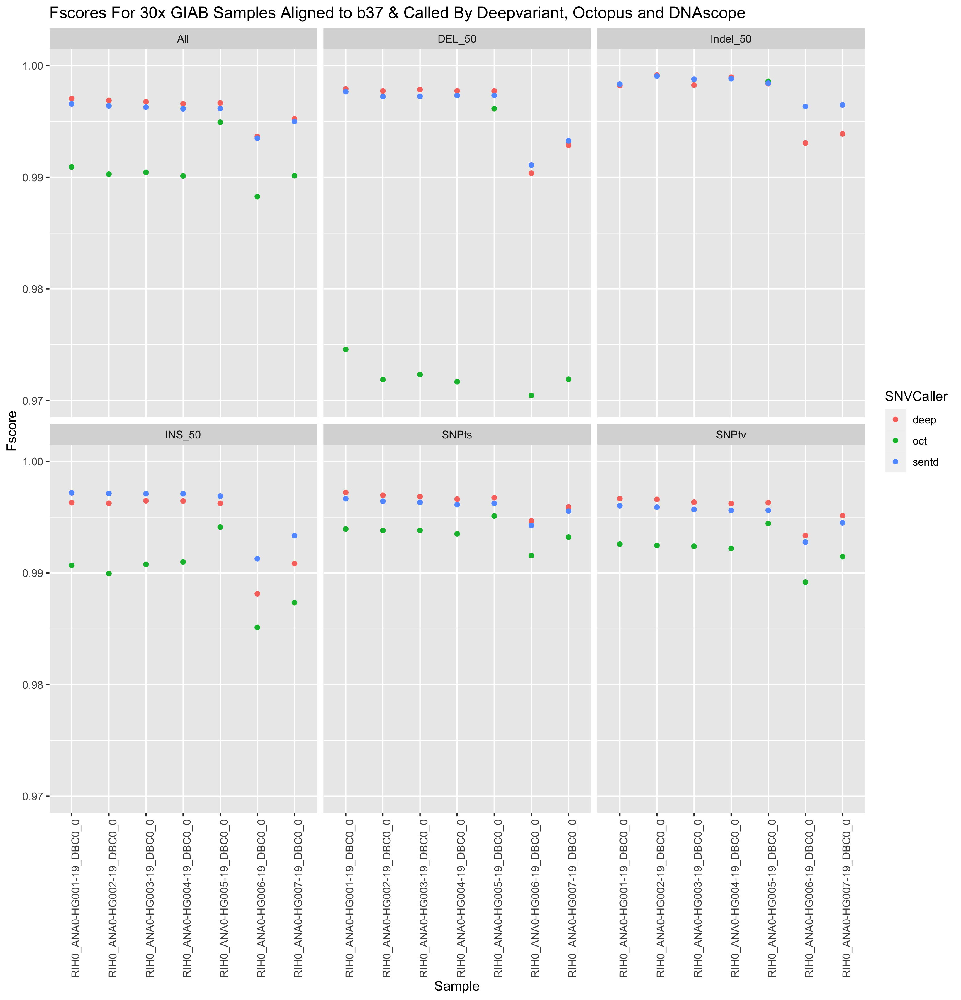
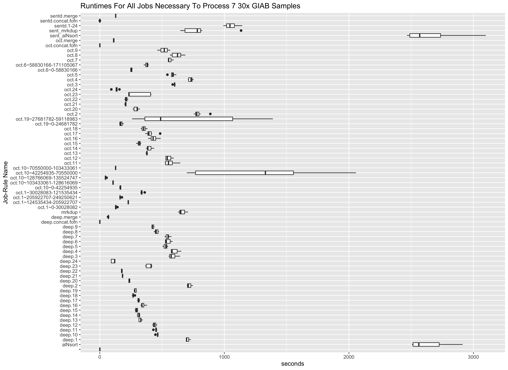

# [DAYLILY](http://daylilyinformatics.com/) && [(blog)](https://daylily-informatics.github.io/)
_v0.6.0_

## Free, Fast(~60m), Frugal(from $3.34 EC2)\^1 & Cloud Native Multi-omics Analysis Framework

30x `fastq` to SNV`vcf` at $3.34 EC2 costs, completes in 57m & process thousands of genomes an hour

- _PLUS_ SNV/SV calling options at other sensitivities / extensive sample + batch QC reporting / performance & cost reporting + budgeting  

- Daylily provides a single point of contact to the myriad systems which need to be orchestrated in order to run omic analysis reproducibly, reliably and at scale in the cloud. **All you need is a laptop and access to an AWS console**. After a [~90m installation](docs/install/video_guide.md), you will be ready to begin processing up to thousands of genomes an hour. 

- Daylily is open source and free to use(excepting the Sentieon pipeline licensing fees which will be added to that pipeline). I hope some neat tricks I deploy are of help to others [see blog](https://daylily-informatics.github.io/). 

  > **Note**
  > [Daylily Informatics](http://daylilyinformatics.com/) is available for consulting services to integrate daylily into your operations, migrate pipelines into this framework, optimize existing pipelines, or general informatics work. [daylily@daylilyinformatics.com](https://us21.list-manage.com/contact-form?u=434d42174af0051b1571c6dce&form_id=23d28c274008c0829e07aff8d5ea2e91)

## Managed Analysis Service
- Daylily Informatics offers a managed genomic analysis service where, depending on the analyses and TAT desired, you pay a per-sample fee for daylily to run the desired analysis.
- The gist of the standard deployment can be reviewed [here](https://github.com/Daylily-Informatics/daylily/blob/main/README.md#managed-genomics-analysis-services). 
  
- Please contact [daylily@daylilyinformatics.com](https://us21.list-manage.com/contact-form?u=434d42174af0051b1571c6dce&form_id=23d28c274008c0829e07aff8d5ea2e91) for further information.

  

  

# General Components Overview

  > Before getting into the cool informatics business going on, there is a boatload of complex ops systems running to manage EC2 spot instances, navigate spot markets, as well as mechanisms to monitor and observe all aspects of this framework. [AWS ParallelCluster](https://docs.aws.amazon.com/parallelcluster/latest/ug/what-is-aws-parallelcluster.html) is the glue holding everything together, and deserves special thanks.
  

# Managed Genomics Analysis Services
The system is designed to be robust, secure, auditable, and should only take a matter of days to stand up. [Please contact me for further details](https://us21.list-manage.com/contact-form?u=434d42174af0051b1571c6dce&form_id=23d28c274008c0829e07aff8d5ea2e91).

## Some Bioinformatics Bits, Big Picture

### The DAG For 1 Sample Running Through The `BWA-MEM2ert+Doppelmark+Deepvariant+Manta+TIDDIT+Dysgu+Svaba+QCforDays` Pipeline
#### NOTE: *each* node in the below DAG is run as a self-contained job. Each job/node/rule is distributed to a suitable EC2 spot(or on demand if you prefer) instance to run. Each node is a packaged/containerized unit of work. This dag represents jobs running across sometimes thousands of instances at a time. Slurm and Snakemake manage all of the scaling, teardown, scheduling, recovery and general orchestration: cherry on top: killer observability & per project resource cost reporting and budget controls!
   
   
   - The above is actually a compressed view of the jobs managed for a sample moving through this pipeline. This view is of the dag which properly reflects parallelized jobs.
   
     

## [Daylily Design Principles](docs/ops/design_principles.md)
  > Daylily was built while drawing on over 20 years of experience in clinical genomics and informatics. [These](docs/ops/design_principles.md) principles were kept front and center while building this framework.

## Some Bioinformatics Bits, Brass Tacks

### Three Pipelines: Performance, Fscores, Costs
  >  Presented below are Fscores, runtime and costs to run 3 pipelines.  The results below are generated from the google-brain 30x Novaseq fastqs for all 7 GIAB samples. These fastqs and an analysis_manifest are included in the daylily-references S3 bucket so you may run these samples to show concordance with results shown here. The tools chosen for inclusion in daylily have been heavily optimized for speed and accuracy. The reported results are the median across all 7 GIAB samples. Costs are the average EC2 spot instance price to process fq.gz->snv.vcf per sample.
 
 | Pipeline |   SNPts/SNPtv fscore  |  INS fscore |  DEL fscore | Indel fscore |  e2e walltime |  e2e instance min | Avg EC2 Cost |
 | :-------------: | :-------------: | :--------------: | :-------------: | :-------------: | :--------------: | :-------------: | :-------------: |
 |   Sentieon** BWA + SentDeDup + DNAscope (BD) | 0.996 / 0.996 | 0.997\* | 0.997 | 0.998\* | 61m | 68m\* | $3.34^\*1 - 128vcpu|
 |   BWA-MEM2 + DpplDeDup + Octopus (B2O) | 0.994 / 0.992  | 0.991 | 0.971 | 0.800 | 72.4m | 273m | $12.92 - various vcpu|
 |   BWA-MEM2 + DpplDeDup + Deepvariant (B2D) |  0.997 / 0.996\* | 0.996 | 0.998\* | 0.998\* | 57m\* | 156m | $8.54 - 128 vcpu|
 
 > ** [Visit this page more info on sentieon licensing](https://www.sentieon.com/free-trial/)
 
 > ^=s/w licensing required to run the sentieon tool
 
 > *=highest value

#### Complete View of Fscores By Sample, Variant Caller & SNV Class

#### Complete View of Rule Runtimes

</p\>

### Daylily Framework, Cont.

#### [Batch QC HTML Summary Report](http://daylilyinformatics.com:8082/reports/DAY_final_multiqc.html)
> The batch is comprised of google-brain Novaseq 30x HG002 fastqs, and again downsampling to: 25,20,15,10,5x.     
[Example report](http://daylilyinformatics.com:8082/reports/DAY_final_multiqc.html).

    
    
### [Consistent + Easy To Navigate Results Directory & File Structure](/docs/ops/dir_and_file_scheme.md)
   - A visualization of just the directories (minus log dirs) created by daylily
    _b37 shown, hg38 is supported as well_

     - [with files](docs/ops/tree_full.md   
    
### [Automated Concordance Analysis Table](http://daylilyinformatics.com:8081/components/daylily_qc_reports/other_reports/giabhcr_concordance_mqc.tsv)
  > Reported faceted by: SNPts, SNPtv, INS>0-<51, DEL>0-51, Indel>0-<51.
  > Generated when the correct info is set in the analysis_manifest.

#### [Performance Monitoring Reports]()
  > Picture and  list of tools

#### [Observability w/CloudWatch Dashboard](https://us-east-2.console.aws.amazon.com/cloudwatch/home?region=us-east-2#)
  > 
  > 
  > 

#### [Cost Tracking and Budget Enforcement](https://aws.amazon.com/blogs/compute/using-cost-allocation-tags-with-aws-parallelcluster/)
  > 
  - 
  - 
  
  

# Future Dev Targets
- [snakemake github action](https://github.com/snakemake/snakemake-github-action) tests.
- Structural Variant Calling Concordance Analysis For The SV Callers:
  - Manta
  - TIDDIT
  - Svaba
  - Dysgu
  - Octopus (which is a good small SV caller)
- Annotation of SNV / SV `vcf` files with potentially clinically relevant info (VEP is in testing).
- Document the steps to quickly re-run the 7 30x GIAB samples from scratch.
- Explore hybrid assemblies using short and long reads (ONT + PacBio).

# DOCUMENTATION (WIP)

## [Installation](docs/install/Install.md)

## [Cost Tagging](docs/ops/cost_tagging.md)

## [DEC Config](docs/ops/config.md)

## [dy-CLI](docs/ops/dycli.md)

## [Analysis Manifest](docs/ops/analysis_manifest.md)

## [Batch Quality Control](docs/ops/batch_quality_control.md)

## [Visualizations](docs/ops/visualizations.md)

## [Running Tests](docs/ops/tests.md)

# [DAY](https://en.wikipedia.org/wiki/Margaret_Oakley_Dayhoff)

_named in honor of Margaret Oakley Dahoff_

1: plus [Sentieon licensing fees](http://sentieon.com)

 
 
 
