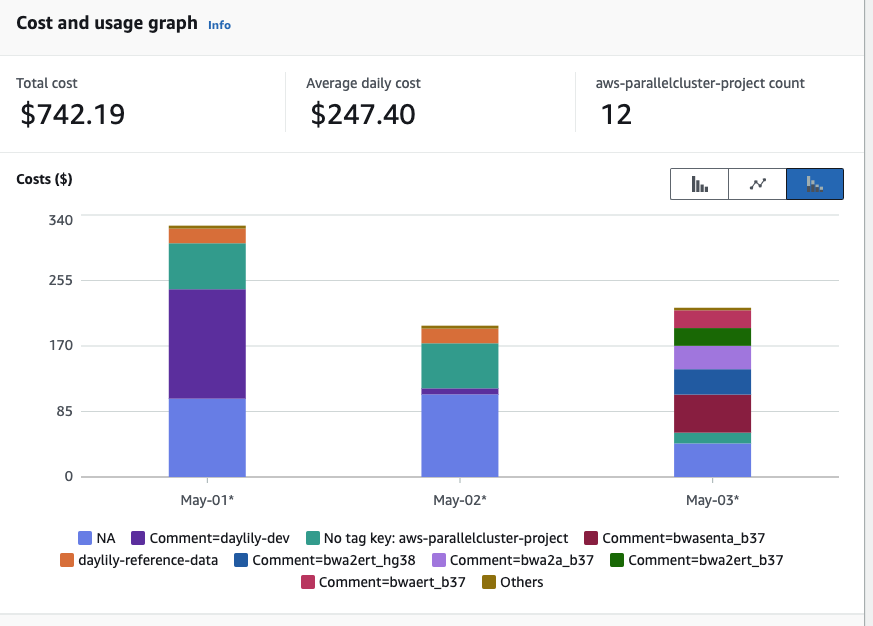

# Daylily AWS Ephemeral Cluster Setup
_(stable tagged release to use --> 0.7.196t ... use main at own risk)_

**beta release**

Daylily is a framework for setting up ephemeral AWS clusters optimized for genomics data analysis. It leverages AWS ParallelCluster and provides automated scripts for cluster creation, management, and teardown.


<p valign="middle"><a href=http://www.workwithcolor.com/color-converter-01.htm?cp=ff8c00></a></p>


## Table of Contents
## Table of Contents
- [Daylily AWS Ephemeral Cluster Setup](#daylily-aws-ephemeral-cluster-setup)
  - [Table of Contents](#table-of-contents)
  - [Table of Contents](#table-of-contents-1)
- [Intention](#intention)
  - [Shift Focus](#shift-focus)
  - [Raise the Bar](#raise-the-bar)
  - [Escape Outdated ‘Best Practices’](#escape-outdated-best-practices)
- [Intention](#intention-1)
  - [Goal 1: Shift Conversation To Better Ways of Assessing Tools, Spend Less Time Finding Winners \& Loosers](#goal-1-shift-conversation-to-better-ways-of-assessing-tools-spend-less-time-finding-winners--loosers)
  - [Goal 2: Establish Higher Expectations re: What Is Considered Sufficent Supporting Data/Docs For Published Tools](#goal-2-establish-higher-expectations-re-what-is-considered-sufficent-supporting-datadocs-for-published-tools)
  - [Goal 3: Move Beyond 'commonly accepted best practices'. Why? Because they have our field stuck in 2012](#goal-3-move-beyond-commonly-accepted-best-practices-why-because-they-have-our-field-stuck-in-2012)
- [Whitepaper In Progress](#whitepaper-in-progress)
- [What's It All About?](#whats-it-all-about)
  - [BFAIR: Bioinformatics FAIR Principles](#bfair-bioinformatics-fair-principles)
  - [Comprehensive Cost Transparency \& Predictability (wip: interactive cost calculator is available here)](#comprehensive-cost-transparency--predictability-wip-interactive-cost-calculator-is-available-here)
- [Self Funded Science](#self-funded-science)
- [Installation -- Quickest Start](#installation----quickest-start)
- [Installation -- Detailed](#installation----detailed)
  - [AWS](#aws)
    - [Create a `daylily-service`  IAM User](#create-a-daylily-service--iam-user)
    - [Attach Permissiong \& Policies To The `daylily-service` User](#attach-permissiong--policies-to-the-daylily-service-user)
      - [Permissions](#permissions)
      - [Create Service Linked Role `VERY IMPORTANT`](#create-service-linked-role-very-important)
      - [Inline Policy](#inline-policy)
    - [Additional AWS Considerations (also will need _admin_ intervention)](#additional-aws-considerations-also-will-need-admin-intervention)
      - [Quotas](#quotas)
      - [Activate Cost Allocation Tags (optional, but strongly suggested)](#activate-cost-allocation-tags-optional-but-strongly-suggested)
      - [A Note On Budgets](#a-note-on-budgets)
    - [AWS `daylily-service` User Account](#aws-daylily-service-user-account)
      - [CLI Credentials](#cli-credentials)
        - [SSH Key Pair(s)](#ssh-key-pairs)
          - [Place .pem File \& Set Permissions](#place-pem-file--set-permissions)
  - [Default Region `us-west-2`](#default-region-us-west-2)
  - [Prerequisites (On Your Local Machine)](#prerequisites-on-your-local-machine)
    - [System Packages](#system-packages)
      - [Check if your prereq's meet the min versions required](#check-if-your-prereqs-meet-the-min-versions-required)
    - [AWS CLI Configuration](#aws-cli-configuration)
      - [Opt 2](#opt-2)
    - [Clone stable release of `daylily` Git Repository](#clone-stable-release-of-daylily-git-repository)
      - [stable `daylily` release](#stable-daylily-release)
    - [Install Miniconda (homebrew is not advised)](#install-miniconda-homebrew-is-not-advised)
    - [Install DAYCLI Environment](#install-daycli-environment)
- [Ephemeral Cluster Creation](#ephemeral-cluster-creation)
  - [daylily-references-public Reference Bucket](#daylily-references-public-reference-bucket)
    - [Clone `daylily-references-public` to YOURPREFIX-omics-analysis-REGION](#clone-daylily-references-public-to-yourprefix-omics-analysis-region)
  - [Generate Analysis Cost Estimates per Availability Zone](#generate-analysis-cost-estimates-per-availability-zone)
  - [Create An Ephemeral Cluster](#create-an-ephemeral-cluster)
    - [Run Remote Slurm Tests On Headnode](#run-remote-slurm-tests-on-headnode)
    - [Review Clusters](#review-clusters)
    - [Confirm The Headnode Is Configured](#confirm-the-headnode-is-configured)
- [Costs](#costs)
  - [Monitoring (tags and budgets)](#monitoring-tags-and-budgets)
  - [Regulating Usage via Budgets](#regulating-usage-via-budgets)
  - [OF HOT \& IDLE CLUSTER ( ~$1.68 / hr )](#of-hot--idle-cluster--168--hr-)
  - [OF RUNNING CLUSTER ( \>= $1.20 / hr )](#of-running-cluster---120--hr-)
    - [Spot instances ( ~$1.20 / hr per 192vcpu instance )](#spot-instances--120--hr-per-192vcpu-instance-)
    - [Data transfer, during analysis ( ~$0.00 )](#data-transfer-during-analysis--000-)
    - [Data transfer, staging and moving off cluster ( ~$0.00 to \> $0.00/hr )](#data-transfer-staging-and-moving-off-cluster--000-to--000hr-)
    - [Storage, during analysis ( ~$0.00 )](#storage-during-analysis--000-)
  - [OF DELETED CLUSTER -- compute and Fsx ( ~$0.00 )](#of-deleted-cluster----compute-and-fsx--000-)
  - [OF REFERENCE DATA in S3 ( $14.50 / month )](#of-reference-data-in-s3--1450--month-)
  - [OF SAMPLE / READ DATA in S3 ( $0.00 to $A LOT / month )](#of-sample--read-data-in-s3--000-to-a-lot--month-)
  - [OF RESULTS DATA in S3 ( $Varies, are you storing BAM or CRAM, vcf.gz or gvcf.gz? )](#of-results-data-in-s3--varies-are-you-storing-bam-or-cram-vcfgz-or-gvcfgz-)
- [PCUI (technically optional, but you will be missing out)](#pcui-technically-optional-but-you-will-be-missing-out)
  - [Install Steps](#install-steps)
    - [Adding `inline policies` To The PCUI IAM Roles To Allow Access To Parallel Cluster Ref Buckets](#adding-inline-policies-to-the-pcui-iam-roles-to-allow-access-to-parallel-cluster-ref-buckets)
  - [PCUI Costs ( ~ $1.00 / month )](#pcui-costs---100--month-)
- [Working With The Ephemeral Clusters](#working-with-the-ephemeral-clusters)
  - [PCUI](#pcui)
  - [DAYCLI \& AWS Parallel Cluster CLI (pcluster)](#daycli--aws-parallel-cluster-cli-pcluster)
    - [Activate The DAYCLI Conda Environment](#activate-the-daycli-conda-environment)
    - [`pcluster` CLI Usage](#pcluster-cli-usage)
      - [List Clusters](#list-clusters)
      - [Describe Cluster](#describe-cluster)
      - [SSH Into Cluster Headnode](#ssh-into-cluster-headnode)
        - [Basic](#basic)
        - [Facilitated](#facilitated)
- [From The Epheemeral Cluster Headnode](#from-the-epheemeral-cluster-headnode)
  - [Confirm Headnode Configuration Is Complete](#confirm-headnode-configuration-is-complete)
    - [(if) Headnode Confiugration Incomplete](#if-headnode-confiugration-incomplete)
    - [Confirm Headnode /fsx/ Directory Structure](#confirm-headnode-fsx-directory-structure)
    - [Run A Local Test Workflow](#run-a-local-test-workflow)
      - [First, clone a new daylily repo with `day-clone`.](#first-clone-a-new-daylily-repo-with-day-clone)
      - [Next, init daylily and, set genome, stage an analysis\_manigest.csv and run a test workflow.](#next-init-daylily-and-set-genome-stage-an-analysis_manigestcsv-and-run-a-test-workflow)
      - [More On The `-j` Flag](#more-on-the--j-flag)
    - [Run A Slurm Test Workflow](#run-a-slurm-test-workflow)
      - [(RUN ON A FULL 30x WGS DATA SET)](#run-on-a-full-30x-wgs-data-set)
        - [Specify A Single Sample Manifest](#specify-a-single-sample-manifest)
        - [Specify A Multi-Sample Manifest (in this case, all 7 GIAB samples) - 2 aligners, 1 deduper, 2 snv callers](#specify-a-multi-sample-manifest-in-this-case-all-7-giab-samples---2-aligners-1-deduper-2-snv-callers)
        - [The Whole Magilla (3 aligners, 1 deduper, 5 snv callers, 3 sv callers)](#the-whole-magilla-3-aligners-1-deduper-5-snv-callers-3-sv-callers)
  - [To Create Your Own `config/analysis_manifest.csv` File From Your Own `analysis_samples.tsv` File](#to-create-your-own-configanalysis_manifestcsv-file-from-your-own-analysis_samplestsv-file)
  - [Supported References](#supported-references)
    - [b37](#b37)
    - [h38](#h38)
    - [hg38\_broad](#hg38_broad)
    - [Reference Artifacts](#reference-artifacts)
      - [Supporting Files `yaml`](#supporting-files-yaml)
      - [`/fsx/data/genomic_data/organism_references/H_sapiens/$DAY_GENOME_BUILD` Files](#fsxdatagenomic_dataorganism_referencesh_sapiensday_genome_build-files)
      - [`/fsx/data/genomic_data/organism_annotations/H_sapiens/$DAY_GENOME_BUILD` Files](#fsxdatagenomic_dataorganism_annotationsh_sapiensday_genome_build-files)
      - [Results Directories: `./results/day/$DAY_GENOME_BUILD/`](#results-directories-resultsdayday_genome_build)
  - [Slurm Monitoring](#slurm-monitoring)
    - [Monitor Slurm Submitted Jobs](#monitor-slurm-submitted-jobs)
    - [SSH Into Compute Nodes](#ssh-into-compute-nodes)
    - [Delete Cluster](#delete-cluster)
    - [Export `fsx` Analysis Results Back To S3](#export-fsx-analysis-results-back-to-s3)
      - [Facilitated](#facilitated-1)
      - [Via `FSX` Console](#via-fsx-console)
      - [Delete The Cluster, For Real](#delete-the-cluster-for-real)
- [Other Monitoring Tools](#other-monitoring-tools)
  - [PCUI (Parallel Cluster User Interface)](#pcui-parallel-cluster-user-interface)
  - [Quick SSH Into Headnode](#quick-ssh-into-headnode)
  - [AWS Cloudwatch](#aws-cloudwatch)
- [And There Is More](#and-there-is-more)
  - [S3 Reference Bucket \& Fsx Filesystem](#s3-reference-bucket--fsx-filesystem)
    - [PREFIX-omics-analysis-REGION Reference Bucket](#prefix-omics-analysis-region-reference-bucket)
      - [Reference Bucket Metrics](#reference-bucket-metrics)
    - [The `YOURPREFIX-omics-analysis-REGION` s3 Bucket](#the-yourprefix-omics-analysis-region-s3-bucket)
      - [daylily-references-public Bucket Contents](#daylily-references-public-bucket-contents)
        - [Top Level Diretories](#top-level-diretories)
- [Fsx Filesystem](#fsx-filesystem)
  - [Fsx Directory Structure](#fsx-directory-structure)
- [In Progress // Future Development](#in-progress--future-development)
  - [Re-enable Sentieon Workflows \& Include in Benchmarking](#re-enable-sentieon-workflows--include-in-benchmarking)
  - [Add Strobe Aligner To Benchmarking](#add-strobe-aligner-to-benchmarking)
  - [Using Data From Benchmarking Experiments, Complete The Comprehensive Cost Caclulator](#using-data-from-benchmarking-experiments-complete-the-comprehensive-cost-caclulator)
  - [Break Daylily Into 2 Parts: 1) Ephermal Cluster Manager 2) Analysis Pipeline](#break-daylily-into-2-parts-1-ephermal-cluster-manager-2-analysis-pipeline)
  - [Update Analysis Pipeline To Run With Snakemake v8.\*](#update-analysis-pipeline-to-run-with-snakemake-v8)
  - [Cromwell \& WDL's](#cromwell--wdls)
- [General Components Overview](#general-components-overview)
- [Managed Genomics Analysis Services](#managed-genomics-analysis-services)
  - [Some Bioinformatics Bits, Big Picture](#some-bioinformatics-bits-big-picture)
    - [The DAG For 1 Sample Running Through The `BWA-MEM2ert+Doppelmark+Deepvariant+Manta+TIDDIT+Dysgu+Svaba+QCforDays` Pipeline](#the-dag-for-1-sample-running-through-the-bwa-mem2ertdoppelmarkdeepvariantmantatidditdysgusvabaqcfordays-pipeline)
    - [Daylily Framework, Cont.](#daylily-framework-cont)
      - [Batch QC HTML Summary Report](#batch-qc-html-summary-report)
    - [Consistent + Easy To Navigate Results Directory \& File Structure](#consistent--easy-to-navigate-results-directory--file-structure)
    - [Automated Concordance Analysis Table](#automated-concordance-analysis-table)
      - [Performance Monitoring Reports](#performance-monitoring-reports)
      - [Observability w/CloudWatch Dashboard](#observability-wcloudwatch-dashboard)
      - [Cost Tracking and Budget Enforcement](#cost-tracking-and-budget-enforcement)
- [Metrics Required To Make Informed Decisions About Choosing An Analysis Pipeline](#metrics-required-to-make-informed-decisions-about-choosing-an-analysis-pipeline)
  - [Accuracy / Precision / Recall / Fscore](#accuracy--precision--recall--fscore)
  - [User Run Time](#user-run-time)
  - [Cost Of Analysis](#cost-of-analysis)
    - [Init Cost](#init-cost)
    - [Compute Cost](#compute-cost)
    - [Storage Cost (for computation)](#storage-cost-for-computation)
    - [Other Costs (ie: data transfer)](#other-costs-ie-data-transfer)
  - [Cost of Storage](#cost-of-storage)
  - [Reproducibility](#reproducibility)
  - [Longevity of Results](#longevity-of-results)
- [Sentieon Tools \& License](#sentieon-tools--license)
- [Contributing](#contributing)
- [Versioning](#versioning)
- [Known Issues](#known-issues)
  - [_Fsx Mount Times Out During Headnode Creation \& Causes Pcluster `build-cluster` To Fail_](#fsx-mount-times-out-during-headnode-creation--causes-pcluster-build-cluster-to-fail)
  - [Cloudstack Formation Fails When Creating Clusters In \>1 AZ A Region (must be manually sorted ATM)](#cloudstack-formation-fails-when-creating-clusters-in-1-az-a-region-must-be-manually-sorted-atm)
- [Compliance / Data Security](#compliance--data-security)
- [Detailed Docs](#detailed-docs)
- [DAY](#day)


# Intention
  > The goal of daylily is to enable more rigorous comparisons of informatics tools by formalizing their compute environments and establishing hardware profiles that reproduce each tool’s accuracy and runtime/cost performance. This approach is general, not tied to a single toolset; while AWS is involved, nothing prevents deployment elsewhere. AWS simply offers a standardized hardware environment accessible to anyone with an account. By “compute environment,” I mean more than a container—containers alone don’t guarantee hardware performance, and cost/runtime considerations demand reproducibility on specific hardware. Though daylily uses containers and conda, it remains agnostic about the tools themselves. I have three main aims: I have three main aims:

## Shift Focus
  Move away from unhelpful debates over “the best” tool and toward evidence-based evaluations. Real use cases dictate tool choice, so let’s make sure relevant data and clear methodologies are accessible—or at least ensure enough detail is published to make meaningful comparisons. Specifically, I wish to move away from scant and overly reductive metrics which fail to describe our tools in as rich detail as they can be. ie:

  > If I am looking for the best possible `recall` in SNV calling, initial data suggestes I might look towards [`sentieon bwa`+`sentieon DNAscope`](https://www.sentieon.com/) ... and interestingly, if I wanted the best possible `precision`, it would be worth investigating [`strobealigner`](https://github.com/ksahlin/strobealign) + `deepvariant` ([REF DATA](https://github.com/Daylily-Informatics/daylily_giab_analyses/blob/main/results/us_west_2d/all/concordance/pvr/hg38_usw2d-all__All_zoom.png)). `Fscore` would not be as informative for these more sepcific cases.

## Raise the Bar 
  Demand better metrics and documentation in tool publications: thorough cost data, specific and reproducible hardware details, more nuanced concordance metrics, and expansive QC reporting. Half-measures shouldn’t pass as “sufficient.”

## Escape Outdated ‘Best Practices’
  They were helpful at first, but our field is stuck in 2012. We need shareable frameworks that capture both accuracy and cost/runtime for truly reproducible pipeline performance—so we can finally move forward.

  > [The daylily GIAB analyses repository contains (work in progress)](https://github.com/Daylily-Informatics/daylily_giab_analyses) results from the first stable daylily release, run on seven GIAB samples.


# Intention

> The intention of [**`daylily`**](https://github.com/Daylily-Informatics/daylily) is to provide a framework to better compare informatics tools, which I assert requires a great deal more control over compute hardware than is common presently.  Simply providing a container is insufficent in allowing for reproducible and meaningful comparisons b/c increasingly cost/runtime weigh as heavily as accuracy does in deciding between tools. Informatics tools must be presented with an (as best possibly) paired hardware environment where the asserted performance of the tool can be reproduced.  I have 3 goals here.

## Goal 1: Shift Conversation To Better Ways of Assessing Tools, Spend Less Time Finding Winners & Loosers
I am not really interested in advocating for which tool is the best for `x` application. My experience has been that selecting tools tends to be highly use-case driven, and what is helpful when making these decisions are datasets and approaches to evaluate a tool for your needs.... and barring this, at least being able to find sufficent information to make comparisons from published data would be nice.  

## Goal 2: Establish Higher Expectations re: What Is Considered Sufficent Supporting Data/Docs For Published Tools
I hope this conversation helps to set a higher expectation regarding what consititutes sufficent metrics and documentation produce when discussing these tools which allow unambiguous assessments of tools (so: detailed and comprehensive cost data, details on hardware which publised performance may be reporduced on, far richer concordance metrics and expansive QC reporting).

## Goal 3: Move Beyond 'commonly accepted best practices'. Why? Because they have our field stuck in 2012
I consider best practices to be a helpful starting point of investigation when moving into a new space, not as the end of the story. Rather than continue into a very satisfying rant, I'll offer that `best practices` have become so entrenched because there are not yet easily sharable frameworks to get reporducible pipepleine perofrmance (again, both in accuracy AND runtime/cost), and this factor is a very significant contributor to how stuck we are in quite outdated best practices. I think `daylily` can help.

> The [daylily GIAB analyses](https://github.com/Daylily-Informatics/daylily_giab_analyses) repo will holds the (_WIP_) analsis from reuslts of the first stable release of `daylily` running on 7 GIAB samples. 

---

# [Whitepaper In Progress](https://github.com/Daylily-Informatics/daylily_giab_analyses/blob/main/docs/whitepaper_draft.md)

Drafting in progress, with the intention of publishing the results in [f1000-research](https://f1000research.com/).

In order to demonstrate the capabilities of daylily, I am processing the 7 GIAB datasets vs: 3 aligners, 1 deduper, 5 SNV callers and 3 SV callers (plus generating concordance results and a variety of qc data), for both `b37` and `hg38`, which yields:
> - 41 BAMs
> -  210 SNV vcfs
> - 129 SV vcfs
> -  2 multiqc reports (per reference)
> -   many qc data files
> -   COST reporting for every task

I will be assessing:
> - Infrastructure management aspects of daylily.
> - Impact on accuracy and cost of all the combinations of above tools.
>   - costs (spoiler:  best performance  is in the $3-4/sample is reasonably to assume) of compute, data transfer, data storage & long term data storage.
>   - fscore (spoiler: as expected performance acheivable of 0.998+)
> - Globally, raising questions about bfx analysis reproducibility, best practices vs. best performance/accuracy, ...


> Would you like to lend a hand?  [contact me](mailto:john@daylilyinformatics.com)


# What's It All About?

## BFAIR: Bioinformatics [FAIR](https://www.go-fair.org/fair-principles/) Principles 
_this is a title rough idea! - not likely final, but is the gist of it_

## Comprehensive Cost Transparency & Predictability [(wip: interactive cost calculator is available here)](https://day.dyly.bio)

> 30x FASTQ->VCF, in 1hr, for ~$3 - $4 @ F-score 0.99xx

> Be up and running in a few hours from reading this sentence. 
> - Have your first GIAB 30x Fastq->VCF (both snv and sv) ~60min later. 
> - The (_onetime_) cost of staging data is ~$20, analysis will be ` ~$3.00 to $5.00 ` (pricing is established dynamically at cluster creation, and you can inspect the max bound on spot prices which are possible, this sets your upper bound... as does complexity of pipeline, but more on that latter).

**Time to result, Cost of analysis, Accuracy && Integrated Concordance/Comparison**: These are key elements required in making solid analysis decisions, and in setting the stage for analysis decisions which can improve in tandem as the field advances. 

**Cost Optimization & Predictability**:  With benchmarked, reproducible analysis on stable and reproducible computing platforms, it is possible to optimze for the most beneficial compute locale && to predict expected (and bound highest) per-sample cost to analyze.

**Cost Transparency & Management**:  IRT views into what is being spent, and where.  Not just compute, but data transfer, sroage, and other _ALL_ other costs. No specialized hardware investment needed, no contracts, pay for what you use. 

**Pro Open Source**: All out of the box functionality here is open source, and does not require any investment in software liscneces, etc. This is important for both future proof reproducibility and ongoing cost management. This said, daylily is not hostile to s/w that requires liscences (if selection of closed s/w is made understanding tradeoffs, if any, in long term reproducibility), but you will need to purchase those separately.

- https://github.com/aws/aws-parallelcluster makes the cluster creation/management possible.
- snakemake
- all the tools!

<p valign="middle"><a href=http://www.workwithcolor.com/color-converter-01.htm?cp=ff00ff></a></p>

<p valign="middle"></p>

# Self Funded Science

> Daylily development has been under development for a number of years & is self-funded work (both time, and AWS costs).
> - [I am available for consulting](https://www.dyly.bio) engagements if you are interested in extending the work here. My areas of expertise also include cllical diagnostics operations, regulatory and compliance.

<hr>

# Installation -- Quickest Start
_most useful if you have already installed daylily previously_

- [Can be found here](docs/quickest_start.md).


# Installation -- Detailed

## AWS 

### Create a `daylily-service`  IAM User
_as the admin user_

From the `Iam -> Users` console, create a new user.

- Allow the user to access the AWS Management Console.
- Select `I want to create an IAM user` _note: the insstructions which follow will probably not work if you create a user with the `Identity Center` option_.
- Specify or autogenerate a p/w, note it down.
- `click next`
- Skip (for now) attaching a group / copying permissions / attaching policies, and `click next`.
- Review the confiirmation page, and click `Create user`.
- On the next page, capture the `Console sign-in URL`, `username`, and `password`. You will need these to log in as the `daylily-service` user.

### Attach Permissiong & Policies To The `daylily-service` User
_still as the admin user_

#### Permissions

- Navigate to the `IAM -> Users` console, click on the `daylily-service` user.
- Click on the `Add permissions` button, then select `Add permission`, `Attach policies directly`.
- Search for `AmazonQDeveloperAccess` , select and add.
- Search for `AmazonEC2SpotFleetAutoscaleRole`, select and add.
- Search for `AmazonEC2SpotFleetTaggingRole`, select and add.

#### Create Service Linked Role `VERY IMPORTANT`

> If this role is missing, you will get very challenging to debug failures for spot instances to launch, despite the cluster building and headnode running fine.

- Does it exist?
```bash
aws iam list-roles --query "Roles[?RoleName=='AWSServiceRoleForEC2Spot'].RoleName"
```
> if `[]`, then it does not exist.

- Create it if not:
```bash
aws iam create-service-linked-role --aws-service-name spot.amazonaws.com
```


#### Inline Policy
__**note:**__ [please consult the parallel cluster docs for fine grained permissions control, the below is a broad approach](https://docs.aws.amazon.com/parallelcluster/latest/ug/iam-roles-in-parallelcluster-v3.html).
- Navigate to the `IAM -> Users` console, click on the `daylily-service` user.
- Click on the `Add permissions` button, then select `create inline policy`.
- Click on the `JSON` bubble button.
- Delete the auto-populated json in the editor window, and paste this json into the editor (replace 3 instances of  <AWS_ACCOUNT_ID> with your new account number, an integer found in the upper right dropdown).

> [The policy template json can be found here](config/aws/daylily-service-cluster-policy.json)

- `click next`
- Name the policy `daylily-service-cluster-policy` (not formally mandatory, but advised to bypass various warnings in future steps), then click `Create policy`.


### Additional AWS Considerations (also will need _admin_ intervention)
#### Quotas
There are a handful of quotas which will greatly limit (or block) your ability to create and run an ephemeral cluster.  These quotas are set by AWS and you must request increases. The `daylily-cfg=ephemeral-cluster` script will check these quotas for you, and warn if it appears they are too low,  but you should be aware of them and [request increases proactively // these requests have no cost](https://console.aws.amazon.com/servicequotas/home).

**dedicated instances**
_pre region quotas_
- `Running Dedicated r7i Hosts` >= 1 **!!(AWS default is 0) !!**
- `Running On-Demand Standard (A, C, D, H, I, M, R, T, Z) instances` must be >= 9 **!!(AWS default is 5) !!** just to run the headnode, and will need to be increased further for ANY other dedicated instances you (presently)/(will) run.

**spot instances**
_per region quotas_
- `All Standard (A, C, D, H, I, M, R, T, Z) Spot Instance Requests` must be >= 310 (and preferable >=2958) **!!(AWS default is 5) !!**

**fsx lustre**
_per region quotas_
- should minimally allow creation of a FSX Lustre filesystem with >= 4.8 TB storage, which should be the default.

**other quotas**
May limit you as well, keep an eye on `VPC` & `networking` specifically.


#### Activate Cost Allocation Tags (optional, but strongly suggested)
The cost management built into daylily requires use of budgets and cost allocation tags. Someone with permissions to do so will need to activate these tags in the billing console. *note: if no clusters have yet been created, these tags may not exist to be activeted until the first cluster is running. Activating these tags can happen at any time, it will not block progress on the installation of daylily if this is skipped for now*. See [AWS cost allocation tags](https://us-east-1.console.aws.amazon.com/billing/home#/tags)

The tags to activate are:
  ```text
  aws-parallelcluster-jobid
  aws-parallelcluster-username
  aws-parallelcluster-project
  aws-parallelcluster-clustername
  aws-parallelcluster-enforce-budget
  ```


#### A Note On Budgets
- The access necesary to *view* budgets is beyond the scope of this config, please work with your admin to set that up. If you are able to create clusters and whatnot, then the budgeting infrastructure should be working.


### AWS `daylily-service` User Account
- Login to the AWS console as the `daylily-service` user using the console URL captured above.

#### CLI Credentials
_as the `daylily-service` user_
- Click your username in the upper right, select `Security credentials`, scroll down to `Access keys`, and click `Create access key` (many services will be displaying that they are not available, this is ok).
- Choose 'Command Line Interface (CLI)', check `I understand` and click `Next`.
- Do not tag the key, click `Next`.
**IMPORTANT**: Download the `.csv` file, and store it in a safe place. You will not be able to download it again. This contains your `aws_access_key_id` and `aws_secret_access_key` which you will need to configure the AWS CLI. You may also copy this info from the confirmation page.

> You will use the `aws_access_key_id` and `aws_secret_access_key` to configure the AWS CLI on your local machine in a future step.


##### SSH Key Pair(s)
_as the `daylily-service` user_

> Must include `-omics-` in the name!

_key pairs are region specific, be sure you create a key pair in the region you intend to create an ephemeral cluster in_

- Navigate to the `EC2 dashboard`, in the left hand menu under `Network & Security`, click on `Key Pairs`. 
- CLick `Create Key Pair`.
- Give it a name, which must include the string `-omics-analysis`. So, _ie:_ `username-omics-analysis-region`. 
- Choose `Key pair type` of `ed25519`.
- Choose `.pem` as the file format.
- Click `Create key pair`.
- The `.pem` file will download, and please move it into your `~/.ssh` dir and give it appropriate permissions. _you may not download this file again, so be sure to store it in a safe place_.

###### Place .pem File & Set Permissions

```bash
mkdir -p ~/.ssh
chmod 700 ~/.ssh

mv ~/Downloads/<yourkey>.pem  ~/.ssh/<yourkey>.pem 
chmod 400 ~/.ssh/<yourkey>.pem`
```

## Default Region `us-west-2`
You may run in any region or AZ you wish to try. This said, the majority of testing has been done in AZ's `us-west-2c` & `us-west-2d` (which have consistently been among the most cost effective & available spot markets for the instance types used in the daylily workflows).


---


## Prerequisites (On Your Local Machine) 
Local machine development has been carried out exclusively on a mac using the `zsh` shell. `bash` should work as well (if you have issues with conda w/mac+bash, confirm that after miniconda install and conda init, the correct `.bashrc` and `.bash_profile` files were updated by `conda init`).
 
_suggestion: run things in tmux or screen_

Very good odds this will work on any mac and most Linux distros (ubuntu 22.04 are what the cluster nodes run). Windows, I can't say.

### System Packages
Install with `brew` or `apt-get`:
- `python3`, tested with `3.11.0
- `git`, tested with `2.46.0`
- `wget`, tested with `1.25.0`
- `awscli`, tested with `2.22.4` [AWS CLI docs](https://docs.aws.amazon.com/cli/latest/userguide/install-cliv2.html)
- `tmux` (optional, but suggested)
- `emacs` (optional, I guess, but I'm not sure how to live without it)

#### Check if your prereq's meet the min versions required
```bash
./bin/check_prereq_sw.sh 
```

### AWS CLI Configuration
#### Opt 2
Create the aws cli files and directories manually.

```bash
mkdir ~/.aws
chmod 700 ~/.aws

touch ~/.aws/credentials
chmod 600 ~/.aws/credentials

touch ~/.aws/config
chmod 600 ~/.aws/config
```

Edit `~/.aws/config`, which should look like:

```yaml
[default]
region = us-west-2
output = json

[daylily-service]
region = us-west-2
output = json

```

Edit `~/.aws/credentials`, and add your deets, which should look like:
```yaml
[default]
aws_access_key_id = <default-ACCESS_KEY>
aws_secret_access_key = <default-SECRET_ACCESS_KEY>
region = <REGION>


[daylily-service]
aws_access_key_id = <daylily-service-ACCESS_KEY>
aws_secret_access_key = <daylily-service-SECRET_ACCESS_KEY>
region = <REGION>
```

- The `default` profile is used for general AWS CLI commands, `daylily-service` can be the same as default, best practice to not lean on default, but be explicit with the intended AWS_PROFILE used.

> To automatically use a profile other than `default`, set the `AWS_PROFILE` environment variable to the profile name you wish to use. _ie:_ `export AWS_PROFILE=daylily-service`


### Clone stable release of `daylily` Git Repository

```bash
git clone -b $(yq -r '.daylily.git_tag' "config/daylily/daylily_cli_global.yaml") https://github.com/Daylily-Informatics/daylily.git  # or, if you have set ssh keys with github and intend to make changes:  git clone git@github.com:Daylily-Informatics/daylily.git
cd daylily
```

#### stable `daylily` release

This repo is cloned to your working environment, and cloned again each time a cluster is created and again for each analysis set executed on the cluster.  The version is pinned to a tagged release so that all of these clones work from the same released version.  This is accomplished by all clone operations pulling the release via:

```bash
echo "Pinned release: "$(yq -r '.daylily.git_tag' "config/daylily_cli_global.yaml")
```

Further, when attemtping to activate an environment on an ephemeral cluster with `dy-a`, this will check to verify that the cluster deployment was created with the matching tag, and throw an error if a mismatch is detected. You can also find the tag logged in the cluster yaml created in `~/.config/daylily/<yourclustername>.yaml`.


### Install Miniconda (homebrew is not advised)
_tested with conda version **`24.11.1`**_

Install with:
```bash
./bin/install_miniconda
```
- open a new terminal/shell, and conda should be available: `conda -v`.

### Install DAYCLI Environment
_from `daylily` root dir_

```bash

./bin/init_daycli 

conda activate DAYCLI

# DAYCLI should now be active... did it work?
colr  'did it work?' 0,100,255 255,100,0

```

- You should see:
 
  > 


<p valign="middle"></p>

# Ephemeral Cluster Creation

## [daylily-references-public](#daylily-references-public-bucket-contents) Reference Bucket

- The `daylily-references-public` bucket is preconfigured with all the necessary reference data to run the various pipelines, as well as including GIAB reads for automated concordance. 
- This bucket will need to be cloned to a new bucket with the name `<YOURPREFIX>-omics-analysis-<REGION>`, one for each region you intend to run in.
- These S3 buckets are tightly coupled to the `Fsx lustre` filesystems (which allows 1000s of concurrnet spot instances to read/write to the shared filesystem, making reference and data management both easier and highly performant). 
- [Continue for more on this topic,,,](#s3-reference-bucket--fsx-filesystem).
- This will cost you ~$23 to clone w/in `us-west-2`, up to $110 across regions. _(one time, per region, cost)_ 
- The bust will cost ~$14.50/mo to keep hot in `us-west-2`. It is not advised, but you may opt to remove unused reference data to reduce the monthly cost footprint by up to 65%. _(monthly ongoing cost)_

### Clone `daylily-references-public` to YOURPREFIX-omics-analysis-REGION

_from your local machine, in the daylily git repo root_

> You may add/remove/update your copy of the refernces bucket as you find necessary.

- `YOURPREFIX` will be used as the bucket name prefix. Please keep it short. The new bucket name will be `YOURPREFIX-omics-analysis-REGION` and created in the region you specify. You may name the buckets in other ways, but this will block you from using the `daylily-create-ephemeral-cluster` script, which is largely why you're here.
- Cloning it will take 1 to many hours.
  
**Use the following script**

_running in a tmux/screen session is advised as the copy may take 1-many hours_

```bash
conda activate DAYCLI
# help
./bin/create_daylily_omics_analysis_s3.sh -h

export AWS_PROFILE=<your_profile>
BUCKET_PREFIX=<your_prefix>
REGION=us-west-2

# dryrun
./bin/create_daylily_omics_analysis_s3.sh  --disable-warn --region $REGION --profile $AWS_PROFILE --bucket-prefix $BUCKET_PREFIX

# run for real
./bin/create_daylily_omics_analysis_s3.sh  --disable-warn --region $REGION --profile $AWS_PROFILE --bucket-prefix $BUCKET_PREFIX --disable-dryrun

```

> You may visit the `S3` console to confirm the bucket is being cloned as expected. The copy (if w/in `us-west-2` should take ~1hr, much longer across AZs.  

---

## Generate Analysis Cost Estimates per Availability Zone 

_from your local machine, in the daylily git repo root_

You may choose any AZ to build and run an ephemeral cluster in (assuming resources both exist and can be requisitioned in the AZ). Run the following command to scan the spot markets in the AZ's you are interested in assessing (reference buckets do not need to exist in the regions you scan, but to ultimately run there, a reference bucket is required):

_this command will take ~5min to complete, and much longer if you expand to all possible AZs, run with `--help` for all flags_

```bash

conda activate DAYCLI
export AWS_PROFILE=daylily-service
REGION=us-west-2          
OUT_TSV=./init_daylily_cluster.tsv

./bin/check_current_spot_market_by_zones.py -o $OUT_TSV --profile $AWS_PROFILE   
```

  > 


```ansi
30.0-cov genome @ vCPU-min per x align: 307.2 vCPU-min per x snvcall: 684.0 vCPU-min per x other: 0.021 vCPU-min per x svcall: 19.0
╒═══════════════════╤════════════╤═══════════╤═══════════╤═══════════╤════════════╤═══════════╤═══════════╤═══════════╤═══════════╤═══════════╤═══════════╤═══════════╤═══════════╤════════════╤════════════╕
│ Region AZ         │   #        │    Median │      Min  │      Max  │   Harmonic │     Spot  │     FASTQ │      BAM  │      CRAM │      snv  │      snv  │      sv   │     Other │      $ per │   ~ EC2 $  │
│                   │   Instance │    Spot $ │      Spot │      Spot │   Mean     │     Stab- │     (GB)  │      (GB) │      (GB) │      VCF  │      gVCF │      VCF  │     (GB)  │   vCPU min │            │
│                   │   Types    │           │      $    │      $    │   Spot $   │     ility │           │           │           │      (GB) │      (GB) │      (GB) │           │   harmonic │   harmonic │
╞═══════════════════╪════════════╪═══════════╪═══════════╪═══════════╪════════════╪═══════════╪═══════════╪═══════════╪═══════════╪═══════════╪═══════════╪═══════════╪═══════════╪════════════╪════════════╡
│ 1. us-west-2a     │          6 │   3.55125 │   2.53540 │   9.03330 │    3.63529 │   6.49790 │  49.50000 │  39.00000 │  13.20000 │   0.12000 │   1.20000 │   0.12000 │   0.00300 │    0.00032 │    9.56365 │
├───────────────────┼────────────┼───────────┼───────────┼───────────┼────────────┼───────────┼───────────┼───────────┼───────────┼───────────┼───────────┼───────────┼───────────┼────────────┼────────────┤
│ 2. us-west-2b     │          6 │   2.69000 │   0.93270 │   7.96830 │    2.06066 │   7.03560 │  49.50000 │  39.00000 │  13.20000 │   0.12000 │   1.20000 │   0.12000 │   0.00300 │    0.00018 │    5.42115 │
├───────────────────┼────────────┼───────────┼───────────┼───────────┼────────────┼───────────┼───────────┼───────────┼───────────┼───────────┼───────────┼───────────┼───────────┼────────────┼────────────┤
│ 3. us-west-2c     │          6 │   2.45480 │   0.92230 │   5.14490 │    1.80816 │   4.22260 │  49.50000 │  39.00000 │  13.20000 │   0.12000 │   1.20000 │   0.12000 │   0.00300 │    0.00016 │    4.75687 │
├───────────────────┼────────────┼───────────┼───────────┼───────────┼────────────┼───────────┼───────────┼───────────┼───────────┼───────────┼───────────┼───────────┼───────────┼────────────┼────────────┤
│ 4. us-west-2d     │          6 │   1.74175 │   0.92420 │   4.54950 │    1.71232 │   3.62530 │  49.50000 │  39.00000 │  13.20000 │   0.12000 │   1.20000 │   0.12000 │   0.00300 │    0.00015 │    4.50474 │
├───────────────────┼────────────┼───────────┼───────────┼───────────┼────────────┼───────────┼───────────┼───────────┼───────────┼───────────┼───────────┼───────────┼───────────┼────────────┼────────────┤
│ 5. us-east-1a     │          6 │   3.21395 │   1.39280 │   4.56180 │    2.37483 │   3.16900 │  49.50000 │  39.00000 │  13.20000 │   0.12000 │   1.20000 │   0.12000 │   0.00300 │    0.00021 │    6.24766 │
├───────────────────┼────────────┼───────────┼───────────┼───────────┼────────────┼───────────┼───────────┼───────────┼───────────┼───────────┼───────────┼───────────┼───────────┼────────────┼────────────┤
│ 6. us-east-1b     │          6 │   3.06900 │   1.01450 │   6.97430 │    2.48956 │   5.95980 │  49.50000 │  39.00000 │  13.20000 │   0.12000 │   1.20000 │   0.12000 │   0.00300 │    0.00022 │    6.54950 │
├───────────────────┼────────────┼───────────┼───────────┼───────────┼────────────┼───────────┼───────────┼───────────┼───────────┼───────────┼───────────┼───────────┼───────────┼────────────┼────────────┤
│ 7. us-east-1c     │          6 │   3.53250 │   1.11530 │   4.86300 │    2.69623 │   3.74770 │  49.50000 │  39.00000 │  13.20000 │   0.12000 │   1.20000 │   0.12000 │   0.00300 │    0.00023 │    7.09320 │
├───────────────────┼────────────┼───────────┼───────────┼───────────┼────────────┼───────────┼───────────┼───────────┼───────────┼───────────┼───────────┼───────────┼───────────┼────────────┼────────────┤
│ 8. us-east-1d     │          6 │   2.07570 │   0.92950 │   6.82380 │    1.79351 │   5.89430 │  49.50000 │  39.00000 │  13.20000 │   0.12000 │   1.20000 │   0.12000 │   0.00300 │    0.00016 │    4.71835 │
├───────────────────┼────────────┼───────────┼───────────┼───────────┼────────────┼───────────┼───────────┼───────────┼───────────┼───────────┼───────────┼───────────┼───────────┼────────────┼────────────┤
│ 9. ap-south-1a    │          6 │   1.78610 │   1.01810 │   3.51470 │    1.63147 │   2.49660 │  49.50000 │  39.00000 │  13.20000 │   0.12000 │   1.20000 │   0.12000 │   0.00300 │    0.00014 │    4.29204 │
├───────────────────┼────────────┼───────────┼───────────┼───────────┼────────────┼───────────┼───────────┼───────────┼───────────┼───────────┼───────────┼───────────┼───────────┼────────────┼────────────┤
│ 10. ap-south-1b   │          6 │   1.29050 │   1.00490 │   2.24560 │    1.37190 │   1.24070 │  49.50000 │  39.00000 │  13.20000 │   0.12000 │   1.20000 │   0.12000 │   0.00300 │    0.00012 │    3.60917 │
├───────────────────┼────────────┼───────────┼───────────┼───────────┼────────────┼───────────┼───────────┼───────────┼───────────┼───────────┼───────────┼───────────┼───────────┼────────────┼────────────┤
│ 11. ap-south-1c   │          6 │   1.26325 │   0.86570 │   1.42990 │    1.18553 │   0.56420 │  49.50000 │  39.00000 │  13.20000 │   0.12000 │   1.20000 │   0.12000 │   0.00300 │    0.00010 │    3.11886 │
├───────────────────┼────────────┼───────────┼───────────┼───────────┼────────────┼───────────┼───────────┼───────────┼───────────┼───────────┼───────────┼───────────┼───────────┼────────────┼────────────┤
│ 12. ap-south-1d   │          0 │ nan       │ nan       │ nan       │  nan       │ nan       │ nan       │ nan       │ nan       │ nan       │ nan       │ nan       │ nan       │  nan       │  nan       │
├───────────────────┼────────────┼───────────┼───────────┼───────────┼────────────┼───────────┼───────────┼───────────┼───────────┼───────────┼───────────┼───────────┼───────────┼────────────┼────────────┤
│ 13. eu-central-1a │          6 │   5.88980 │   2.02420 │  15.25590 │    4.32093 │  13.23170 │  49.50000 │  39.00000 │  13.20000 │   0.12000 │   1.20000 │   0.12000 │   0.00300 │    0.00038 │   11.36744 │
├───────────────────┼────────────┼───────────┼───────────┼───────────┼────────────┼───────────┼───────────┼───────────┼───────────┼───────────┼───────────┼───────────┼───────────┼────────────┼────────────┤
│ 14. eu-central-1b │          6 │   2.00245 │   1.11620 │   2.97580 │    1.72476 │   1.85960 │  49.50000 │  39.00000 │  13.20000 │   0.12000 │   1.20000 │   0.12000 │   0.00300 │    0.00015 │    4.53746 │
├───────────────────┼────────────┼───────────┼───────────┼───────────┼────────────┼───────────┼───────────┼───────────┼───────────┼───────────┼───────────┼───────────┼───────────┼────────────┼────────────┤
│ 15. eu-central-1c │          6 │   1.90570 │   1.15920 │   3.36620 │    1.71591 │   2.20700 │  49.50000 │  39.00000 │  13.20000 │   0.12000 │   1.20000 │   0.12000 │   0.00300 │    0.00015 │    4.51419 │
├───────────────────┼────────────┼───────────┼───────────┼───────────┼────────────┼───────────┼───────────┼───────────┼───────────┼───────────┼───────────┼───────────┼───────────┼────────────┼────────────┤
│ 16. ca-central-1a │          6 │   3.89545 │   3.42250 │   5.23380 │    4.04001 │   1.81130 │  49.50000 │  39.00000 │  13.20000 │   0.12000 │   1.20000 │   0.12000 │   0.00300 │    0.00035 │   10.62839 │
├───────────────────┼────────────┼───────────┼───────────┼───────────┼────────────┼───────────┼───────────┼───────────┼───────────┼───────────┼───────────┼───────────┼───────────┼────────────┼────────────┤
│ 17. ca-central-1b │          6 │   3.81865 │   3.18960 │   4.92650 │    3.86332 │   1.73690 │  49.50000 │  39.00000 │  13.20000 │   0.12000 │   1.20000 │   0.12000 │   0.00300 │    0.00034 │   10.16355 │
├───────────────────┼────────────┼───────────┼───────────┼───────────┼────────────┼───────────┼───────────┼───────────┼───────────┼───────────┼───────────┼───────────┼───────────┼────────────┼────────────┤
│ 18. ca-central-1c │          0 │ nan       │ nan       │ nan       │  nan       │ nan       │ nan       │ nan       │ nan       │ nan       │ nan       │ nan       │ nan       │  nan       │  nan       │
╘═══════════════════╧════════════╧═══════════╧═══════════╧═══════════╧════════════╧═══════════╧═══════════╧═══════════╧═══════════╧═══════════╧═══════════╧═══════════╧═══════════╧════════════╧════════════╛

Select the availability zone by number: 
```
> The script will go on to approximate the entire cost of analysis: EC2 costs, data transfer costs and storage cost.  Both the active analysis cost, and also the approximate costs of storing analysis results per month.


---

## Create An Ephemeral Cluster
_from your local machine, in the daylily git repo root_

Once you have selected an AZ && have a reference bucket ready in the region this AZ exists in, you are ready to proceed to creating an ephemeral cluster.

The following script will check a variety of required resources, attempt to create some if missing and then prompt you to select various options which will all be used to create a new parallel cluster yaml config, which in turn is used to create the cluster via `StackFormation`. [The template yaml file can be checked out here](config/day_cluster/prod_cluster.yaml).

```bash
export AWS_PROFILE=daylily-service
REGION_AZ=us-west-2c
./bin/daylily-create-ephemeral-cluster --region-az $REGION_AZ --profile $AWS_PROFILE

# And to bypass the non-critical warnings (which is fine, not all can be resolved )
./bin/daylily-create-ephemeral-cluster --region-az $REGION_AZ --profile $AWS_PROFILE --pass-on-warn # If you created an inline policy with a name other than daylily-service-cluster-policy, you will need to acknowledge the warning to proceed (assuming the policy permissions were granted other ways)

```    

> config for many user prompted options in `daylily-create-ephemeral-clsuter` can be specified in the yaml file: `config/daylily_ephemeral_cluster.yaml`.
> The options specified there will be used in lieu of prompting on the command line.
> ```yaml
> ephemeral_cluster:
>  config:
>    delete_local_root: true # or false
>    budget_email: johnm@lsmc.com # any single valid email
>    allowed_budget_users: ubuntu # or other username or csv of usernames
>    budget_amount: 200 # or other int
>    enforce_budget: skip # or enforce
>    auto_delete_fsx: Delete # or Retain
>    fsx_fs_size: 4800 # or 7200 or other valid FSX fs sizes
>    enable_detailed_monitoring: false # or true
>    cluster_template_yaml: config/day_cluster/prod_cluster.yaml
>    spot_instance_allocation_strategy: price-capacity-optimized # lowest_price, price-capacity-optimized,capacity-optimized
>    max_count_8I: 4 # max number of spots of this cpu size to request
>    max_count_128I: 3 # max number of spots of this cpu size to request
>    max_count_192I: 2 # max number of spots of this cpu size to request
> ```
>
> *note:* CONFIG_MAX_COUNT_(n)I should be set so that you do not over-request spot instances far beyond your quotas as a deadlock can occur, especially when your quotas are very small.

**The gist of the flow of the script is as follows:**

- Your aws credentials will be auto-detected and used to query appropriate resources to select from to proceed. You will be prompted to:

- (_one per-region_) select the full path to your $HOME/.ssh/<mykey>.pem (from detected .pem files)
  
- (_one per-region_) select the `s3` bucket you created and seeded, options presented will be any with names ending in `-omics-analysis`. Or you may select `1` and manually enter a s3 url.
  
- (_one per-region-az_) select the `Public Subnet ID` created when the cloudstack formation script was run earlier. **if none are detected, this will be auto-created for you via stack formation**

- (_one per-region-az_) select the `Private Subnet ID` created when the cloudstack formation script was run earlier.from the cloudformation stack output. **if none are detected, this will be auto-created for you via stack formation**

- (_one per-aws-account_) select the `Policy ARN` created when the cloudstack formation script was run earlier. **if none are detected, this will be auto-created for you via stack formation**

- (_one unique name per region_)enter a name to asisgn your new ephemeral cluster (ie: `<myorg>-omics-analysis`)

- (_one per-aws account_) You will be prompted to enter info to create a `daylily-global` budget (allowed user-strings: `daylily-service`, alert email: `your@email`, budget amount: `100`)

- (_one per unique cluster name_) You will be prompted to enter info to create a `daylily-ephemeral-cluster` budget (allowed user-strings: `daylily-service`, alert email: `your@email`, budget amount: `100`)

- Enforce budgets? (default is no, _yes is not fully tested_)

- Choose the cloudstack formation `yaml` template  (default is `prod_cluster.yaml`)

- Choose the FSx size (default is 4.8TB)

- Opt to store detailed logs or not (default is no)

- Choose if you wish to AUTO-DELETE the root EBS volumes on cluster termination (default is NO *be sure to clean these up if you keep this as no*)

- Choose if you wish to RETAIN the FSx filesystem on cluster termination (default is YES *be sure to clean these up if you keep this as yes*)

The script will take all of the info entered and proceed to:

- Run a process will run to poll and populate maximum spot prices for the instance types used in the cluster.

- A `CLUSTERNAME_cluster.yaml` and `CLUSTERNAME_cluster_init_vals.txt` file are created in `~/.config/daylily/`,

- First, a dryrun cluster creation is attempted.  If successful, creation proceeds.  If unsuccessful, the process will terminate.

- The ephemeral cluster creation will begin and a monitoring script will watch for its completion. **this can take from 20m to an hour to complete**, depending on the region, size of Fsx requested, S3 size, etc.  There is a max timeout set in the cluster config yaml of 1hr, which will cause a failure if the cluster is not up in that time. 

The terminal will block, a status message will slowly scroll by, and after ~20m, if successful, the headnode config will begin (you may be prompted to select the cluster to config if there are multiple in the AZ.  The headnode confiig will setup a few final bits, and then run a few tests (you should see a few magenta success bars during this process).


If all is well, you will see the following message:

```text
You can now SSH into the head node with the following command:
ssh -i /Users/daylily/.ssh/omics-analysis-b.pem ubuntu@52.24.138.65
Once logged in, as the 'ubuntu' user, run the following commands:
  cd ~/projects/daylily
  source dyinit
  source dyinit  --project PROJECT
  dy-a local hg38 # the other option being b37

  export DAY_CONTAINERIZED=false # or true to use pre-built container of all analysis envs. false will create each conda env as needed

  dy-r help
 
"Would you like to start building various caches needed to run jobs? [y/n]"

```

- (optional), you may select `y` or `n` to begin building the cached environments on the cluster. The caches will be automatically created if missing whenever a job is submitted. They should only need to be created _once_ per ephemeral cluster (the compute nodes all share the caches w/the headnode). The build can take 15-30m the first time.

- You are ready to roll.


> During cluster creation, and especially if you need to debug a failure, please go to the `CloudFormation` console and look at the `CLUSTER-NAME` stack.  The `Events` tab will give you a good idea of what is happening, and the `Outputs` tab will give you the IP of the headnode, and the `Resources` tab will give you the ARN of the FSx filesystem, which you can use to look at the FSx console to see the status of the filesystem creation.

### Run Remote Slurm Tests On Headnode

```bash
./bin/daylily-run-ephemeral-cluster-remote-tests $pem_file $region $AWS_PROFILE
```

A successful test will look like this:
  
  > 


### Review Clusters
You may confirm the cluster creation was successful with the following command (alternatively, use the PCUI console).

```bash
pcluster list-clusters --region $REGION
```

### Confirm The Headnode Is Configured

[See the instructions here](#first-time-logging-into-head-node) to confirm the headnode is configured and ready to run the daylily pipeline.


<p valign="middle"></p>

# Costs

## Monitoring (tags and budgets)
Every resource created by daylily is tagged to allow in real time monitoring of costs, to whatever level of granularity you desire. This is intended as a tool for not only managing costs, but as a very important metric to track in assessing various tools utility moving ahead (are the costs of a tool worth the value of the data produced by it, and how does this tool compare with others in the same class?)


## Regulating Usage via Budgets
During setup of each ephemeral cluster, each cluster can be configured to enforce budgets. Meaning, job submission will be blocked if the budget specifiecd has been exceeded.
  

## OF HOT & IDLE CLUSTER ( ~$1.68 / hr )
For default configuration, once running, the hourly cost will be ~ **$1.68** (_note:_ the cluster is intended to be up only when in use, not kept hot and inactive).
The cost drivers are:

1. `r7i.2xlarge` on-demand headnode = `$0.57 / hr`.
2. `fsx` filesystem = `$1.11 / hr` (for 4.8TB, which is the default size for daylily. You do not pay by usage, but by size requested). 
3.  No other EC2 or storage (beyond the s3 storage used for the ref bucket and your sample data storage) costs are incurred.

## OF RUNNING CLUSTER ( >= $1.20 / hr )
There is the idle hourly costs, plus...

### Spot instances ( ~$1.20 / hr per 192vcpu instance )
For v192 spots, the cost is generally $1 to $3 per hour _(if you are discriminating in your AZ selection, the cost should be closer to $1/hr)_.

- You pay for spot instances as they spin up and until they are shut down (which all happens automatically). The max spot price per resource group limits the max costs (as does the max number of instances allowed per group, and your quotas).

### Data transfer, during analysis ( ~$0.00 )
There are no anticipated or observed costs in runnin the default daylily pipeline, as all data is already located in the same region as the cluster. The cost to reflect data from Fsx back to S3 is effectively $0.

### Data transfer, staging and moving off cluster ( ~$0.00 to > $0.00/hr )
Depending on your data management strategy, these costs will be zero or more than zero.

- You can use  Fsx to bounce results back to the mounted S3 bucket, then move the results elsewhre, or move them from the cluster to another bucket (the former I know has no impact on performance, the latter might interfere with network latency?).

### Storage, during analysis ( ~$0.00 )
- You are paying for the fsx filesystem, which are represented in the idle cluster hourly cost. There are no costs beyond this for storage.
- *HOWEVER*, you are responsible for sizing the Fsx filesystem for your workload, and to be on top of moving data off of it as analysis completes. Fsx is not intended as a long term storage location, but is very much a high performance scratch space.


## OF DELETED CLUSTER -- compute and Fsx ( ~$0.00 )
If its not being used, there is no cost incurred.

## OF REFERENCE DATA in S3 ( $14.50 / month )
- The reference bucket will cost ~$14.50/mo to keep available in `us-west-2`, and one will be needed in any AZ you intend to run in. 
- You should not store your sample or analysis data here long term.
-   ONETIME per region reference bucket cloning costs $10-$27.

## OF SAMPLE / READ DATA in S3 ( $0.00 to $A LOT / month )
- I argue that it is unecessary to store `fastq` files once bams are (properly) created, as the bam can reconstitute the fastq. So, the cost of storing fastqs beyond initial analysis, should be `$0.00`.

## OF RESULTS DATA in S3 ( $Varies, are you storing BAM or CRAM, vcf.gz or gvcf.gz? )

I suggest:

- CRAM (which is ~1/3 the size of BAM, costs correspondingly less in storage and transfer costs).
- gvcf.gz, which are bigger than vcf.gz, but contain more information, and are more useful for future analysis. _note, bcf and vcf.gz sizes are effectively the same and do not justify the overhad of managing the additional format IMO._


<p valign="middle"></p>


# PCUI (technically optional, but you will be missing out)
[Install instructions here](https://docs.aws.amazon.com/parallelcluster/latest/ug/install-pcui-v3.html#install-pcui-steps-v3), launch it using the public subnet created in your cluster, and the vpcID this public net belongs to. These go in the `ImageBuilderVpcId` and `ImageBuilderSubnetId` respectively.

You should be sure to enable SSM which allows remote access to the nodes from the PCUI console. https://docs.aws.amazon.com/systems-manager/latest/userguide/session-manager-getting-started-ssm-user-permissions.html

## Install Steps
Use a preconfigured template in the region you have built a cluster in, [they can be found here](https://docs.aws.amazon.com/parallelcluster/latest/ug/install-pcui-v3.html#install-pcui-steps-v3).
  
You will need to enter the following (all other params may be left as default):

- `Stack name`: parallelcluster-ui
- `Admin's Email`: your email ( a confirmation email will be sent to this address with the p/w for the UI, and can not be re-set if lost ).
- `ImageBuilderVpcId`: the *vpcID of the public subnet* created in your cluster creation, visit the VPC console and look for a name like `daylily-cs-<REGION-AZ>` #AZ is digested to text, us-west-2d becomes us-west-twod
- `ImageBuilderSubnetId`: the *subnetID of the public subnet* created in your cluster creation, visit the VPC console to find this (possibly navigate from the EC2 headnode to this).
- Check the 2 acknowledgement boxes, and click `Create Stack`.

This will boot you to cloudformation, and will take ~10m to complete.  Once complete, you will receive an email with the password to the PCUI console. 

To find the PCUI url, visit the `Outputs` tab of the `parallelcluster-ui` stack in the cloudformation console, the url for `ParallelClusterUIUrl` is the one you should use. You use the entered email and the password emailed to login the first time.

> The PCUI stuff is not required, but very VERY awesome.

> AND, it seems there is a permissions problem with the `daylily-service` user, as it is setup right now... the stack is failing.  Permissions are likely missing...

### Adding `inline policies` To The PCUI IAM Roles To Allow Access To Parallel Cluster Ref Buckets
Go to the `IAM Dashboard`, and under roles, search for the role `ParallelClusterUIUserRole-*` and the role `ParallelClusterLambdaRole-*`. For each, add an in line json policy as follows (_you will need to enumerate all reference buckets you wish to be able to edit with PCUI_). Name it something like `pcui-additional-s3-access`. *you may be restricted to only editing clusters w/in the same region the PCUI was started even with these changes*

```json
{
	"Version": "2012-10-17",
	"Statement": [
		{
			"Effect": "Allow",
			"Action": [
				"s3:ListBucket",
				"s3:GetBucketLocation"
			],
			"Resource": [
				"arn:aws:s3:::YOURBUCKETNAME-USWEST2",
				"arn:aws:s3:::YOURBUCKETNAME-EUCENTRAL1",
				"arn:aws:s3:::YOURBUCKETNAME-APSOUTH1"
			]
		},
		{
			"Effect": "Allow",
			"Action": [
				"s3:GetObject",
				"s3:PutObject"
			],
			"Resource": [
				"arn:aws:s3:::YOURBUCKETNAME-USWEST2/*",
				"arn:aws:s3:::YOURBUCKETNAME-EUCENTRAL1/*",
				"arn:aws:s3:::YOURBUCKETNAME-APSOUTH1/*"
			]
		},
    {
        "Effect": "Allow",
        "Action": [
            "fsx:*"
        ],
        "Resource": "*"
    }
	]
}
```


## PCUI Costs ( ~ $1.00 / month )
*[< $1/month>](https://docs.aws.amazon.com/parallelcluster/latest/ug/install-pcui-costs-v3.html)*


<p valign="middle"></p>

# Working With The Ephemeral Clusters

## PCUI
Visit your url created when you built a PCUI

## DAYCLI & AWS Parallel Cluster CLI (pcluster)

### Activate The DAYCLI Conda Environment

```bash
conda activate DAYCLI
```

### `pcluster` CLI Usage
**WARNING:**  you are advised to run `aws configure set region <REGION>` to set the region for use with the pcluster CLI, to avoid the errors you will cause when the `--region` flag is omitted.

```text
pcluster -h  
usage: pcluster [-h]
                {list-clusters,create-cluster,delete-cluster,describe-cluster,update-cluster,describe-compute-fleet,update-compute-fleet,delete-cluster-instances,describe-cluster-instances,list-cluster-log-streams,get-cluster-log-events,get-cluster-stack-events,list-images,build-image,delete-image,describe-image,list-image-log-streams,get-image-log-events,get-image-stack-events,list-official-images,configure,dcv-connect,export-cluster-logs,export-image-logs,ssh,version}
                ...

pcluster is the AWS ParallelCluster CLI and permits launching and management of HPC clusters in the AWS cloud.

options:
  -h, --help            show this help message and exit

COMMANDS:
  {list-clusters,create-cluster,delete-cluster,describe-cluster,update-cluster,describe-compute-fleet,update-compute-fleet,delete-cluster-instances,describe-cluster-instances,list-cluster-log-streams,get-cluster-log-events,get-cluster-stack-events,list-images,build-image,delete-image,describe-image,list-image-log-streams,get-image-log-events,get-image-stack-events,list-official-images,configure,dcv-connect,export-cluster-logs,export-image-logs,ssh,version}
    list-clusters       Retrieve the list of existing clusters.
    create-cluster      Create a managed cluster in a given region.
    delete-cluster      Initiate the deletion of a cluster.
    describe-cluster    Get detailed information about an existing cluster.
    update-cluster      Update a cluster managed in a given region.
    describe-compute-fleet
                        Describe the status of the compute fleet.
    update-compute-fleet
                        Update the status of the cluster compute fleet.
    delete-cluster-instances
                        Initiate the forced termination of all cluster compute nodes. Does not work with AWS Batch clusters.
    describe-cluster-instances
                        Describe the instances belonging to a given cluster.
    list-cluster-log-streams
                        Retrieve the list of log streams associated with a cluster.
    get-cluster-log-events
                        Retrieve the events associated with a log stream.
    get-cluster-stack-events
                        Retrieve the events associated with the stack for a given cluster.
    list-images         Retrieve the list of existing custom images.
    build-image         Create a custom ParallelCluster image in a given region.
    delete-image        Initiate the deletion of the custom ParallelCluster image.
    describe-image      Get detailed information about an existing image.
    list-image-log-streams
                        Retrieve the list of log streams associated with an image.
    get-image-log-events
                        Retrieve the events associated with an image build.
    get-image-stack-events
                        Retrieve the events associated with the stack for a given image build.
    list-official-images
                        List Official ParallelCluster AMIs.
    configure           Start the AWS ParallelCluster configuration.
    dcv-connect         Permits to connect to the head node through an interactive session by using NICE DCV.
    export-cluster-logs
                        Export the logs of the cluster to a local tar.gz archive by passing through an Amazon S3 Bucket.
    export-image-logs   Export the logs of the image builder stack to a local tar.gz archive by passing through an Amazon S3 Bucket.
    ssh                 Connects to the head node instance using SSH.
    version             Displays the version of AWS ParallelCluster.

For command specific flags, please run: "pcluster [command] --help"
```

#### List Clusters

```bash
pcluster list-clusters --region us-west-2
```

#### Describe Cluster

```bash
pcluster describe-cluster -n $cluster_name --region us-west-2
```

ie: to get the public IP of the head node.

```bash
pcluster describe-cluster -n $cluster_name --region us-west-2 | grep 'publicIpAddress' | cut -d '"' -f 4
```

#### SSH Into Cluster Headnode

##### Basic

From your local shell, you can ssh into the head node of the cluster using the following command.

```bash
ssh -i $pem_file ubuntu@$cluster_ip_address 
```

##### Facilitated

```bash
export AWS_PROFILE=<profile_name>
bin/daylily-ssh-into-headnode 
```


<p valign="middle"></p>

# From The Epheemeral Cluster Headnode

## Confirm Headnode Configuration Is Complete

**Is `daylily` CLI Available & Working**

```bash
cd ~/projects/daylily
. dyinit # inisitalizes the daylily cli
dy-a local hg38 # activates the local config using reference hg38, the other build available is b37

```

> if `. dyinit` works, but `dy-a local` fails, try `dy-b BUILD`


This should produce a magenta `WORKFLOW SUCCESS` message and `RETURN CODE: 0` at the end of the output.  If so, you are set. If not, see the next section.

### (if) Headnode Confiugration Incomplete

If there is no `~/projects/daylily` directory, or the `dyinit` command is not found, the headnode configuration is incomplete. 

**Attempt To Complete Headnode Configuration**
From your remote terminal that you created the cluster with, run the following commands to complete the headnode configuration.

```bash
conda activate DAYCLI

./bin/daylily-cfg-headnode $PATH_TO_PEM $CLUSTER_AWS_REGION $AWS_PROFILE
```

> If the problem persists, ssh into the headnode, and attempt to run the commands as the ubuntu user which are being attempted by the `daylily-cfg-headnode` script.

### Confirm Headnode /fsx/ Directory Structure

**Confirm `/fsx/` directories are present**

```bash
ls -lth /fsx/

total 130K
drwxrwxrwx 3 root root 33K Sep 26 09:22 environments
drwxr-xr-x 5 root root 33K Sep 26 08:58 data
drwxrwxrwx 5 root root 33K Sep 26 08:35 analysis_results
drwxrwxrwx 3 root root 33K Sep 26 08:35 resources
```

### Run A Local Test Workflow

#### First, clone a new daylily repo with `day-clone`.

`day-clone` will be available on your path as long as conda is activated. This script will create a new named analysis directory in `/fsx/analysis_results/ubuntu/` named the string specified in the `-d` flag. It will use defaults to clone this repo into the new analysis dir (_to override defaults, run with `-h`_).

```bash
day-clone --help

# create new analysis dir and clone daylily into it
day-clone -d first_analysis
echo "TO MOVE TO YOUR NEW ANALYSIS DIRECTORY, run:"
echo  "        bash"
echo  "        cd /fsx/analysis_results//ubuntu/07194a/daylily"

# move to your new analysis dir
bash
cd /fsx/analysis_results//ubuntu/07194a/daylily

```

#### Next, init daylily and, set genome, stage an analysis_manigest.csv and run a test workflow.

```bash
. dyinit  --project PROJECT

dy-a local hg38 # the other option: b37 ( or set via config command line below)

head -n 2 .test_data/data/giab_30x_hg38_analysis_manifest.csv

export DAY_CONTAINERIZED=false # or true to use pre-built container of all analysis envs. false will create each conda env as needed

dy-r produce_deduplicated_bams -p -j 2 --config genome_build=hg38 aligners=['bwa2a','sent'] dedupers=['dppl'] -n # dry run
dy-r produce_deduplicated_bams -p -j 2 --config genome_build=hg38 aligners=['bwa2a','sent'] dedupers=['dppl'] 
```

#### More On The `-j` Flag

The `-j` flag specified in `dy-r` limits the number of jobs submitted to slurm. For out of the box settings, the advised range for `-j` is 1 to 10. You may omit this flag, and allow submitting all potnetial jobs to slurm, which slurm, /fsx, and the instances can handle growing to the 10s or even 100 thousands of instances... however, various quotas will begin causing problems before then.  The `local` defauly is set to `-j 1` and `slurm` is set to `-j 10`, `-j` may be set to any int > 0.

This will produce a job plan, and then begin executing. The sample manifest can be found in `.test_data/data/0.01x_3_wgs_HG002.samplesheet.csv` (i am aware this is not a `.tsv` :-P ). Runtime on the default small test data runnin locally on the default headnode instance type should be ~5min.

```text
NOTE! NOTE !! NOTE !!! ---- The Undetermined Sample Is Excluded. Set --config keep_undetermined=1 to process it.
Building DAG of jobs...
Creating conda environment workflow/envs/vanilla_v0.1.yaml...
Downloading and installing remote packages.
Environment for /home/ubuntu/projects/daylily/workflow/rules/../envs/vanilla_v0.1.yaml created (location: ../../../../fsx/resources/environments/conda/ubuntu/ip-10-0-0-37/f7b02dfcffb9942845fe3a995dd77dca_)
Creating conda environment workflow/envs/strobe_aligner.yaml...
Downloading and installing remote packages.
Environment for /home/ubuntu/projects/daylily/workflow/rules/../envs/strobe_aligner.yaml created (location: ../../../../fsx/resources/environments/conda/ubuntu/ip-10-0-0-37/a759d60f3b4e735d629d60f903591630_)
Using shell: /usr/bin/bash
Provided cores: 16
Rules claiming more threads will be scaled down.
Provided resources: vcpu=16
Job stats:
job                          count    min threads    max threads
-------------------------  -------  -------------  -------------
doppelmark_dups                  1             16             16
pre_prep_raw_fq                  1              1              1
prep_results_dirs                1              1              1
produce_deduplicated_bams        1              1              1
stage_supporting_data            1              1              1
strobe_align_sort                1             16             16
workflow_staging                 1              1              1
total                            7              1             16
```

> This should exit with a magenta success message and `RETURN CODE: 0`. Results can be found in `results/day/{hg38,b37}`.


### Run A Slurm Test Workflow

The following will submit jobs to the slurm scheduler on the headnode, and spot instances will be spun up to run the jobs (modulo limits imposed by config and quotas).

First, create a working directory on the `/fsx/` filesystem.

> init daylily, activate an analysis profile, set genome, stage an analysis_manigest.csv and run a test workflow.

```bash
# create a working analysis directory & clone daylily
day-clone -d first_analysis

bash
cd /fsx/analysis_results/first_analysis/daylily # this command is provided from day-clone

#  prepare to run the test
tmux new -s slurm_test
. dyinit 
dy-a slurm hg38 # the other options being b37

# create a test manifest for one giab sample only, which will run on the 0.01x test dataset
head -n 2 .test_data/data/0.01xwgs_HG002_hg38.samplesheet.csv > config/analysis_manifest.csv

export DAY_CONTAINERIZED=false # or true to use pre-built container of all analysis envs. false will create each conda env as needed

# run the test, which will auto detect the analysis_manifest.csv file & will run this all via slurm
dy-r produce_snv_concordances -p -k -j 2 --config genome_build=hg38 aligners=['bwa2a'] dedupers=['dppl'] snv_callers=['deep'] -n
```

Which will produce a plan that looks like.

```text

Job stats:
job                           count    min threads    max threads
--------------------------  -------  -------------  -------------
deep_concat_fofn                  1              2              2
deep_concat_index_chunks          1              4              4
deepvariant                      24             64             64
doppelmark_dups                   1            192            192
dv_sort_index_chunk_vcf          24              4              4
pre_prep_raw_fq                   1              1              1
prep_deep_chunkdirs               1              1              1
prep_for_concordance_check        1             32             32
prep_results_dirs                 1              1              1
produce_snv_concordances          1              1              1
stage_supporting_data             1              1              1
strobe_align_sort                 1            192            192
workflow_staging                  1              1              1
total                            59              1            192
```

Run the test with:

```bash
dy-r produce_snv_concordances -p -k -j 6  --config genome_build=hg38 aligners=['bwa2a'] dedupers=['dppl'] snv_callers=['deep'] #  -j 6 will run 6 jobs in parallel max, which is done here b/c the test data runs so quickly we do not need to spin up one spor instance per deepvariant job & since 3 dv jobs can run on a 192 instance, this flag will limit creating only  2 instances at a time.
```

_note1:_ the first time you run a pipeline, if the docker images are not cached, there can be a delay in starting jobs as the docker images are cached. They are only pulled 1x per cluster lifetime, so subsequent runs will be faster.

_note2:_ The first time a cold cluster requests spot instances, can take some time (~10min) to begin winning spot bids and running jobs. Hang tighe, and see below for monitoring tips.

#### (RUN ON A FULL 30x WGS DATA SET)

**ALERT** The `analysis_manifest.csv` is being re-worked to be more user friendly. The following will continue to work, but will be repleaced with a less touchy method soon.

##### Specify A Single Sample Manifest

You may repeat the above, and use the pre-existing analysis_manifest.csv template `.test_data/data/giab_30x_hg38_analysis_manifest.csv`.

```bash
tmux new -s slurm_test_30x_single

# Create new analyiss dir
day-clone -d slurmtest
bash
cd /fsx/analysis_results/slurmtest/daylily # this command is provided from day-clone


. dyinit  --project PROJECT 
dy-a slurm hg38 # the other option being b37

# TO create a single sample manifest
head -n 2 .test_data/data/giab_30x_hg38_analysis_manifest.csv > config/analysis_manifest.csv

export DAY_CONTAINERIZED=false # or true to use pre-built container of all analysis envs. false will create each conda env as needed

dy-r produce_snv_concordances -p -k -j 10 --config genome_build=hg38 aligners=['bwa2a'] dedupers=['dppl'] snv_callers=['deep'] -n  # dry run

dy-r produce_snv_concordances -p -k -j 10  --config genome_build=hg38 aligners=['bwa2a'] dedupers=['dppl'] snv_callers=['deep'] # run jobs, and wait for completion
```


##### Specify A Multi-Sample Manifest (in this case, all 7 GIAB samples) - 2 aligners, 1 deduper, 2 snv callers

```bash

tmux new -s slurm_test_30x_multi

# Create new analyiss dir
day-clone -d fulltest
bash
cd /fsx/analysis_results/fulltest/daylily # this command is provided from day-clone


. dyinit  --project PROJECT 
dy-a slurm hg38 # the other options being b37

# copy full 30x giab sample template to config/analysis_manifest.csv
cp .test_data/data/giab_30x_hg38_analysis_manifest.csv  config/analysis_manifest.csv

export DAY_CONTAINERIZED=false # or true to use pre-built container of all analysis envs. false will create each conda env as needed

dy-r produce_snv_concordances -p -k -j 10 --config genome_build=hg38 aligners=['strobe,'bwa2a'] dedupers=['dppl'] snv_callers=['oct','deep'] -n  # dry run

dy-r produce_snv_concordances -p -k -j 10 --config genome_build=hg38 aligners=['strobe','bwa2a'] dedupers=['dppl'] snv_callers=['oct','deep'] 

```

##### The Whole Magilla (3 aligners, 1 deduper, 5 snv callers, 3 sv callers)

```bash
max_snakemake_tasks_active_at_a_time=2 # for local headnode, maybe 400 for a full cluster
dy-r produce_snv_concordances produce_manta produce_tiddit produce_dysgu produce_kat produce_multiqc_final_wgs -p -k -j $max_snakemake_tasks_active_at_a_time --config genome_build=hg38 aligners=['strobe','bwa2a','sent'] dedupers=['dppl'] snv_callers=['oct','sentd','deep','clair3','lfq2'] sv_callers=['tiddit','manta','dysgu'] -n
```

## To Create Your Own `config/analysis_manifest.csv` File From Your Own `analysis_samples.tsv` File

The `analysis_manifest.csv` file is required to run the daylily pipeline. It should only be created via the helper script `./bin/daylily-analysis-samples-to-manifest-new`.

**this script is still in development, more docs to come**, run with `-h` for now and see the example [etc/analysis_samples.tsv template](etc/analysis_samples.tsv) file for the format of the `analysis_samples.tsv` file. You also need to have a valid ephemeral cluster available.

**TODO** document this

---

## Supported References

The references supported via cloning public references s3 bucket are `b37`, `hg38`, `hg38_broad`.  You specify a reference build by setting `export DAY_GENOME_BUILD=hg38` and/or when activating a compute environment, ie: `dy-a slurm hg38`. `dy-g hg38` will also do the trick.

### b37
- with no alt contigs.

### h38
- with no alt contigs.

### hg38_broad
- all contigs


### Reference Artifacts

#### Supporting Files `yaml`
- The build will direct daylily to choose the correct `config/supporting_files/${DAY_GENOME_BUILD}_suppoting_files.yaml` which contain the paths to resources specific to the build.

#### `/fsx/data/genomic_data/organism_references/H_sapiens/$DAY_GENOME_BUILD` Files

- All reference files can be found here for the build.

#### `/fsx/data/genomic_data/organism_annotations/H_sapiens/$DAY_GENOME_BUILD` Files

- All annotation files can be found here for the build

#### Results Directories: `./results/day/$DAY_GENOME_BUILD/`

- Each build has it's own results subdirectory.

## Slurm Monitoring

### Monitor Slurm Submitted Jobs

Once jobs begin to be submitted, you can monitor from another shell on the headnode(or any compute node) with:

```bash
# The compute fleet, only nodes in state 'up' are running spots. 'idle' are defined pools of potential spots not bid on yet.
sinfo
PARTITION AVAIL  TIMELIMIT  NODES  STATE NODELIST
i8*          up   infinite     12  idle~ i8-dy-gb64-[1-12]
i32          up   infinite     24  idle~ i32-dy-gb64-[1-8],i32-dy-gb128-[1-8],i32-dy-gb256-[1-8]
i64          up   infinite     16  idle~ i64-dy-gb256-[1-8],i64-dy-gb512-[1-8]
i96          up   infinite     16  idle~ i96-dy-gb384-[1-8],i96-dy-gb768-[1-8]
i128         up   infinite     28  idle~ i128-dy-gb256-[1-8],i128-dy-gb512-[1-10],i128-dy-gb1024-[1-10]
i192         up   infinite      1  down# i192-dy-gb384-1
i192         up   infinite     29  idle~ i192-dy-gb384-[2-10],i192-dy-gb768-[1-10],i192-dy-gb1536-[1-10]

# running jobs, usually reflecting all running node/spots as the spot teardown idle time is set to 5min default.
squeue
             JOBID PARTITION     NAME     USER ST       TIME  NODES NODELIST(REASON)
                 1      i192 D-strobe   ubuntu PD       0:00      1 (BeginTime)
# ST = PD is pending
# ST = CF is a spot has been instantiated and is being configured
# PD and CF sometimes toggle as the spot is configured and then begins running jobs.

 squeue
             JOBID PARTITION     NAME     USER ST       TIME  NODES NODELIST(REASON)
                 1      i192 D-strobe   ubuntu  R       5:09      1 i192-dy-gb384-1
# ST = R is running


# Also helpful
watch squeue

# also for the headnode
glances
```


### SSH Into Compute Nodes

You can not access compute nodes directly, but can access them via the head node. From the head node, you can determine if there are running compute nodes with `squeue`, and use the node names to ssh into them.

```bash
ssh i192-dy-gb384-1
```


### Delete Cluster

**warning**: this will delete all resources created for the ephemeral cluster, importantly, including the fsx filesystem. You must export any analysis results created in `/fsx/analysis_results` from the `fsx` filesystem  back to `s3` before deleting the cluster. 

- During cluster config, you will choose if Fsx and the EBS volumes auto-delete with cluster deletion. If you disable auto-deletion, these idle volumes can begin to cost a lot, so keep an eye on this if you opt for retaining on deletion.

### Export `fsx` Analysis Results Back To S3

#### Facilitated

Run:

```bash
./bin/daylily-export-fsx-to-s3 <cluster_name> <region> <export_path:analysis_results>
```

- export_path should be `analysis_results` or a subdirectory of `analysis_results/*` to export successfully. 
- The script will run, and report status until complete. If interrupted, the export will not be halted. 
- You can visit the FSX console, and go to the Fsx filesystem details page to monitor the export status in the data repository tab.


#### Via `FSX` Console

- Go to the 'fsx' AWS console and select the filesystem for your cluster.
- Under the `Data Repositories` tab, select the `fsx` filesystem and click `Export to S3`. Export can only currently be carried out back to the same s3 which was mounted to the fsx filesystem. 
- Specify the export path as `analysis_results` (or be more specific to an `analysis_results/subdir`), the path you enter is named relative to the mountpoint of the fsx filesystem on the cluster head and compute nodes, which is `/fsx/`. Start the export. This can take 10+ min.  When complete, confirm the data is now visible in the s3 bucket which was exported to. Once you confirm the export was successful, you can delete the cluster (which will delete the fsx filesystem).

#### Delete The Cluster, For Real

_note: this will not modify/delete the s3 bucket mounted to the fsx filesystem, nor will it delete the policyARN, or private/public subnets used to config the ephemeral cluster._

**the headnode `/root` volume and the fsx filesystem will be deleted if not explicitly flagged to be saved -- be sure you have exported Fsx->S3 before deleting the cluster**

```bash
pcluster delete-cluster-instances -n <cluster-name> --region us-west-2
pcluster delete-cluster -n <cluster-name> --region us-west-2
```

- You can monitor the status of the cluster deletion using `pcluster list-clusters --region us-west-2` and/or `pcluster describe-cluster -n <cluster-name> --region us-west-2`. Deletion can take ~10min depending on the complexity of resources created and fsx filesystem size.


<p valign="middle"></p>

# Other Monitoring Tools

## PCUI (Parallel Cluster User Interface)
... For real, use it!

## Quick SSH Into Headnode
(also, can be done via pcui)

`bin/daylily-ssh-into-headnode`

_alias it for your shell:_ `alias goday="source ~/git_repos/daylily/bin/daylily-ssh-into-headnode"`


---

## AWS Cloudwatch

- The AWS Cloudwatch console can be used to monitor the cluster, and the resources it is using.  This is a good place to monitor the health of the cluster, and in particular the slurm and pcluster logs for the headnode and compute fleet.
- Navigate to your `cloudwatch` console, then select `dashboards` and there will be a dashboard named for the name you used for the cluster. Follow this link (be sure you are in the `us-west-2` region) to see the logs and metrics for the cluster.
- Reports are not automaticaly created for spot instances, but you may extend this base report as you like.  This dashboard is automatically created by `pcluster` for each new cluster you create (and will be deleted when the cluster is deleted).


<p valign="middle"></p>
 
# And There Is More

## S3 Reference Bucket & Fsx Filesystem

### PREFIX-omics-analysis-REGION Reference Bucket

Daylily relies on a variety of pre-built reference data and resources to run. These are stored in the `daylily-references-public` bucket. You will need to clone this bucket to a new bucket in your account, once per region you intend to operate in.  

> This is a design choice based on leveraging the `FSX` filesystem to mount the data to the cluster nodes. Reference data in this S3 bucket are auto-mounted an available to the head and all compute nodes (*Fsx supports 10's of thousands of concurrent connections*), further, as analysis completes on the cluster, you can choose to reflect data back to this bucket (and then stage elsewhere). Having these references pre-arranged aids in reproducibility and allows for the cluster to be spun up and down with negligible time required to move / create refernce data. 

> BONUS: the 7 giab google brain 30x ILMN read sets are included with the bucket to standardize benchmarking and concordance testing.

> You may add / edit (not advised) / remove data (say, if you never need one of the builds, or don't wish to use the GIAB reads) to suit your needs.

#### Reference Bucket Metrics

*Onetime* cost of between ~$27 to ~$108 per region to create bucket.

*monthly S3 standard* cost of ~$14/month to continue hosting it.

- Size: 617.2GB, and contains 599 files.
- Source bucket region: `us-west-2`
- Cost to store S3 (standard: $14.20/month, IA: $7.72/month, Glacier: $2.47 to $0.61/month)
- Data transfer costs to clone source bucket
  - within us-west-2: ~$3.40
  - to other regions: ~$58.00
- Accelerated transfer is used for the largest files, and adds ~$24.00 w/in `us-west-2` and ~$50 across regions.
- Cloning w/in `us-west-2` will take ~2hr, and to other regions ~7hrs.
- Moving data between this bucket and the FSX filesystem and back is not charged by size, but by number of objects, at a cost of `$0.005 per 1,000 PUT`. The cost to move 599 objecsts back and forth once to Fsx is `$0.0025`(you do pay for Fsx _when it is running, which is only when you choose to run analysus_).

### The `YOURPREFIX-omics-analysis-REGION` s3 Bucket

- Your new bucket name needs to end in `-omics-analysis-REGION` and be unique to your account.
- One bucket must be created per `REGION` you intend to run in.
- The reference data version is currently `0.7`, and will be replicated correctly using the script below.
- The total size of the bucket will be 779.1GB, and the cost of standard S3 storage will be ~$30/mo.
- Copying the daylily-references-public bucket will take ~7hrs using the script below.

#### daylily-references-public Bucket Contents

- `hg38` and `b37` reference data files (including supporting tool specific files).
- 7 google-brain ~`30x` Illunina 2x150 `fastq.gz` files for all 7 GIAB samples (`HG001,HG002,HG003,HG004,HG005,HG006,HG007`).
- snv and sv truth sets (`v4.2.1`) for all 7 GIAB samples in both `b37` and `hg38`.
- A handful of pre-built conda environments and docker images (for demonstration purposes, you may choose to add to your own instance of this bucket to save on re-building envs on new eclusters).
- A handful of scripts and config necessary for the ephemeral cluster to run.

_note:_ you can choose to eliminate the data for `b37` or `hg38` to save on storage costs. In addition, you may choose to eliminate the GIAB fastq files if you do not intend to run concordance or benchmarking tests (which is advised against as this framework was developed explicitly to facilitate these types of comparisons in an ongoing way).

##### Top Level Diretories

See the secion on [shared Fsx filesystem](#shared-fsx-filesystem) for more on hos this bucket interacts with these ephemeral cluster region specific S3 buckets.

```text
.
├── cluster_boot_config  # used to configure the head and compute nodes in the ephemeral cluster, is not mounted to cluster nodes
└── data # this directory is mounted to the head and compute nodes under /fsx/data as READ-ONLY. Data added to the S3 bucket will become available to the fsx mount, but can not be written to via FSX
    ├── cached_envs
    │   ├── conda
    │   └── containers
    ├── genomic_data
    │   ├── organism_annotations
    │   │   └── H_sapiens
    │   │       ├── b37
    │   │       └── hg38
    │   ├── organism_reads
    │   │   └── H_sapiens
    │   │       └── giab
    │   └── organism_references
    │       └── H_sapiens
    │           ├── b37
    │           └── hg38
    └── tool_specific_resources
        └── verifybam2
            ├── exome
            └── test
```


# Fsx Filesystem

Are region specific, and may only intereact with `S3` buckets in the same region as the filesystem. There are region specific quotas to be aware of.

- Fsx filesystems are extraordinarily fast, massively scallable (both in IO operations as well as number of connections supported -- you will be hard pressed to stress this thing out until you have 10s of thousands of concurrent connected instances).  It is also a pay-to-play product, and is only cost effective to run while in active use.
- Daylily uses a `scratch` type instance, which auto-mounts the region specific `s3://PREFIX-omics-analysis-REGION/data` directory to the fsx filesystem as `/fsx/data`.  `/fsx` is available to the head node and all compute nodes.  
- When you delete a cluster, the attached `Fsx Lustre` filesystem will be deleted as well.  
- > **BE SURE YOU REFLECT ANALYSIS REUSLTS BACK TO S3 BEFORE DELETING YOUR EPHEMERAL CLUSTER** ... do this via the Fsx dashboard and create a data export task to the same s3 bucket you used to seed the fsx filesystem ( you will probably wish to define exporting `analysis_results`, which will export back to `s3://PREFIX-omics-analysis-REGION/FSX-export-DATETIME/` everything in `/fsx/analysis_results` to this new FSX-export directory.  **do not export the entire `/fsx` mount, this is not tested and might try to duplicate your reference data as well!** ).  This can take 10+ min to complete, and you can monitor the progress in the fsx dashboard & delete your cluster once the export is complete.
- Fsx can only mount one s3 bucket at a time, the analysis_results data moved back to S3 via the export should be moved again to a final destination (w/in the same region ideally) for longer term storage.  
- All of this handling of data is amendable to being automated, and if someone would like to add a cluster delete check which blocks deletion if there is unexported data still on /fsx, that would be awesome.
- Further, you may write to any path in `/fsx` from any instance it is mounted to, except `/fsx/data` which is read only and will only update if data mounted from the `s3://PREFIX-omics-analysis-REGION/data` is added/deleted/updated (not advised).

## Fsx Directory Structure

The following directories are created and accessible via `/fsx` on the headnode and compute nodes.

```text

/fsx/
├── analysis_results
│   ├── cromwell_executions  ## in development
│   ├── daylily   ## deprecated
│   └── ubuntu  ## <<<< run all analyses here <<<<
├── data  ## mounted to the s3 bucket PREFIX-omics-analysis-REGION/data
│   ├── cached_envs
│   ├── genomic_data
│   └── tool_specific_resources
├── miners  ## experimental & disabled by default
├── resources
│   └── environments  ## location of cached conda envs and docker images. so they are only created/pulled once per cluster lifetime.
├── scratch  ## scratch space for high IO tools
└── tmp ## tmp used by slurm by default
```


<p valign="middle"></p>


# In Progress // Future Development

## Re-enable Sentieon Workflows & Include in Benchmarking

- I have a demo lisc, and old working workflows (but they are ~2yrs out of date at this point).  I will be updating these workflows and including them in the benchmarking results.

## Add Strobe Aligner To Benchmarking

- The aligner is already included, but I have not been running it as my $ resources are v. limited.

## Using Data From Benchmarking Experiments, Complete The Comprehensive Cost Caclulator

- Rough draft script is running already, with best guesses for things like compute time per-x coverage, etc.

## Break Daylily Into 2 Parts: 1) Ephermal Cluster Manager 2) Analysis Pipeline

- The `daylily` repo grew from an analysis pipeline, and has co-mingled the ephmeral cluster infrastructure (which is not tied to any particular pipeline orchestrator). Breaking it into 2 parts will make things more modular and easier to maintain.

## Update Analysis Pipeline To Run With Snakemake v8.*

- A branch has been started for this work, which is reasonably straightforward. Tasks include:
-  The AWS parallel cluster slurm snakemake executor, [pcluster-slurm](https://github.com/Daylily-Informatics/snakemake-executor-plugin-pcluster-slurm)  is written, but needs some additional features and to be tested at scale.
-  Migrate from the current `daylily` `analysis_manifest.csv` to the snakemake `v8.*` `config/samples/units` format (which is much cleaner than the current manifest).
-  The actual workflow files should need very little tweaking.

## Cromwell & WDL's

- Running Cromwell WDL's is in early stages, and preliminary & still lightly documented work can be found [here](config/CROMWELL/immuno/workflow.sh) ( using the https://github.com/wustl-oncology as starting workflows ).


<p valign="middle"></p>


# General Components Overview

> Before getting into the cool informatics business going on, there is a boatload of complex ops systems running to manage EC2 spot instances, navigate spot markets, as well as mechanisms to monitor and observe all aspects of this framework. [AWS ParallelCluster](https://docs.aws.amazon.com/parallelcluster/latest/ug/what-is-aws-parallelcluster.html) is the glue holding everything together, and deserves special thanks.
  


# Managed Genomics Analysis Services

The system is designed to be robust, secure, auditable, and should only take a matter of days to stand up. [Please contact me for further details](https://us21.list-manage.com/contact-form?u=434d42174af0051b1571c6dce&form_id=23d28c274008c0829e07aff8d5ea2e91).


<p valign="middle"></p>


## Some Bioinformatics Bits, Big Picture

### The DAG For 1 Sample Running Through The `BWA-MEM2ert+Doppelmark+Deepvariant+Manta+TIDDIT+Dysgu+Svaba+QCforDays` Pipeline

NOTE: *each* node in the below DAG is run as a self-contained job. Each job/n
ode/rule is distributed to a suitable EC2 spot(or on demand if you prefer) instance to run. Each node is a packaged/containerized unit of work. This dag represents jobs running across sometimes thousands of instances at a time. Slurm and Snakemake manage all of the scaling, teardown, scheduling, recovery and general orchestration: cherry on top: killer observability & per project resource cost reporting and budget controls!
   
   
   
   - The above is actually a compressed view of the jobs managed for a sample moving through this pipeline. This view is of the dag which properly reflects parallelized jobs.
   
     


### Daylily Framework, Cont.

#### [Batch QC HTML Summary Report](http://daylilyinformatics.com:8082/reports/DAY_final_multiqc.html)

> The batch is comprised of google-brain Novaseq 30x HG002 fastqs, and again downsampling to: 25,20,15,10,5x.     
[Example report](http://daylilyinformatics.com:8082/reports/DAY_final_multiqc.html).


    
    
### [Consistent + Easy To Navigate Results Directory & File Structure](/docs/ops/dir_and_file_scheme.md)
   
- A visualization of just the directories (minus log dirs) created by daylily _b37 shown, hg38 is supported as well_


- [with files](docs/ops/tree_full.md   
    
### [Automated Concordance Analysis Table](http://daylilyinformatics.com:8081/components/daylily_qc_reports/other_reports/giabhcr_concordance_mqc.tsv)
  > Reported faceted by: SNPts, SNPtv, INS>0-<51, DEL>0-51, Indel>0-<51.
  > Generated when the correct info is set in the analysis_manifest.


#### [Performance Monitoring Reports]()

  > Picture and  list of tools

#### [Observability w/CloudWatch Dashboard](https://us-east-2.console.aws.amazon.com/cloudwatch/home?region=us-east-2#)

  > 
  > 
  > 

#### [Cost Tracking and Budget Enforcement](https://aws.amazon.com/blogs/compute/using-cost-allocation-tags-with-aws-parallelcluster/)

  > 
  - 
  - 
  
  
<p valign="middle"><a href=http://www.workwithcolor.com/color-converter-01.htm?cp=ff8c00></a></p>


# Metrics Required To Make Informed Decisions About Choosing An Analysis Pipeline

To make informed decisions about choosing an analysis pipeline, there are four key metrics to consider: accuracy(as generally measured via Fscore), user run time, cost of analysis and reproducibility. Further consideration should then be given to the longevity of results (how results are stored, costs associated with storage, and the ease of access to results). All of these can not be optimized simultaneously, and trade-offs must be made. Making these tradeoffs with intention is the primary goal of the daylily framework.

## Accuracy / Precision / Recall / Fscore

- what is the pipelines perofrmance?

## User Run Time

- how long does it take to run the pipeline?

## Cost Of Analysis

### Init Cost
- is
### Compute Cost
- is
### Storage Cost (for computation)
- is
### Other Costs (ie: data transfer)
- is

## Cost of Storage
- is

## Reproducibility
- what is the asserted reproducibility of the pipeline? For 1 month? 1 year? 5 years? 20 years?
- And how is this tested?

## Longevity of Results
- how are results stored? What are the costs and access mechanisms for these results?

# Sentieon Tools & License
To activate sentieon bwa and sentieon DNA scope, edit the `config/day_profiles/{local,slurm}/templates/rule_config.yaml` file to uncomment the following:

```yaml
active_snv_callers:
    - deep
#    - sentd

active_aligners:
    - bwa2a:
        mkdup: dppl
#    - sent:  # uncomment to run aligner (same deduper must be used presently in all aligner outputs, unless bundled into the align rule)
#        mkdup: dppl  # One ddup'r per analysis run.  dppl and sent currently are active
#    - strobe:

```

- This will enable running these two tools.  You will also need a liscence file from sentieon in order to run these tools.  
- Please [contact them](https://www.sentieon.com/company/) to obtain a valid liscense . 
- Once you have a lisence file, edit the `dyinit` file to include the */fsx/* relative path to this file where `export SENTIEON_LICENSE=` is found.  
- Save the liscence file in the each region specific S3 reference bucket, ie: `s3://PREFIX-omics-analysis-REGION/data/cached_envs/`. When this bucket is mounted to the fsx filesystem, the liscence file will be available to all instances at `/fsx/data/cached_envs/`.


# Contributing

[Contributing Guidelines](CONTRIBUTING.md)

# Versioning

Daylily uses [Semantic Versioning](https://semver.org/). For the versions available, see the [tags on this repository](https://github.com/Daylily-Informatics/daylily/tags).

# Known Issues

## _Fsx Mount Times Out During Headnode Creation & Causes Pcluster `build-cluster` To Fail_

If the `S3` bucket mounted to the FSX filesystem is too large (the default bucket is close to too large), this can cause Fsx to fail to create in time for pcluster, and pcluster time out fails.  The wait time for pcluster is configured to be much longer than default, but this can still be a difficult to identify reason for cluster creation failure. Probability for failure increases with S3 bucket size, and also if the imported directories are being changed during pcluster creation. Try again, try with a longer timeount, and try with a smaller bucket (ie: remove one of the human reference build data sets, or move to a different location in the bucket not imported by Fsx)

## Cloudstack Formation Fails When Creating Clusters In >1 AZ A Region (must be manually sorted ATM)

The command `bin/init_cloudstackformation.sh ./config/day_cluster/pcluster_env.yml "$res_prefix" "$region_az" "$region" $AWS_PROFILE` does not yet gracefully handle being run >1x per region.  The yaml can be edited to create the correct scoped resources for running in >1 AZ in a region (this all works fine when running in 1AZ in >1 regions), or you can manually create the pub/private subnets, etc for running in multiple AZs in a region. The fix is not difficult, but is not yet automated.


# Compliance / Data Security

Is largely in your hands. AWS Parallel Cluster is as secure or insecure as you set it up to be. https://docs.aws.amazon.com/parallelcluster/v2/ug/security-compliance-validation.html


# Detailed Docs

> **[daylib](docs/daylib/README.md)**: python library code.
> **and**: ...

<p valign="middle"><a href=http://www.workwithcolor.com/color-converter-01.htm?cp=ff8c00></a></p>

<p valign="middle"><a href=http://www.workwithcolor.com/color-converter-01.htm?cp=ff8c00></a></p>

# [DAY](https://en.wikipedia.org/wiki/Margaret_Oakley_Dayhoff)

_named in honor of Margaret Oakley Dahoff_ 
 
 
 
 
 
 
 
 
 
 
 
 
Z
a
A
 
 
 
 
