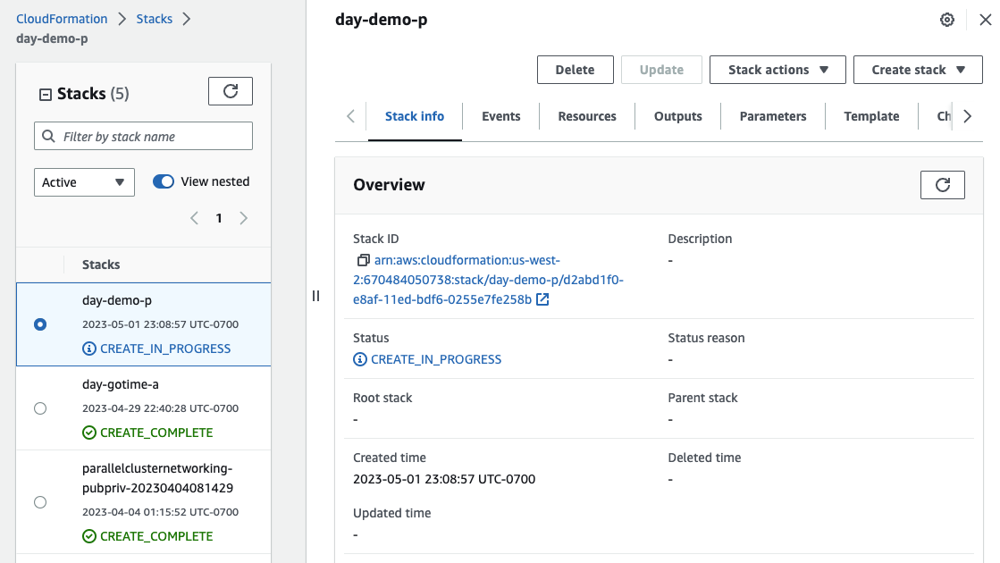

# Daylily Ephemeral Cluster(DEC) Initialization

## Pre-requisites

  - Please see the [pre-requisite instructions](prereq.md) for guidance on gathering the information necessary to proceed with spinning up a DEC:
    1. Github SSH Key Authorized
    2. AWS CLI Credentials
    3. AWS PEM File
    4. Sufficent AWS Spot Quota Allowance
    5. AWS VPC, Public/Private Subnet IDs
    6. AWS Cost Tracking Tagging Policy ARN
    7. A new S3 Bucket
  - With the above in hand, you are ready to move on (in the region `us-west-2`!) to initializing a DEC.

## Initializing a DEC
  > Install is tested from a MAC using zsh only.  This should also work from linux w/homebrew (or hack the install script to install the few brew installed deps). Edit the init script and swap zsh for bash if you prefer.

### Clone daylily 
  > Your ssh keys should be stored to github as described in the [prerequisite instructions](prereq.md).
  ```bash
  cd ~
  mkdir -p projects && cd projects
  
  git clone git@github.com:Daylily-Informatics/daylily.git daylily
  cd daylily
  ```
  
### Run Daylily-Init
  > With the prerequisite information in hand, run:
  
  ```bash
  source bin/daylily-init
  ```
  
  - You will be prompted for the information you obtained in the prereq steps (it is fine to re-run this script for new DECs or to re-try a failed attempt).
  - This script will:
      1. Install brew (if not detected).
      3. Install conda (if not detected).
      4. Install w/in a conda venv: mamba, aws cli, aws parallel cluster cli, gnu parallel
      5. It activates the venv, then runs `bin/daylily` to proceed with the DEC creation.  This will ask for (in order):
        4. If you have gathered the pre-req info.
        5. The path to your `PEM` file (ie: /Users/day/.ssh/daylily.pem).
        6. The name to give your cluster (only alpha, -, and numbers).
        7. The ID of your `public subnet`.
        8. The ID of your `private subnet`.
        9. The S3 bucket url you prepared to use for the DEC.
        10. The S3 same S3 bucket URL you provided above... (redundant).
        11. The `ARN` for the tagging policy created w/the subnets and VPC.
      6. If the cluster config dry-run was successful, enter 'yes' when asked if you wish to create the cluster.  The AWS Cloudformation Stack will be created and will take ~15min to complete. The script will poll until it is done.
        > ie:   
      7. Once the DEC has completed successfully, you will be asked to enter the cluster-name entered earlier.  This cluster will then have it's head node prepared for use.  Once this step is complete, the cluster may be used!

### Accessing and Testing Your DEC
  1. xxx
  2. bbbb

### Monitoring a DEC
  1. Cloudwatch dashboard created for each DEC.
    - [Cloudwatch Dashboard](xxxx)
  2. Costs
    - To create [Cost Explorer]() reports by tag, you need to `activate` the DEC cost tracking tags. [Follow these instructions](https://docs.aws.amazon.com/awsaccountbilling/latest/aboutv2/activating-tags.html).
    - Once done, this can take 24hrs to activate. Reports may then be faceted by tag & tag value.

### Shutting Down a DEC
  - DECs may be created on demand in roughly 20m.  Depending on your needs, the DEC will probably be shutdown when not needed. To do so, follow these steps:
    - *FIRST* 
    > **Warning**
    > Be very certain you have exported the Fsx filesystem `analysis_results` directory back to the S3 bucket!!! When you delete the DEC, the Fsx filestem will be deleted.  Any unsaved data will be lost.
    - _*Second*_, you exported the Fsx filesystem, and the export job completed, correct?  ( [see the end of the S3 prereq instructions for pointers on exporting](prereq.md) ).
    - _third_, find the cluster you wish to delete:
      ```bash
      conda activate DAYCLI;
      pcluster list-clusters;
      ```
    - _fourth_, delete the cluster:
      ```bash
      conda activate DAYCLI;
      pcluster delete-cluster -n YOUR-CLUSTER-NAME
      ```
    - lastly, monitor deletion if desired:
      ```bash
      conda activate DAYCLI;
      pcluster list-clusters;
      ```
