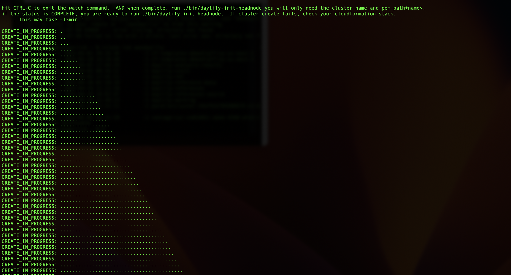
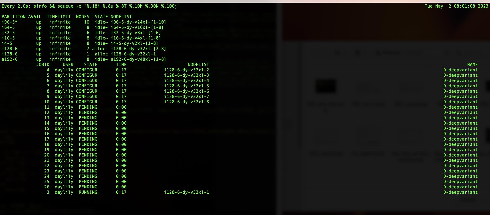
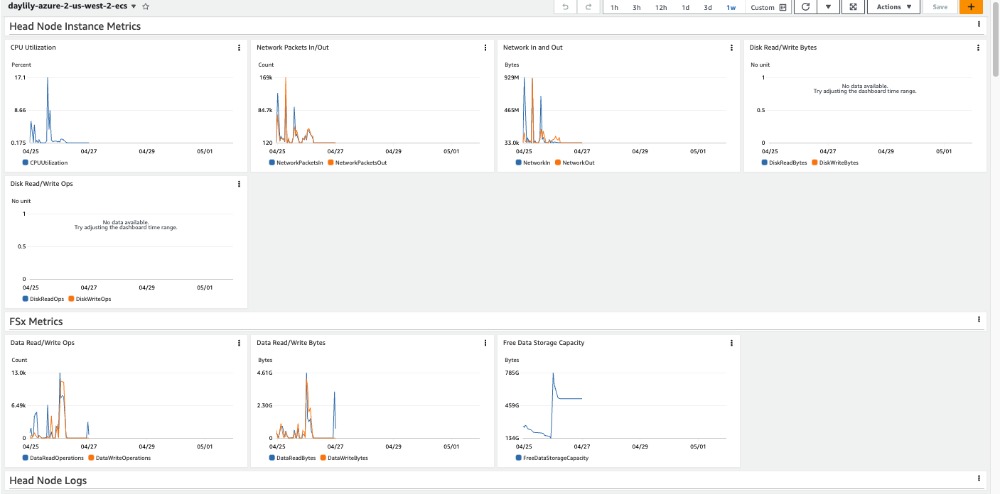
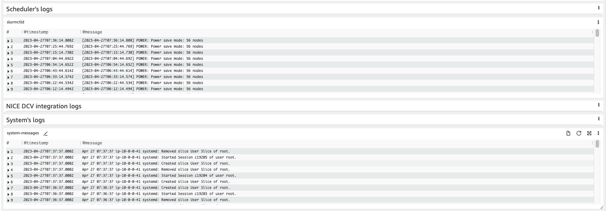
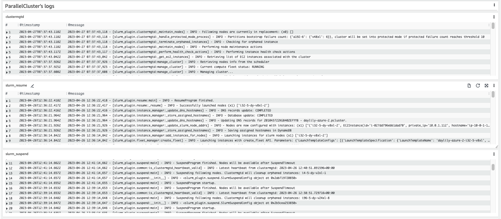
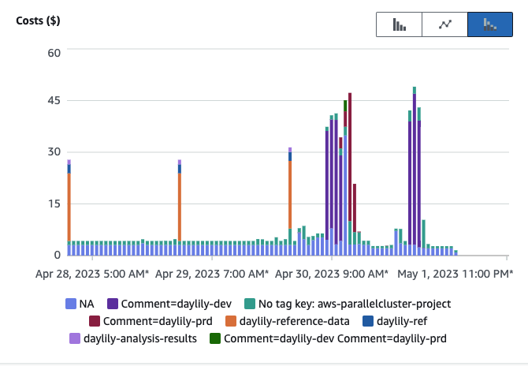

# Daylily Ephemeral Cluster(DEC) Initialization

## Pre-requisites

  - Please see the [prerequisite instructions](prereq.md) for guidance on gathering the information necessary to proceed with spinning up a DEC:
    1. Github SSH Key Authorized
    2. AWS CLI Credentials and cli installed and available in the shell `pip install --no-input awscli==1.27.123`
    3. AWS PEM File
    4. Sufficient AWS Spot Quota Allowance
    5. AWS VPC, Public/Private Subnet IDs
    6. AWS Cost Tracking Tagging Policy ARN
    7. A new S3 Bucket With The Daylily Ref & Cfg Data Copied To It
  - With the above in hand, you are ready to move on (in the region `us-west-2`!) to initializing a DEC.

## Initializing a DEC
[there is a video guide for reference](video_guide.md).

  > Install is tested from a MAC using zsh only.  This should also work from linux w/homebrew (or hack the install script to install the few brew installed deps). Edit the init script and swap zsh for bash if you prefer.

### To Watch This Install Process In (near) Real Time
  > [Check out these video clips](video_guide.md)

### Clone daylily 
  > Your ssh keys should be stored to github as described in the [prerequisite instructions](prereq.md).
  ```bash
  cd ~
  mkdir -p projects && cd projects
  
  git clone git@github.com:Daylily-Informatics/daylily.git daylily
  cd daylily
  ```

  
### Run Daylily-Init
#### Conda must be installed and activated
##### OSX ARM
```sh
wget https://repo.anaconda.com/miniconda/Miniconda3-latest-MacOSX-arm64.sh
chmod a+x Miniconda3-latest-MacOSX-arm64.sh
./Miniconda3-latest-MacOSX-arm64.sh
# the installer should have run  ~/miniconda3/bin/conda init
# So, open a new shell so that the PS1 reports (base), ie: (base) daylily@rangerrick ~ %
```

##### Ubuntu x86
```sh
wget https://repo.anaconda.com/miniconda/Miniconda3-latest-Linux-x86_64.sh
chmod a+x Miniconda3-latest-Linux-x86_64.sh
Miniconda3-latest-Linux-x86_64.sh
# the installer should have run  ~/miniconda3/bin/conda init
# So, open a new shell so that the PS1 reports (base), ie: (base) daylily@rangerrick ~ %, run conda init if not
```

#### In A Shell With Conda Active
  > Have the other prerequisite information in hand, and run:
  
  ```bash
  source bin/daylily-init
  ```
  
  - You will be prompted for the information you obtained in the prereq steps (it is fine to re-run this script for new DECs or to retry a failed attempt).
  - This script will:
      1. Install brew (if not detected).
      3. Install conda (if not detected).
      4. Install w/in a conda venv: mamba, aws cli, aws parallel cluster cli, gnu parallel
      5. It activates the venv, then runs `bin/daylily` to proceed with the DEC creation.  This will ask for (in order):
        4. If you have gathered the pre-req info.
        5. The path to your `PEM` file (ie: /Users/day/.ssh/daylily.pem).
        6. The name to give your cluster (only alpha, -, and numbers).
        7. The ID of your `public subnet`.
        8. The ID of your `private subnet`.
        9. The S3 bucket url you prepared to use for the DEC.
        10. The S3 same S3 bucket URL you provided above... (redundant).
        11. The `ARN` for the tagging policy created w/the subnets and VPC.
      6. If the cluster config dry-run was successful, enter 'yes' when asked if you wish to create the cluster.  The AWS Cloudformation Stack will be created and will take ~15min to complete. The script will poll until it is done. *THIS MAY TAKE ~20m*.
        
         ie: 
         
         You may also monitor progress via the [AWS stack](https://us-west-2.console.aws.amazon.com/cloudformation/) dashboard. ie:
         via the stack AWS dashboard:   
      7. Once the DEC has completed successfully, you will move to the final config of the head node and be asked:
      8.  to enter the cluster name from the displayed list.
      9.  to answer yes to adding the newly created ip address to your known hosts.
      10. A ssh key is created for the daylily user on the head node, and is displayed to you.  You must now go to [github ssh and gpg keys](https://github.com/settings/keys) and enter this ssh key as a new key in your list of keys. This is the same process as described [here](https://github.com/Daylily-Informatics/daylily/blob/main/docs/install/prereq.md#local-ssh-key-stored-with-github-account).  Once the key is saved, type `yes` and hit enter.
      11. The daylily user on the head node will now have the final configuration executed.  This will take a few moments.  Once complete, you are ready to use the DEC. It will exit with the following output:
     
    ```bash
    You may now ssh into the head node with : ssh -i /Users/$USERNAME/.ssh/$PEMNAME.pem ubuntu@$IP-ADDRESS 
    ... once logged in, run : sudo su - daylily 
    ...... then as daylily run: cd projects/daylily; source dyinit; dy-a local && dy-r help 
    ```
       
   - note: you should not run daylily from ~ for production, but create a new subdir in `/fsx/analysis_results/daylily`.


### Accessing and Testing Your DEC
  1. Determine your DEC public head node IP address
  
  ```bash
  conda activate DAYCLI
  pcluster list-clusters
  
  # confirm your cluster is active, copy name
  pcluster describe-cluster-instances -n YOUR-CLUSTER-NAME
  
  # the json string will have a public IP key-value, copy the IP
  ssh -i ~/.ssh/PEMFILENAME.pem ubuntu@IP-ADDRESS
  
  # you will now be logged into the cluster.
  
  # confirm the cluster compute fleet is waiting and ready
  sinfo
  
  # change to the daylily user
  sudo su - daylily 
  ```
  
  2. Strongly Advised: Use `screen` or `tmux`
  ```bash
  tmux new -s day-analysis
  ```
  
  3. Run the built in test data
  ```bash
  
  # make an analysis sub-dir
  mkdir -p /fsx/analysis_results/daylily/test
  cd /fsx/analysis_results/daylily/test
  
  # clone the daylily repo
  git clone git@github.com:Daylily-Informatics/daylily.git
  cd daylily

  # source dy-cli
  source dyinit

  # Build daylily if not done so already
  dy-b

  # activate the local profile
  dy-a local
  
  # run the included test data
  dy-r produce_snv_concordances -p -n # the -n runs a dry run, its good form to run any command with this flag first.
  ```
  - The output of this command will print the commands and execution plan (which will run locally) and will look like this:
  
  
  - To run locally, re-run the previous command minus the `-n`:
  ```bash
  dy-r produce_snv_concordances -p 
  ```
  - This will run a small test data set (~0.01x WGS) on the 16core head node.  Execution will take ~5min in general. The first time the head node runs daylily, requested environments will need to be built (only for the first job for each new DEC). This will add ~5m to the first job.

  3. To run this test data launching cluster jobs via slurm:
  ```bash
  # if you have already run the local test, clear the results directory
  rm -rf results .snakemake logs
  
  # activate the slurm profile
  dy-a slurm
  
  # dry run
  dy-r produce_snv_concordances -p -n
  
  # run
  dy-r produce_snv_concordancesq -p 

  ```
4. daylily will now run the same jobs as it had locally, but now via compute nodes it will spin up. Configuring new nodes can take several minutes depending on the spot market, etc. Once configured, the run time will be very quick.  You can monitor the DEC via the [cloudwatch dashboard](https://us-west-2.console.aws.amazon.com/cloudformation/) or with the `squeue` and `sinfo` commands, which are wrapped up in:  
```bash
# in a new terminal
cd /fsx/analysis_results/daylily/test
bin/helpers/watch_slurm.sh  
```

   

### Monitoring a DEC
#### A [Cloudwatch dashboard](https://us-west-2.console.aws.amazon.com/cloudwatch/home?region=us-west-2#dashboards:) created for each DEC. A few screenshots:

   - 
   - 
   - 
#### Costs

   - To create [Cost Explorer](https://us-east-1.console.aws.amazon.com/cost-management/) reports by tag, you need to `activate` the DEC cost tracking tags. [Follow these instructions](https://docs.aws.amazon.com/awsaccountbilling/latest/aboutv2/activating-tags.html).
   - Once done, this can take 24hrs to activate. Reports may then be faceted by tag & tag value. Here is an example costs breakdown report:
   - 

### Shutting Down a DEC
  - DECs may be created on demand in roughly 20m.  Depending on your needs, the DEC will probably be shut down when not needed. To do so, follow these steps:
    - *FIRST* 
    > **Warning**
    > Be very certain you have exported the Fsx file system `analysis_results` directory back to the S3 bucket!!! When you delete the DEC, the Fsx filesystem will be deleted.  Any unsaved data will be lost.
    - _*Second*_, you exported the Fsx filesystem, and the export job completed, correct?  ( [see the end of the S3 prereq instructions for pointers on exporting](prereq.md) ).
    - _third_, find the cluster you wish to delete:
      ```bash
      conda activate DAYCLI;
      pcluster list-clusters;
      ```
    - _fourth_, delete the cluster:
      ```bash
      conda activate DAYCLI;
      pcluster delete-cluster -n YOUR-CLUSTER-NAME
      ```
    - lastly, monitor deletion if desired:
      ```bash
      conda activate DAYCLI;
      pcluster list-clusters;
      ```


