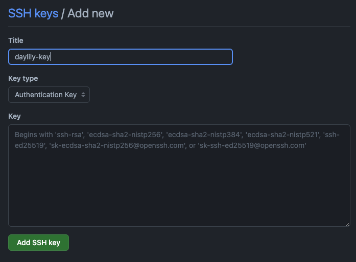
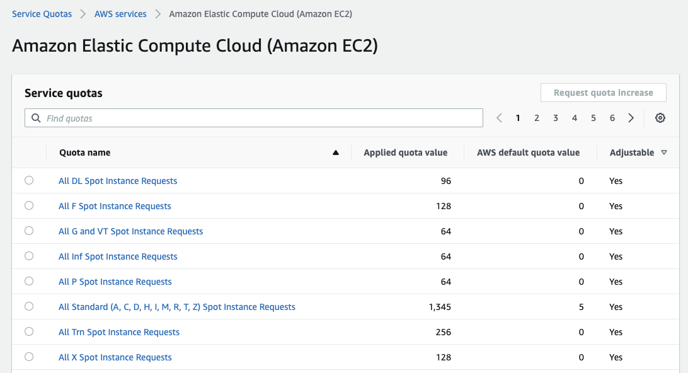
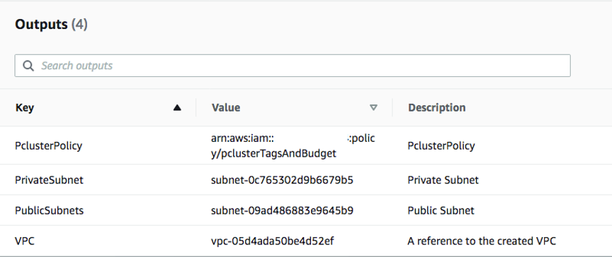
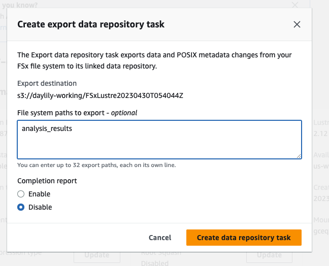

# Daylily Pre-requisites

To create a daylily ephemeral cluster (DEC), these pre-requisites must be completed one time only.  Once done with these pre-req's, you'll have the 6 components necessary to run the [DEC initialization](Install.md):
  1. Github SSH Key Authorized
  2. AWS CLI Credentials
  3. AWS PEM File
  4. Sufficent AWS Spot Quota Allowance
  5. AWS VPC, Public/Private Subnet IDs
  6. AWS Cost Tracking Tagging Policy ARN
  7. A new S3 Bucket 

  > With the above info, you will be able to create as many DECs as your AWS quotas allow. 
  > *These resources only need to be created this one time*.


## Github Account & Stored Local id_rsa.pub
  - Create you local ssh key if you have not done so already.
  ```bash
ssh-keygen 
# Generating public/private rsa key pair.
Enter file in which to save the key (/Users/day/.ssh/id_rsa): 
# Created directory '/Users/day/.ssh'.
Enter passphrase (empty for no passphrase): 
Enter same passphrase again: 
# Your identification has been saved in /Users/day/.ssh/id_rsa
# Your public key has been saved in /Users/day/.ssh/id_rsa.pub
  ```
  
  - Capture Your id_rsa.pub Key.
  ```bash
  head ~/.ssh/id_rsa.pub
  # << your key displayed here >>
  # Double click the key and copy to clipboard. If you use head, it should copy w/out linebreaks.
  ```
  
  - Save Key To github.
    - After logging in to [github](www.github.com), go to the [settings](https://github.com/settings/profile)->[ssh and gpg keys](https://github.com/settings/keys).
    - Click `New SSH Key`.
    - Give the key a unique name, and paste your id_rsa.pub key into the `Key` textarea.
    
    - Click `Add SSH Key`.
  - You're all set for now with adding ssh keys to github.


## AWS Console Stuff


### Regions
  - Please create all resources in the us-west-2 (Oregon) region.  This may be changed, but all instructions will assume this region. If you choose a different region, make sure all EC2 instance types used in the daylily ephemeral cluster (DEC) config are also available... or edit out the ones which are not (but it will be easier to stick with us-west-2 for now).


### Key Pair
- Daylily will locally utilize the [aws cli](https://docs.aws.amazon.com/cli/index.html) and [aws parallelcluster cli](https://docs.aws.amazon.com/parallelcluster/latest/ug/commands-v3.html) to create a DEC. 
  > **Note**
  > These credentials are not used beyond the user account you use to configure and launch DEC's, IAM roles are used for all other aspects of AWS interactions, these credentials are not copied elsewhere.

-  [Instructions for creating a key pair](https://docs.aws.amazon.com/parallelcluster/latest/ug/set-up-keypair.html):
    1. Go to the AWS Management Console and log in to your account.
    2. Click on your username on the top right corner and select "My Security Credentials" from the dropdown menu.
    3. On the left-hand side of the page, click on "Access keys (access key ID and secret access key)".
    4. Click on the "Create New Access Key" button.
    5. In the pop-up window that appears, click on the "Download .csv file" button to download a file containing your new access key ID and secret access key. Make sure to keep this file in a secure location as it cannot be retrieved later.
    6. After downloading the .csv file, click on "Close" to return to the Access keys page.
    7. Your new access key and secret access key will be displayed on the page. You can also copy them from this page if needed. 
    > **Note**
    > You only have one chance to save these keys. If you do not do so, or loose them, you will need to create a new keys.
- Save your `access key` and `secret access key` for latter, the aws cli will ask for them when you first are prompted to use it.


### PEM File
  - As with the AWS credential keys, a `PEM` file will be needed to create and access the headnode of the DEC. 
    > **Note**
    > Theis `PEM` file is not used beyond the user account you use to configure and launch DEC's, IAM roles are used for all other aspects of AWS interactions, this `PEM` file is not copied elsewhere.
  - [Create and download](https://docs.aws.amazon.com/AWSEC2/latest/UserGuide/ec2-key-pairs.html#having-ec2-create-your-key-pair) to your `PEM` to your `~/.ssh/` directory:
    1. Log in to the AWS Management Console and go to the EC2 dashboard.
    2. Click on the "Key Pairs" link in the left-hand navigation pane.
    3. Click on the "Create Key Pair" button.
    4. In the "Create Key Pair" dialog box, enter a name for your key pair in the "Key pair name" field. Make sure to choose a descriptive name that you will remember later.
    5. Choose the "PEM" format from the "File format" dropdown menu.
    6. Click on the "Create Key Pair" button.
    7. Your key pair will be created, and a private key file with a .pem file extension will be downloaded to your local machine. Save this file in a secure location as you will need it to access your instances.
    8. Download and save the `PEM` file to your `~/.ssh/` directory. *It should be named PEMKEYNAME.pem*.
    > **Note**
    > You only have one chance to download this key. If you do not do so, or loose the file, you will need to create a new `PEM`.


### AWS Quotas
  - Be sure you are in the `us-west-2` region when checking quotas.
  - In order to create the DEC, you must have appropriate quota allowances from AWS to run the required on-demand and spot instances.  Minimally you need to be able to run 1 on-demand instance of the `5` generation instance type, and be allowed to run at least 128 vCPUs on spot instances.
    > **Note**
    > **128** is the bare minimum to run daylily.  This will only allow 1 alignment to run at a time.  A reccomended 1028 vCPU quota will allow 8 alignments to run in parallel.  If you wish to parallelize further, be sure to have the quota allowances and tweak the [cluster config yaml](../../config/day_cluster/prod_cluster.yaml) to increase the max instances allowed in the [i128-6 queue](https://github.com/Daylily-Informatics/daylily/blob/7fa0cd522db3bb0a7c8b548981d70ccac273b69d/config/day_cluster/prod_cluster.yaml#L184).
  - Visit the [AWS Quotas Dashboard](https://us-west-2.console.aws.amazon.com/servicequotas/home/services/ec2/quotas).
    - Confirm your quotas for `All Standard (A, C, D, H, I, M, R, T, Z) Spot Instance Requests` are >= 128 _in the screenshot below, they are set at 1345_.
      
    - To request an increase, click the quota link, then on the detail page click `request quota increase`. Fill out the request, and check back for the decision.


### Stack Creation For: VPC, Public/Private Subnets & Budget + Cost Tracking Policy
  - Daylily integrates fine grained [cost tracking by configurable project tags](https://aws.amazon.com/blogs/compute/using-cost-allocation-tags-with-aws-parallelcluster/). Further, you may set budget caps for each tag to block jobs when a given budget is exceeded.  Resources tagged with the appopriate tags will appear in the cost explorer by tag value.  This will allow you to track expenditures by project tag. To do so, a policy must be created. 
      > Example Hourly Cost Tracking Report:
    
  - In addition daylily requires a *VPC* enclosing a *public subnet* and a *private subnet*. The cost tracking policy, along with these networks and VPC are created using [this template](https://github.com/aws-samples/aws-parallelcluster-cost-allocation-tags/blob/master/pcluster_env.yml) via the [AWS Stack Formation Dashboard](https://us-west-2.console.aws.amazon.com/cloudformation/home?region=us-west-2#/stacks). To create this stack:
    1. Visit [this template](https://github.com/aws-samples/aws-parallelcluster-cost-allocation-tags/blob/master/pcluster_env.yml), and click `download raw file` as `pcluster_env.yaml`.
    2. From the [stack dashboard](https://us-west-2.console.aws.amazon.com/cloudformation/home?region=us-west-2#/stacks), click `create stack` in the upper right.
    3. Choose `with new resources`.
    4. Select `Template is ready`.
    5. Select `Upload a template file`, select the `pcluster_env.yaml` file you previously downloaded, click `Next`.
    6. Enter a `Stack name`, ie: _stack-daylily-cost-tracking_
    7. Under parameters, enter `daylily` as the `EnvironmentName`.
    8. Leave the PrivateSubnetCIDR, PublicSubnetCIDR and VpcCIDR alone unless you know what you are doing.
    9. Click `Next`
    10. Do not edit anything on the next page, click `Next`.
    11. On the `Review STACKNAME` page, scroll to the bottom and `check the acknowledgement box`, then click `Submit`.
    12. The stack will take a few moments to create... sit tight.  Eventually, it will succeed and you will want to visit the stack detail page to extract the aws identifiers for the VPC, public+private subnets, and the arn for the tagging policy.  Something like this:
        
       > **Note** 
       > You will require these 4 IDs to run the DEC init process. 


## A S3 Bucket With The Appropriate Daylily Reference Data & DEC Config Scripts
  - When a DEC is spun up, a [Fsx](https://docs.aws.amazon.com/fsx/index.html) filesystem is mounted to the head node, and too all compute node which are created.  The Fsx filesystem mirrors the files stored in the S3 bucket which you specify during the init. Fsx is a filesystem optimized for HPC uses, and can handle thousands of concurrent access hosts at a time. 
  - Your bucket needs to be in the same region as the stack just created, us-west-2.  You will need to copy the daylily reference data from the daylily hosted bucket to the bucket you plan to use for your DECs.  The files imported from S3 to the Fsx system will be read only.  New files written to the Fsx filesystem *must* be explicitly exported back to this S3 bucket, which is done via cli command or via the [Fsx dashboard](https://us-west-2.console.aws.amazon.com/fsx/) for each filesystem, each export will create a new top level directory in this S3 bucket named `FSXLusterTIMESTAMP`.
  - *COPY THE DAYLILY REFERENCE AND CONFIG DIRECTORIES* -- the daylily-references bucket has all of the reference data and indexes necessary to run vs both `b37` and `hg38`.
    - This command should do the trick `aws s3 cp s3://daylily-references/ s3:/YOURBUCKET/ --recursive --request-payer requester --progress` <-- contact me at john@daylilyinformatics.com if this does not work for you.
    - You'll end up with two directories in YOURBUCKET, `data` and `cluster_boot_config`.  In the `data` directory, create a directory called `sample_input_data`.  You will save your fastq data to subdirectories in this folder, and when creating sample sheets refeerence the files w/in this folder as `/fsx/data/sample_input_data/RUN_FOLDER_NAME/*fq.gz`.  When you save data to this S3 folder, it will become available to the Fsx filesystems which mount this bucket.  It is advised that once sample data is procecssed, it is moved outside the `data` top level directory so it is not consuming space on the Fsx filesystem.
    - On the Fsx filesystem each DEC node mounts, results will be saved to an `analysis_results` directory, the contents of which will be mirrored back to S3 each time you trigger the Fsx export.
      > **Warning**
      > This is very important.  The movement of analysis_results back to S3 is not (yet) automated, nor is the deletion of the DEC.  When an analysis batch is complete, depending on your expected incoming data, it may make sense to delete the DEC until it is needed again.  Letting it sit idle costs the head node and Fsx costs- presently clocking in ~$3/hr. *BEFORE* you delete the DEC, be sure to visit the [Fsx dashboard](https://us-west-2.console.aws.amazon.com/fsx/) and export the `analysis_results` folder to S3.  Once this export is complete, it is safe to delete the DEC.  The export UI looks like:
      
      
   - The s3 bucket you create may be used repeatedly, read: you do not need to copy the daylily-reference bucket more than this first time.  It is up to you to actively manage the `sample_input_data` and exported `analysis_results` directories.  If you have odd cluster failures, a first thing to check is the space left on Fsx: `df -h /fsx`.  If the created volume needs to be larger, you can set larger sizes via the [SharedStorage](https://github.com/Daylily-Informatics/daylily/blob/bee80581ad77f0d1754ca62a408f6953131f91c9/config/day_cluster/prod_cluster.yaml#L251) section of the cluster config yaml.  Also consider changing from `SCRATCH` type drives to `PERSISTENT` (the latter may be expanded as needed, and backed up outside the export to S3).
 - Ok, save this new S3 bucket name for use in the daylily init, ie: `s3::/your-new-bucket`.


## Move On To DEC Initialization !
  - [DEC INITIALIZE](Install.md)
