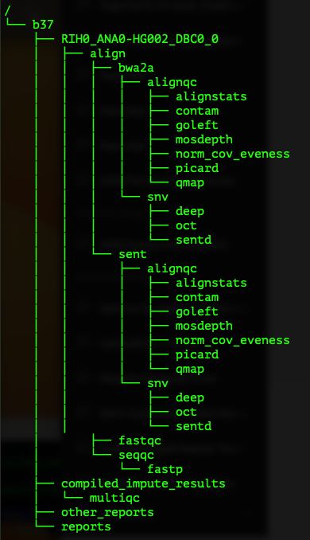

# Daylily Directory Structure

The `results` [directory structure](../../docs/ops/tree_structure) is designed to cleanly organize the output of daylily.  The tree of the directories if running both the `SBS` and `B2ertD` pipelines is:
  
  
The file naming convention is designed to allow straight forward integration of new aligners, deduplication, SNV/SV callers, and QC tools. Filenames are are unique w/in a batch, allowing working with files w/out namespace collision. Filenames will be unique across batches if run & experiment identifiers are manages appropriately when creating `analysis_manifese.csv` files to begin analysis batches. 
  
  ## Daylily Annotate Dirs
  ```bash
  
  <pre>
{b38,hg38}/
├── RIH0_ANA0-HG002_DBC0_0. #fastq.gz files linked as source data here, and serves as root for all sample analysis
│   ├── align  # each aligner has a directory here to run in
│   │   ├── bwa2b  # bwa2b == bwa2 ert  
│   │   │   ├── alignqc  # All sort.bam QC tools are run here
│   │   │   │   ├── alignstats # tool to gather a massive number of descriptive stats
│   │   │   │   │   └── logs
│   │   │   │   │       └── RIH0_ANA0-HG002_DBC0_0.bwa2a.alignstats.log
│   │   │   │   ├── contam
│   │   │   │   │   └── vb2 # verifybam2 calculate a contamination estimate
│   │   │   │   │       └── logs
│   │   │   │   ├── goleft # bam depth metrics
│   │   │   │   │   ├── golefttwo.done
│   │   │   │   │   └── logs
│   │   │   │   ├── goleft.done
│   │   │   │   ├── mosdepth # more, mostly redundant bam metrics
│   │   │   │   │   ├── RIH0_ANA0-HG002_DBC0_0.bwa2a
│   │   │   │   │   │   └── RIH0_ANA0-HG002_DBC0_0.md
│   │   │   │   │   ├── RIH0_ANA0-HG002_DBC0_0.bwa2a.mosdepth.log
│   │   │   │   │   └── logs
│   │   │   │   ├── norm_cov_eveness # calculate coverage uniformity metrics by chrm, used to identify samples at risk of poor SV calling
│   │   │   │   │   └── logs
│   │   │   │   │       └── norm_cov_eveness.mqc.log
│   │   │   │   ├── picard # picard alignment stats
│   │   │   │   │   ├── logs
│   │   │   │   │   │   └── RIH0_ANA0-HG002_DBC0_0.bwa2a.picard.stats.log
│   │   │   │   └── qmap # qualimap QC
│   │   │   │       └── RIH0_ANA0-HG002_DBC0_0
│   │   │   │           └── logs
│   │   │   ├── logs
│   │   │   │   ├── RIH0_ANA0-HG002_DBC0_0.bwa2a_sort.log
│   │   │   │   └── dedupe.RIH0_ANA0-HG002_DBC0_0.bwa2a.log
│   │   │   └── snv # Each SNV caller gets a directory under an aligner to run in
│   │   │       ├── deep  # deepvariant
│   │   │       │   ├── RIH0_ANA0-HG002_DBC0_0.bwa2a.deep.snv.sort.vcf
│   │   │       │   ├── RIH0_ANA0-HG002_DBC0_0.bwa2a.deep.snv.sort.vcf.gz
│   │   │       │   ├── RIH0_ANA0-HG002_DBC0_0.bwa2a.deep.snv.sort.vcf.gz.tbi
│   │   │       │   ├── bcfstats
│   │   │       │   │   └── logs
│   │   │       │   ├── log
│   │   │       │   │   ├── RIH0_ANA0-HG002_DBC0_0.bwa2a.deep.cocncat.fofn.log
│   │   │       │   │   ├── RIH0_ANA0-HG002_DBC0_0.bwa2a.deep.snv.merge.sort.gatherered.log
│   │   │       │   │   └── vcfs
│   │   │       │   ├── logs
│   │   │       │   │   └── RIH0_ANA0-HG002_DBC0_0.bwa2a.chunkdirs.log
│   │   │       │   ├── peddy # SNV calling metrics
│   │   │       │   │   ├── RIH0_ANA0-HG002_DBC0_0.bwa2a.deep.peddy.ped
│   │   │       │   │   └── log
│   │   │       │   ├── vcf_stats # vcf descriptive stats
│   │   │       │   │   └── logs
│   │   │       │   └── vcfs
│   │   │       │       ├── 19
│   │   │       │       └── 21
│   │   │       ├── oct # octopus SNV caller
│   │   │       │   ├── RIH0_ANA0-HG002_DBC0_0.bwa2a.oct.snv.sort.vcf
│   │   │       │   ├── RIH0_ANA0-HG002_DBC0_0.bwa2a.oct.snv.sort.vcf.gz
│   │   │       │   ├── RIH0_ANA0-HG002_DBC0_0.bwa2a.oct.snv.sort.vcf.gz.tbi
│   │   │       │   ├── bcfstats # vcf metrics
│   │   │       │   │   └── logs
│   │   │       │   ├── log
│   │   │       │   │   ├── RIH0_ANA0-HG002_DBC0_0.bwa2a.oct.cocncat.fofn.log
│   │   │       │   │   ├── RIH0_ANA0-HG002_DBC0_0.bwa2a.oct.snv.merge.sort.gatherered.log
│   │   │       │   │   └── vcfs
│   │   │       │   ├── logs
│   │   │       │   │   └── RIH0_ANA0-HG002_DBC0_0.bwa2a.chunkdirs.log
│   │   │       │   ├── peddy
│   │   │       │   │   ├── RIH0_ANA0-HG002_DBC0_0.bwa2a.oct.peddy.ped
│   │   │       │   │   └── log
│   │   │       │   ├── vcf_stats
│   │   │       │   │   └── logs
│   │   │       │   └── vcfs
│   │   │       │       ├── 19
│   │   │       │       ├── 1~0-30028082
│   │   │       │       └── 20-21
│   │   │       └── sentd
│   │   │           ├── RIH0_ANA0-HG002_DBC0_0.bwa2a.sentd.snv.sort.vcf
│   │   │           ├── RIH0_ANA0-HG002_DBC0_0.bwa2a.sentd.snv.sort.vcf.gz
│   │   │           ├── RIH0_ANA0-HG002_DBC0_0.bwa2a.sentd.snv.sort.vcf.gz.tbi
│   │   │           ├── bcfstats
│   │   │           │   └── logs
│   │   │           ├── log
│   │   │           │   ├── RIH0_ANA0-HG002_DBC0_0.bwa2a.sentd.cocncat.fofn.log
│   │   │           │   ├── RIH0_ANA0-HG002_DBC0_0.bwa2a.sentd.snv.merge.sort.gatherered.log
│   │   │           │   └── vcfs
│   │   │           ├── logs
│   │   │           │   └── RIH0_ANA0-HG002_DBC0_0.bwa2a.chunkdirs.log
│   │   │           ├── peddy
│   │   │           │   ├── RIH0_ANA0-HG002_DBC0_0.bwa2a.sentd.peddy.ped
│   │   │           │   └── log
│   │   │           ├── vcf_stats
│   │   │           │   └── logs
│   │   │           └── vcfs
│   │   │               └── 16-19
│   │   └── sent ### This is a mirror of subdirs and files as in bwa2b
│   │       ├── alignqc
│   │       │   ├── alignstats
│   │       │   │   └── logs
│   │       │   │       └── RIH0_ANA0-HG002_DBC0_0.sent.alignstats.log
│   │       │   ├── contam
│   │       │   │   └── vb2
│   │       │   │       └── logs
│   │       │   ├── goleft
│   │       │   │   ├── golefttwo.done
│   │       │   │   └── logs
│   │       │   │       └── goleft.log
│   │       │   ├── goleft.done
│   │       │   ├── mosdepth
│   │       │   │   ├── RIH0_ANA0-HG002_DBC0_0.sent
│   │       │   │   │   └── RIH0_ANA0-HG002_DBC0_0.md
│   │       │   │   ├── RIH0_ANA0-HG002_DBC0_0.sent.mosdepth.log
│   │       │   │   └── logs
│   │       │   ├── norm_cov_eveness
│   │       │   │   └── logs
│   │       │   │       └── norm_cov_eveness.mqc.log
│   │       │   ├── picard
│   │       │   │   ├── logs
│   │       │   │   │   └── RIH0_ANA0-HG002_DBC0_0.sent.picard.stats.log
│   │       │   │   └── picard
│   │       │   │       └── RIH0_ANA0-HG002_DBC0_0.sent.mrkdup.sort.picard.done
│   │       │   └── qmap
│   │       │       └── RIH0_ANA0-HG002_DBC0_0
│   │       │           └── logs
│   │       ├── logs
│   │       │   ├── RIH0_ANA0-HG002_DBC0_0.sent.sort.log
│   │       │   └── dedupe.RIH0_ANA0-HG002_DBC0_0.sent.log
│   │       └── snv
│   │           ├── deep
│   │           │   ├── RIH0_ANA0-HG002_DBC0_0.sent.deep.snv.sort.vcf
│   │           │   ├── RIH0_ANA0-HG002_DBC0_0.sent.deep.snv.sort.vcf.gz
│   │           │   ├── RIH0_ANA0-HG002_DBC0_0.sent.deep.snv.sort.vcf.gz.tbi
│   │           │   ├── bcfstats
│   │           │   │   └── logs
│   │           │   ├── log
│   │           │   │   ├── RIH0_ANA0-HG002_DBC0_0.sent.deep.cocncat.fofn.log
│   │           │   │   ├── RIH0_ANA0-HG002_DBC0_0.sent.deep.snv.merge.sort.gatherered.log
│   │           │   │   └── vcfs
│   │           │   ├── logs
│   │           │   │   └── RIH0_ANA0-HG002_DBC0_0.sent.chunkdirs.log
│   │           │   ├── peddy
│   │           │   │   ├── RIH0_ANA0-HG002_DBC0_0.sent.deep.peddy.ped
│   │           │   │   └── log
│   │           │   ├── vcf_stats
│   │           │   │   └── logs
│   │           │   └── vcfs
│   │           │       ├── 19
│   │           │       └── 21
│   │           ├── oct
│   │           │   ├── RIH0_ANA0-HG002_DBC0_0.sent.oct.snv.sort.vcf
│   │           │   ├── RIH0_ANA0-HG002_DBC0_0.sent.oct.snv.sort.vcf.gz
│   │           │   ├── RIH0_ANA0-HG002_DBC0_0.sent.oct.snv.sort.vcf.gz.tbi
│   │           │   ├── bcfstats
│   │           │   │   └── logs
│   │           │   ├── log
│   │           │   │   ├── RIH0_ANA0-HG002_DBC0_0.sent.oct.cocncat.fofn.log
│   │           │   │   ├── RIH0_ANA0-HG002_DBC0_0.sent.oct.snv.merge.sort.gatherered.log
│   │           │   │   └── vcfs
│   │           │   ├── logs
│   │           │   │   └── RIH0_ANA0-HG002_DBC0_0.sent.chunkdirs.log
│   │           │   ├── peddy
│   │           │   │   ├── RIH0_ANA0-HG002_DBC0_0.sent.oct.peddy.ped
│   │           │   │   └── log
│   │           │   ├── vcf_stats
│   │           │   │   └── logs
│   │           │   └── vcfs
│   │           │       ├── 19
│   │           │       ├── 1~0-30028082
│   │           │       └── 20-21
│   │           └── sentd
│   │               ├── RIH0_ANA0-HG002_DBC0_0.sent.sentd.snv.sort.vcf
│   │               ├── RIH0_ANA0-HG002_DBC0_0.sent.sentd.snv.sort.vcf.gz
│   │               ├── RIH0_ANA0-HG002_DBC0_0.sent.sentd.snv.sort.vcf.gz.tbi
│   │               ├── bcfstats
│   │               │   └── logs
│   │               ├── log
│   │               │   ├── RIH0_ANA0-HG002_DBC0_0.sent.sentd.cocncat.fofn.log
│   │               │   ├── RIH0_ANA0-HG002_DBC0_0.sent.sentd.snv.merge.sort.gatherered.log
│   │               │   └── vcfs
│   │               ├── logs
│   │               │   └── RIH0_ANA0-HG002_DBC0_0.sent.chunkdirs.log
│   │               ├── peddy
│   │               │   ├── RIH0_ANA0-HG002_DBC0_0.sent.sentd.peddy.ped
│   │               │   └── log
│   │               ├── vcf_stats
│   │               │   └── logs
│   │               └── vcfs
│   │                   └── 16-19
│   └── logs
│       ├── RIH0_ANA0-HG002_DBC0_0.dirsetup.log
│       ├── fastqc # fastq metrics
│       │   └── RIH0_ANA0-HG002_DBC0_0.fastqc.log
│       └── seqqc # fastq metrics
│           └── fastp
│               └── RIH0_ANA0-HG002_DBC0_0.fastp.log
├── logs
│   ├── alignstats_summary_compile.log
│   ├── alignstats_summary_gather.log
│   └── multiqc
│       └── SEQQC_multiqc.FQ.log
├── other_reports # reports at the batch level
│   └── logs
│       └── rules_benchmarks_summary.log
└── reports # more reports at the batch level
    └── logs
        ├── all__mqc_fin_a.log
        └── all_mqc_fin_b.log

  
  
  ```

  
# Daylily File Naming Scheme
_Wildcards, `{}` in file names match the directory names above as appropriate._

  - RUNID_ANALYSIS-ID-SAMPLE-ID_SEQBARCODEID_LANE.{sent,bwab}.{oct,sentd,deep}.snv.{,sort}.vcf
    - where LANE is a 1+ integer lane ID, or if `0` implies input lane fastqs were combined to be processed as lane zero.
