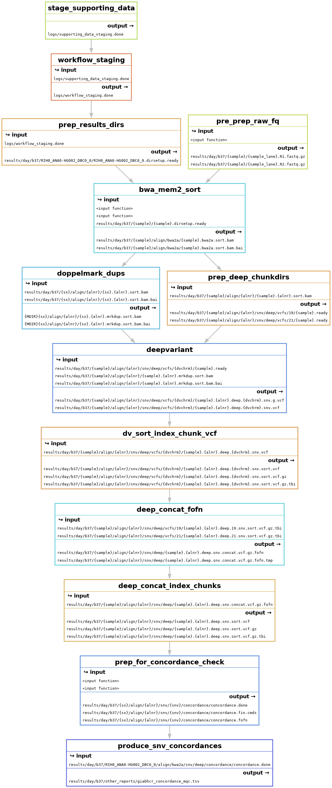

# DAGs
Generate DAGs of the worflow target you are running.

## Rulegraph (the compressed workflow, no parallelization shown)
  - `dy-r produce_snv_concordances --rulegraph | dot -Tpng > dag.png`
  produces w/the test data in the slurm profile:
  
  
## Filegraph (rulegraph, but with in/out file details blown up)
  - `dy-r producce_snv_concordances --filegraph | dot -Tpng > rulegraph.png`
  produces w/the test data in the slurm profile:
  
  
## DAG (all the gory details, can get unusable with large numbers of samples and longer workflows)
  - `dy-r producce_snv_concordances --dag | dot -Tpng > rulegraph.png`
  produces w/the test data in the slurm profile:
  
  
# Snakemake Report
Snakemake will generate a report when a job has completed that visualizes the rules executed, and the runtime stats per executed rule.
  - `dy-r produce_snv_concordances --report ./smk_report.html`
  produces w/the test data in the slurm profile [this report.gz](../../docs/reports/smk_report.html.gz).
  
# QC Reports!
Daylily will generate exhaustive QC reports for samples run in the same batch. When an analysis_manifest specifies multiple samples, and the kitchen sink pipeline is run, the final step will produce the following multiqc report.
  - `dy-r produce_multiqc_final_wgs -p`
  produces for NA002 at 30x, 25x, 20x, 15x, 10x, 5x, 1.4x [the following report](http://daylilyinformatics.com:8082/reports/DAY_final_multiqc.html).
  
